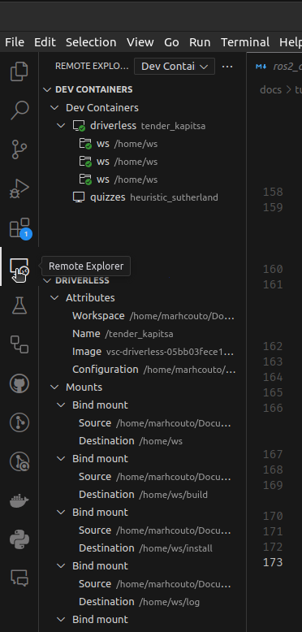
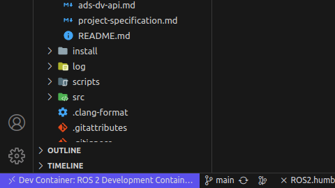

# ROS2 + Docker + VSCode Coding Environment

## Requirements

- Install VSCode: https://code.visualstudio.com/
    - with [Remote Development Extension](https://marketplace.visualstudio.com/items?itemName=ms-vscode-remote.vscode-remote-extensionpack)
- Install Docker Engine (or Desktop): https://docs.docker.com/engine/
- (MacOS) Install [XQuartz](https://www.xquartz.org/)
- (Windows) Install [VcXsrv Windows X Server ](https://sourceforge.net/projects/vcxsrv/)

## Installation Steps

#### Extra for MacOS

Follow all the steps in [the tutorial video](https://www.youtube.com/watch?v=cNDR6Z24KLM), especially the part of allowing connections from network clients in the preferences.

### Docker Setup

This step goes over how to set up a docker dev container as a development environment for our project. For more information on docker, there is a [tutorial](https://github.com/fs-feup/tutorials/blob/main/tutorials/docker-tutorial.md) in the startup guide that links some content for education on the topic.

There is a .devcontainer folder with files that define and configure the dev container environment. One defines the base docker image, while the other defines the add-ons to the container and the parameters it should run in, specially the ones related to vscode. If you are using Windows or it is not working as is, you should set a .env file similar to the [example one](../../../.devcontainer/.env.example). If it is still failing (for instance, in WSL it wasn't working), introduce the following line in your .bashprofile or .zprofile (or .bashrc or .zshrc):```export USERNAME=your_username```. This enables the devcontainer.json file to read your user and pass it inside the docker container. In Linux, this might not be necessary, but in case of error, do so as well.

The files in .devcontainer are mostly based in the [guide from ROS](https://docs.ros.org/en/humble/How-To-Guides/Setup-ROS-2-with-VSCode-and-Docker-Container.html).

Also, run the **environment_setup.sh** script to create the folders the docker container needs:
```sh
./environment_setup.sh
```

### Attaching VSCode to Dev Container

Do CTRL+SHIFT+P and select `Dev Containers: (Re-)build and Reopen in Container` and execute.

**Note:** Everytime graphical features are to be ran on the container, open terminal on host machine (your Ubuntu computer) and run `xhost +local:docker`. You should also run `xhost -local:docker` after using.

### Testing Environment

Run:
```bash
source /opt/ros/humble/setup.bash
rviz2
```
If all correct, should open a window with no errors.

### Set Up C++ Extension

1. Ctrl+Shift+P and write 'C/C++: Edit Configurations (UI)
2. Scroll down to 'Include Path'
3. Add this to the text box:
    ```
    ${workspaceFolder}/**
    /opt/ros/humble/include/**
    /usr/include/**
    ```

## Usage of the Environment

### Notes

The environment is all installed inside a docker container, which works like a lightweight virtual machine, having its own file system, etc. This means ROS2 and all other tools and libraries were not installed in your computer, but inside the container, meaning you won't have access to them in a shell/terminal connected to your computer. The terminal that VSCode opens when inside the docker container is a special terminal that automatically connects to the container, meaning it works inside it. Therefore, all work should be done inside this terminal. You can also [connect your own terminal application to the container](https://kodekloud.com/blog/docker-exec/). The folders between the container and your pc are synchronized with Docker Volumes, so any change in your pc will reflect in the docker and vice versa.

Another important note: as described in the tutorial further ahead on Docker, docker images and docker containers are two different things. If you select rebuild and reopen container again, all changes you made to the container afterwards will be wiped out.

Remember you will always have to run ```source /opt/ros/humble/setup.bash``` every time you open a shell in order to tell it where ROS2 is. If you don't want to do this all the time, add the line to your .bashrc file like so ```echo "source /opt/ros/humble/setup.bash" >> ~/.bashrc```.

### Steps for Usage

1. If using Docker desktop and it does not start on start-up, open it.
2. Open VSCode. If the last project opened in VSCode was this one, it should open inside the container rightaway. If not, proceed with the next steps.
3. Select the remote connection extension on the left side bar.
    
4. Click on the ws folder inside the docker container. Make sure you have the remote explorer selected to dev containers.
5. Check that you are inside the docker container.
    
6. Program

### Last Notes

- The terminal cannot access ssh in windows, so you must use an external terminal