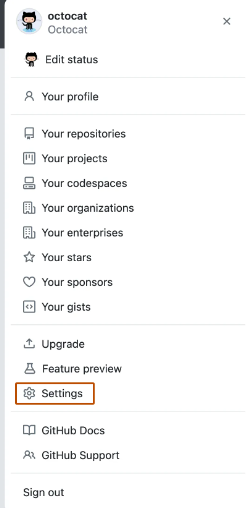
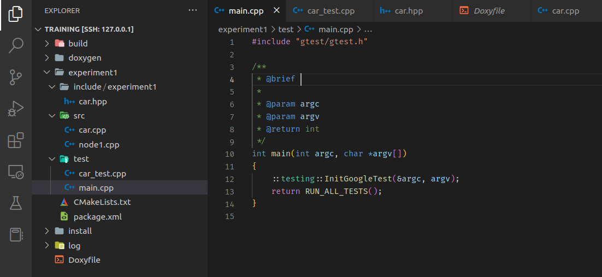

# Coding environment

This tutorial aims to aid in teaching the developer how to use multiple tools established for this project, as well as creating the base environment for the project and understanding the project's structure.

### Notes
- Before proceeding with this guide, please ensure that you have the following prerequisites in place:
    - [ROS2 Setup](./ros2_setup.md)

## Links
- [VSCode](https://code.visualstudio.com/Download)

## Git

If you already use git and github, you can skip this step. If you use windows, make sure to be inside your wsl for this.

### Installation

```sh
sudo apt install git
```

### Configuration

Configure according to github account. For global configuration:

```sh
git config --global user.name "username"
git config --global user.email "useremail"
```

To configure independently per project:

```sh
git config user.name "username"
git config user.email "useremail"
```

### SSH connection to Github

1. Generate ssh key pair:
    ```sh
    ssh-keygen -t ed25519 -C "your_email@example.com"
    ```
    You can leave the default file. Setup password if you wish.
2. Start the ssh-agent in the background:
    ```sh
    eval "$(ssh-agent -s)"
    ```
1. Add the ssh key to the agent:
    ```sh
    ssh-add ~/.ssh/id_ed25519
    ```
1. Copy the SSH public key to your clipboard:
    ```sh
    cat ~/.ssh/id_ed25519.pub
    # Then select and copy the contents of the id_ed25519.pub file
    # displayed in the terminal to your clipboard
    ```
    **Tip:** Alternatively, you can locate the hidden .ssh folder, open the file in your favorite text editor, and copy it to your clipboard.
1. In the upper-right corner of any page, click your profile photo, then click Settings.

    

    Screenshot of GitHub's account menu showing options for users to view and edit their profile, content, and settings. The menu item "Settings" is outlined in dark orange.
    In the "Access" section of the sidebar, click  SSH and GPG keys.
1. Click New SSH key or Add SSH key.
1. In the "Title" field, add a descriptive label for the new key. For example, if you're using a personal laptop, you might call this key "Personal laptop".
1. Select the type of key, either authentication or signing. For more information about commit signing, see "About commit signature verification."
1. In the "Key" field, paste your public key.
1. Click Add SSH key.
1. If prompted, confirm access to your account on GitHub. For more information, see "Sudo mode."

For more details on that, checkout the Github tutorials: [Generating a new SSH key](https://docs.github.com/en/authentication/connecting-to-github-with-ssh/generating-a-new-ssh-key-and-adding-it-to-the-ssh-agent) and [Adding a new SSH key to your GitHub account](https://docs.github.com/en/authentication/connecting-to-github-with-ssh/adding-a-new-ssh-key-to-your-github-account). 

## Cloning the project

Before anything else, you need to clone the project into your laptop using [git](https://git-scm.com/book/en/v2/Getting-Started-About-Version-Control). Simply hit clone in the home page of the project, select ssh, copy the command and run git clone, or:
```sh
git clone git@github.com:fsfeup-driverless/driverless.git
```

## Project Structure

This project is divided into multiple folders inside **src** folder. Each of these folders contain a ROS2 package. Essentially, the project is composed of multiple ROS2 packages whose nodes interact with each other in runtime. More details on the system's architecture can be found in [here](../project-specification.md).

### Notes on C++ Modules

- Each module is divided into three folders:
  - **src:** executables *.cpp files
  - **include:** libraries and headers *.hpp files
  - **test:** test files
- CMakeLists.txt is used as a build system (ROS2 default): it is a tool used to generate makefiles for c++. Everytime you creat e a new .cpp file, it must be added to the list of executable files in this CMakeLists.txt

## Coding Environment

In order to properly contribute to this project, a code editor or IDE is suggested. In this tutorial, some **suggestions** for an environment will be presented.


### VSCode

Visual Studio Code is a general purpose IDE very widely used. VSCode is our choice due to the great quantity of extensions available, namely:
- extensions for ROS environment and ROS2 syntax
- extensions for C++ and Python syntax check
- overall simplicity and great array of tools

**Steps:**

- Install [VSCode](https://code.visualstudio.com/Download)
- (Optional) Install VSCode Extensions in Virtual Machine
    - CMake extension 
    - C++ Intellisense extension

#### VSCode in WSL

To get VSCode inside wsl, simply run ```code``` inside WSL and it will install the dependencies necessary and connect to the existing installation of vscode on the Windows system.

The rest of the tutorial should be followed using the WSL environment through the terminal. Only perform one of the alternatives.

## File Strucure and Guidelines

**THIS SECTION IS ONLY MEANT FOR THE CREATION OF NEW PARTS OF THE PROJECT, NOT FOR THE USUAL STARTING MEMBER (USED FOR THE BEGINNING OF THE PROJECT)**

A package in ROS2 can be created via the command line. The created project already constructs a certain file structure. However, some changes and additions ought to be made in order for it to meat the guidelines established. To create a project:
1. Run ```ros2 pkg create --build-type "ament_cmake" --node-name "<node_name>" "<package_name>"```
2. Add Doxyfile to the root directory (can be inside or outside the folder created, I would advise outside)
3. Create test folder inside the folder created (beside src folder)
4. Change the CMakeLists.txt to file to support the tests (change 'if(BUILD_TESTING)' part to this 

```
    if(BUILD_TESTING)
    find_package(ament_lint_auto REQUIRED)
    # the following line skips the linter which checks for copyrights
    # uncomment the line when a copyright and license is not present in all source files
    #set(ament_cmake_copyright_FOUND TRUE)
    # the following line skips cpplint (only works in a git repo)
    # uncomment the line when this package is not in a git repo
    #set(ament_cmake_cpplint_FOUND TRUE)
    find_package(ament_cmake_gtest REQUIRED)

    set(TESTFILES 
        test/main.cpp
        test/car_test.cpp
        )
    
    ament_add_gtest(${PROJECT_NAME}_test ${TESTFILES})
    target_include_directories(node1 PUBLIC
        $<BUILD_INTERFACE:${CMAKE_CURRENT_SOURCE_DIR}/include>
        $<INSTALL_INTERFACE:include>)

    install(TARGETS
        ${PROJECT_NAME}_test
        # Install the generated test executable file to the path after DESTINATION
        DESTINATION lib/${PROJECT_NAME})

    # ament_lint_auto_find_test_dependencies()
    endif()
```

An example project can be found in the assets folder or on this [link]().



