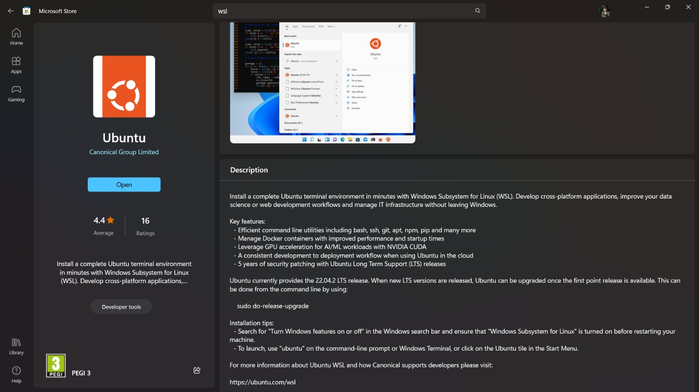

# Install WSL

There are instructions for direct instalation for Windows and there are other methods for having ROS2 in a Windows machine. However, the simplest and safest choice is to use **Windows Subsystem for Linux**. Overall, all tools utilized function better in the Linux subsystem. Moreover, most documentation, inside and outside this repository, is made by Linux users. This option is essentially the installation of the Linux Kernel and file system (corresponding to the latest Ubuntu distribution) on top of the Windows system.

The first step is to obtain it from the Windows Store. Make sure to get the 22.04 version of Ubuntu WSL.

After installation. Make sure to complete the first tip: 
- Search for "Turn Windows feature on or off" in the search bar of Windows and make sure Windows Subsystem for Linux's box is ticked in the control panel window that will open. If it is not, tick it. You will be prompted to reboot the pc.

## Setting Up WSL

Open the Windows Terminal and type ubuntu. The final setup and installation of the Ubuntu WSL will be prompted and, after a few minutes, you will be asked to provide an username and password. After that, the setup is complete. Everytime you want to access WSL you can use its icon on the Start Menu or access it directly through the Windows Terminal, just as depicted in the image below.

.

## Other option - Multipass

[Multipass](https://multipass.run) is a tool to generate cloud-style Ubuntu VMs quickly on Linux, macOS, and Windows.

It gives you a simple but powerful CLI that allows you to quickly access an Ubuntu command line or create your own local mini-cloud.

You can follow the tutorial to the installation [here](https://multipass.run/docs/how-to-guides#heading--install-multipass-).
