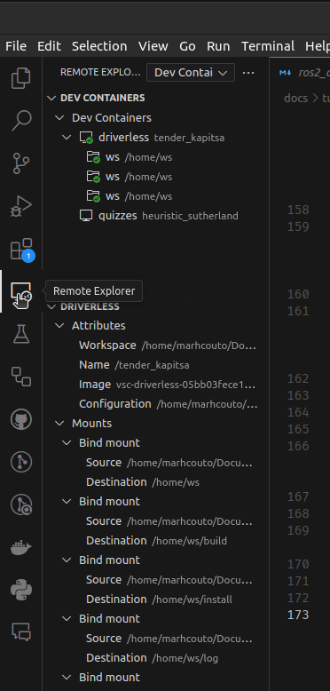
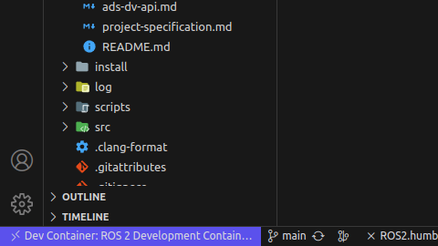

# ROS2 + Docker + VSCode Coding Environment

## Requirements

- Install VSCode: https://code.visualstudio.com/
    - with [Remote Development Extension](https://marketplace.visualstudio.com/items?itemName=ms-vscode-remote.vscode-remote-extensionpack)
- Install Docker Engine (or Desktop): https://docs.docker.com/engine/
- (MacOS) Install [XQuartz](https://www.xquartz.org/)
- (Windows) Install [VcXsrv Windows X Server ](https://sourceforge.net/projects/vcxsrv/)

## Installation Steps

#### Extra for MacOS

Follow all the steps in [the tutorial video](https://www.youtube.com/watch?v=cNDR6Z24KLM), especially the part of allowing connections from network clients in the preferences.

#### Extra for Windows

Run Xlaunch from the start menu and perform the initial configuration.
Make sure to save to the configuration file before you click finish. Save it to one of the following locations: ```%appdata%\Xming %userprofile%\Desktop %userprofile%```

[example of usage](https://www.youtube.com/watch?v=BDilFZ9C9mw)

### Docker Setup

This step goes over how to set up a docker dev container as a development environment for our project. For more information on docker, there is a [tutorial further ahead](https://github.com/fs-feup/autonomous-systems/blob/main/docs/tutorials/docker-tutorial.md) in the startup guide that links some content for education on the topic.

Create a ".devcontainer" folder in the root of this repository and add a "devcontainer.json" and "Dockerfile" to this .devcontainer folder (names and extensions as mentioned). Additionally, you need to create a cache folder in which you can cache the build and install folders for different ROS 2 distros. Make sure to create the distro, build, log, and install folders.

```ssh
project_root
├── cache
|   ├── humble-ros-base-jammy
|   |   ├── build
|   |   ├── install
|   |   └── log
├── .devcontainer
│   ├── devcontainer.json
│   └── Dockerfile
├── src
|   ├── package1
|   └── package2
```

For the Dev Container to function properly, we have to build it with the correct user. Therefore add the following to .devcontainer/devcontainer.json
```json
{
    "name": "ROS 2 Development Container",
    "privileged": true,
    "remoteUser": "user",
    "build": {
        "dockerfile": "Dockerfile",
        "args": {
            "USERNAME": "user"
        }
    },
    "features": {
        "ghcr.io/itsmechlark/features/act:1": {},
        "ghcr.io/devcontainers/features/docker-in-docker:2": {}
    },
    "workspaceFolder": "/home/ws",
    "workspaceMount": "source=${localWorkspaceFolder},target=/home/ws,type=bind",
    "customizations": {
        "vscode": {
            "extensions":[
                "ms-vscode.cpptools",
                "ms-azuretools.vscode-docker",
                "ms-vscode.cpptools-themes",
                "twxs.cmake",
                "donjayamanne.python-extension-pack",
                "eamodio.gitlens",
                "ms-iot.vscode-ros",
                "GitHub.vscode-github-actions"
            ]
        }
    },
    "containerEnv": {
        "DISPLAY": "unix:0",
        "ROS_AUTOMATIC_DISCOVERY_RANGE": "LOCALHOST",
        "ROS_DOMAIN_ID": "42"
    },
    "runArgs": [
        "--net=host",
        "--ipc=host",
        "--pid=host",
        "-e", "DISPLAY=${env:DISPLAY}"
    ],
    "mounts": [
       "source=/tmp/.X11-unix,target=/tmp/.X11-unix,type=bind,consistency=cached",
        "source=/dev/dri,target=/dev/dri,type=bind,consistency=cached",
        "source=${localWorkspaceFolder}/cache/humble-ros-base-jammy/build,target=/home/ws/build,type=bind",
        "source=${localWorkspaceFolder}/cache/humble-ros-base-jammy/install,target=/home/ws/install,type=bind",
        "source=${localWorkspaceFolder}/cache/humble-ros-base-jammy/log,target=/home/ws/log,type=bind"
    ],
    "postCreateCommand": "sudo apt update && rosdep update && rosdep install --from-paths src --ignore-src -y && sudo chown -R user /home/ws/",
	"initializeCommand": "echo Initialize...."
}
```
With CTRL+F find "user" and replace it by your pc user (for sudo access). Run `echo $USERNAME` or `echo $USER` in the terminal if you don't know this.
Next, add the following to the Dockerfile

```dockerfile
FROM ros:humble-ros-base-jammy
ARG USERNAME=user
ARG USER_UID=1000
ARG USER_GID=$USER_UID

# Create the user
RUN groupadd --gid $USER_GID $USERNAME \
    && useradd --uid $USER_UID --gid $USER_GID -m $USERNAME \
    #
    # [Optional] Add sudo support. Omit if you don't need to install software after connecting.
    && apt-get update \
    && apt-get install -y sudo \
    && echo $USERNAME ALL=\(root\) NOPASSWD:ALL > /etc/sudoers.d/$USERNAME \
    && chmod 0440 /etc/sudoers.d/$USERNAME
RUN apt-get update && apt-get upgrade -y
RUN apt-get install -y python3-pip
RUN apt install ros-$ROS_DISTRO-rviz2 -y
RUN apt install openssh-client -y
RUN apt install openssh-server -y
RUN apt update
RUN apt install python-is-python3 -y
RUN pip3 install cpplint
RUN pip install rosbags
RUN apt install clang-format -y
ENV SHELL /bin/bash

# ********************************************************
# * Anything else you want to do like clean up goes here *
# ********************************************************

# [Optional] Set the default user. Omit if you want to keep the default as root.
USER $USERNAME
CMD ["/bin/bash"]
```

Again replace "user" by your user.

### Attaching VSCode to Dev Container

Do CTRL+SHIFT+P and select `Dev Containers: (Re-)build and Reopen in Container` and execute.

**Note:** Everytime graphical features are to be ran on the container, open terminal on host machine (your Ubuntu computer) and run `xhost +local:docker`. You should also run `xhost -local:docker` after using.

### Testing Environment

Run:
```bash
source /opt/ros/humble/setup.bash
rviz2
```
If all correct, should open a window with no errors.

### Set Up C++ Extension

1. Ctrl+Shift+P and write 'C/C++: Edit Configurations (UI)
2. Scroll down to 'Include Path'
3. Add this to the text box:
    ```
    ${workspaceFolder}/**
    /opt/ros/humble/include/**
    /usr/include/**
    ```

## Usage of the Environment

### Notes

The environment is all installed inside a docker container, which works like a lightweight virtual machine, having its own file system, etc. This means ROS2 and all other tools and libraries were not installed in your computer, but inside the container, meaning you won't have access to them in a shell/terminal connected to your computer. The terminal that VSCode opens when inside the docker container is a special terminal that automatically connects to the container, meaning it works inside it. Therefore, all work should be done inside this terminal. You can also [connect your own terminal application to the container](https://kodekloud.com/blog/docker-exec/). The folders between the container and your pc are synchronized with Docker Volumes, so any change in your pc will reflect in the docker and vice versa.

Another important note: as described in the tutorial further ahead on Docker, docker images and docker containers are two different things. If you select rebuild and reopen container again, all changes you made to the container afterwards will be wiped out.

Remember you will always have to run ```source /opt/ros/humble/setup.bash``` every time you open a shell in order to tell it where ROS2 is. If you don't want to do this all the time, add the line to your .bashrc file like so ```echo "source /opt/ros/humble/setup.bash" >> ~/.bashrc```.

### Steps for Usage

1. If using Docker desktop and it does not start on start-up, open it.
2. Open VSCode. If the last project opened in VSCode was this one, it should open inside the container rightaway. If not, proceed with the next steps.
3. Select the remote connection extension on the left side bar.
    
4. Click on the ws folder inside the docker container. Make sure you have the remote explorer selected to dev containers.
5. Check that you are inside the docker container.
    
6. Program