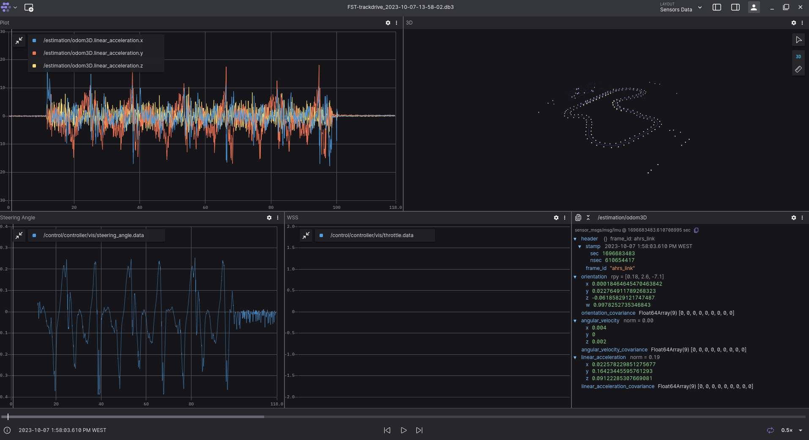
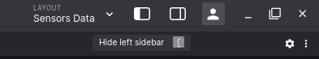

# Foxglove

Foxglove is an open-source tool specifically designed to visualize and debug data from robots. It allows to see data through features like:

* Visualizing different sensor data formats like images, 3D point clouds, etc.
* Overlaying information on the visualizations like bounding boxes and labels.
* Analyzing data in detail with plots and raw message views.

## Foxglove connection

There are several ways for the foxglove to recieve topics:

<p align="center">
  
</p>

* Open local file - For example, running a rosbag in your computer

* Open a connection - Which can be either through a Rosbridge or a Foxglove WebSocket

The Foxglove WebSocket is a good option for transmiting data when connected to the same private network as the car, even allowing you to change parameters of the topics using Foxglove.

### How to connect using Foxglove WebSocket

First open a terminal in the car / docker container and run the following command: 

```
sudo apt install ros-$ROS_DISTRO-foxglove-bridge
```

Then launch it with the following command:

```
ros2 launch foxglove_bridge foxglove_bridge_launch.xml
```

This uses the standard foxglove bridge launch file that can be changed to use another port, instead of the standard one 8765. You can also change the number of threads to use for the ROS node executor. This controls the number of subscriptions that can be processed in parallel. 

For more details see the link `(https://docs.foxglove.dev/docs/connecting-to-data/ros-foxglove-bridge/)`.

After launching the foxglove bridge, in a new terminal install net-tools if you do not have it already

```
sudo apt install net-tools
```

After this run the command and copy the second ip you get (corresponds to the ip of the private network).

```
hostname -I
```

Finally you can go to Foxglove in you computer / outside the docker and connect it via Foxglove WebSocket.

To do that go to Open a new connection > Foxglove WebSocket > and in the url space do: 
```
ws://(ip you got from the previous step):8765
```

You need to change the port if you are changed the port in the launch file of the foxglove bridge. 


## Foxglove layout and panels

The next figure shows a layout of the foxglove, which can be used to see data coming from various sensors.

<p align="center">
  
</p>


You can add a panel to the layout by clicking the second icon in the top left corner. 

There are different panels that can be used, each serving their own purpose.

* The 3D can be used to visualize the PointClouds

* Raw Messages can be used to print the messages the way they are published from the topic. 

* The plot can be used to represent data through time, and compare with other data, as you can add several topics to the same graph

* Diagnostics used to represent diagnostic nodes

* The topic graph used to represent the structure topics its recieving

* Parameters to show the parameters of each topic

* Several others like state transitions, indicators, etc

There is a settings icon to each panel, that can allow you to make several changes to the topic. For example, in the plot on you can choose the title, the legend, the topic you want to plot, change the X and Y axis, among other things.

<p align="center">
  
</p>


On the topic right corner, there are several icons, such as hide / show left sidebar, which allows you to see the topics its recieving as well as see the typic of each topic. This is usefull as each panel only allows certain types to topics to be shown.

There is also a layout tab, that enables you to change between different layouts and change to a layout of the organization. This layouts are common to every member with a foxglove account associated with the Formula Student. 

To add a new personal layout to the organization, click the layout tab on the top right corner, and then right click on the layout you want to share. Then finally do "Share with team...".

With this you should be set to use the Foxglove Studio