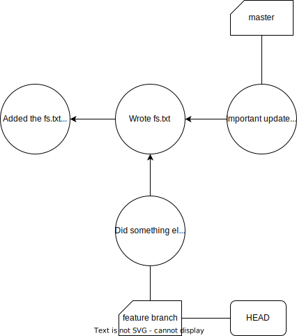
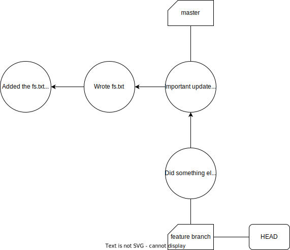

# Advanced Git Tutorial

## Git Rebase

A rebase is kind of like the reverse of a merge. Essentially, when you are in a short lived branch and important updates were introduced into the main branch, you can use rebase to retrieve those important updates. The next two figures denote the git history graph before and after a rebase in branch 'feature-branch' from 'master'.





Contrarily to a merge, these updates will be included before any commits that you have introduced instead of after. Beware that this operation is also susceptible to merge conflicts.

You can also use git rebase to rename and restructure the commits made (like squashing them), with interactive rebase:
```sh
git rebase -i HEAD~3
```
The example allows you to edit the last 3 commits. Just follow the instructions on your text editor, which will open and close multiple times, asking you what actions you want to perform and to rename or select the commits to leave/squash, etc.

The pictures below showcase the process of squashing one commit and renaming another one:
1. Log before
    
2. First text editor: choose actions
    
3. Second text editor: Reword
    
4. Third text editor: choose the commit message to keep after squashing
    
5. Log afterwards
    


## Git stash

Git stash can be used when you want to save the current directory state for later but do not want to add it to the history, for instance when you want to take in updates from a remote but don't want to make a commit out of the current work, as it is not ready yet. It essentially hads the current directory state to a stack (the changes, that is, git only records changes) upon execution of the command ```git stash```. To retrieve these changes, simply use ```git stash pop```. You can also use ```git stash list``` to list all stashed changes and ```git stash drop``` to drop the changes that are currently on the top of the stack (the last ones stashed).

## Git LFS

Git having large files in the git history will make git very slow. Git Large File Storage allows to store larger file in repositories without this problem. All you have to do is:

1. Install git lfs:
    ```sh
    git lfs install
    ```
2. Use the following command to make lfs track certain file patterns instead of normal git:
    ```sh
    git lfs track "*.db3"
    ```
3. Make sure you have staged the gitattributes file (it is where these file pattern configurations are stored).
    ```sh
    git add .gitattributes
    ```

Now every time you would add a .db3 file to the repo, it will be managed by Git LFS.

## Git submodules

Git submodules allows you to add another remote repository to your repository folder, while keeping it synchronized (not just the folder contents of the repo). This means you can add another project as a subfolder of your project which will still actively update according to the updates made by the authors of that repository. Git Submodules adds a file that indicates the submodules a repository has and how they should be configured, but most happens behind the scenes. 

To add a new submodule, run:

```sh
git submodule add <repo url> <directory to add to>
```

In the case of this repository, you will often have to update the submodules you are depending on. If a change is made to the submodules you can do the following to reset the structure:

```sh
git submodule deinit --all -f 
git submodule sync --recursive
git submodule update --init --recursive
```

If changes have been made to the repository which you have a submodule for, just add and commit them as usual. If you want to access the repositories you have as submodule (in case you are their owner), you can just travel to the subfolder they are on and it works just as a normal clone. Finally, if you have changed the remote location or changed a submodule to another repository (for instance, if you forked a repository and you want to use that fork now rather than the original repository), you are advised to follow the update steps mentioned above, as well as these on the sub-folder of the sub-module:

```sh
git pull origin main # or the name of the branch you use
git branch main -f
git checkout main
```
After this, the submodule should be tracking the new repository and be up-to-date.

