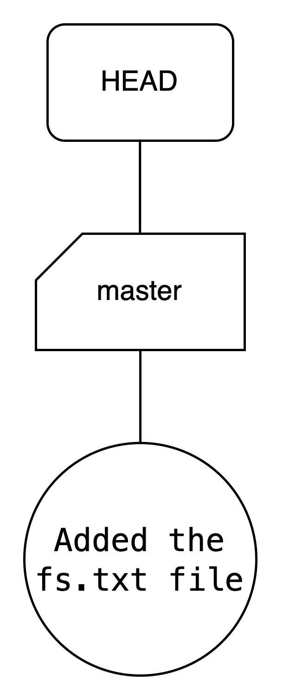
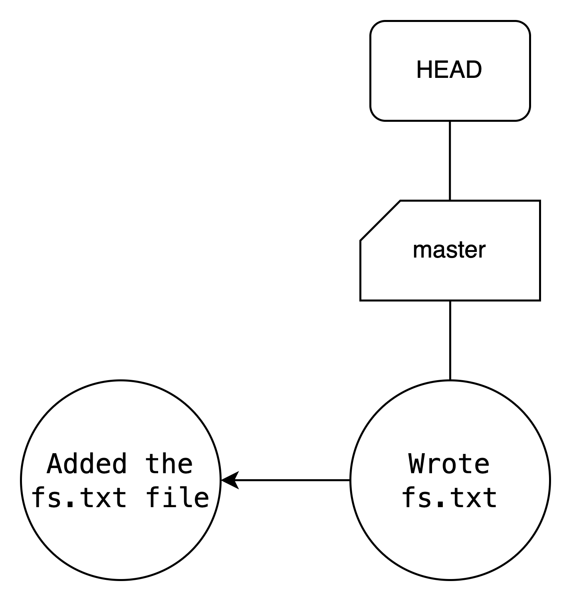
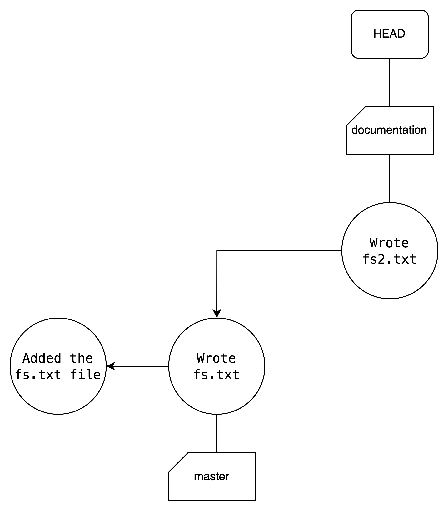
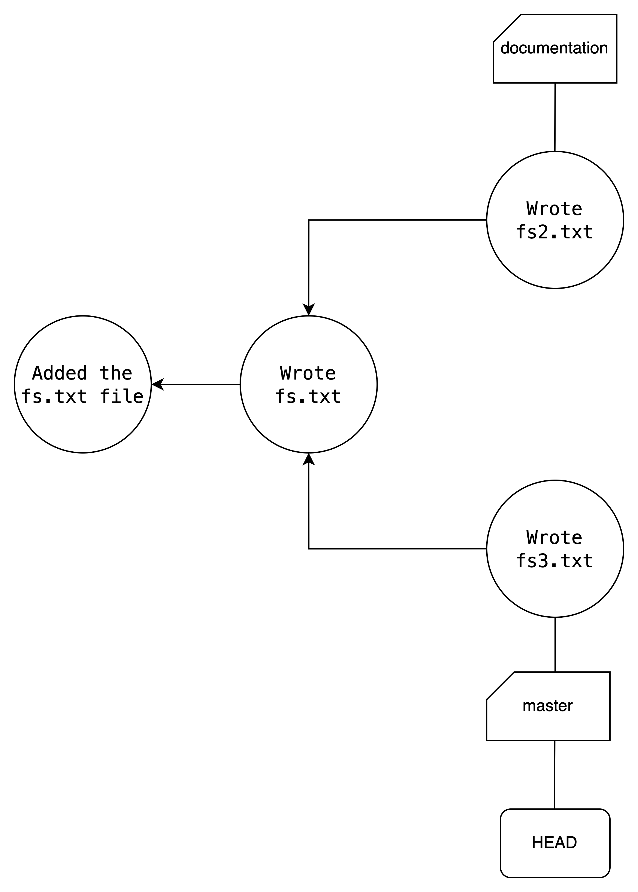
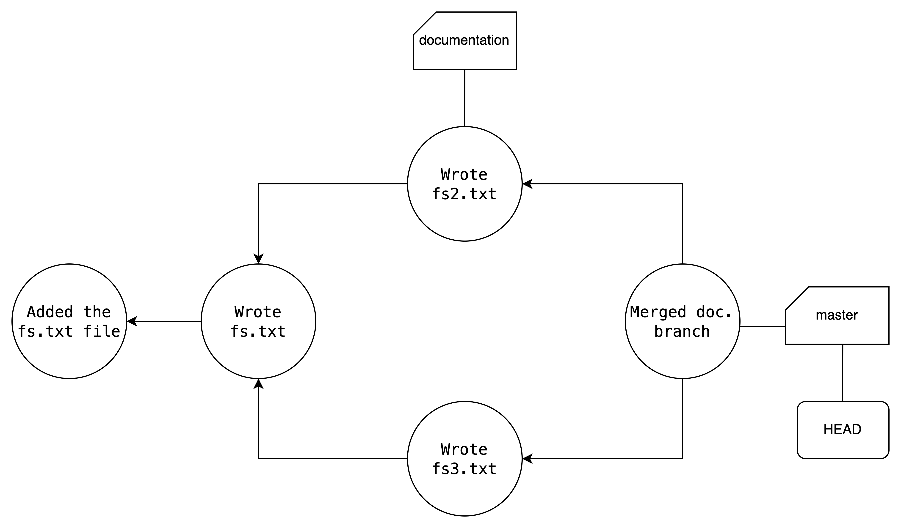

# Git Tutorial

Git is a version control system (VCS) for tracking changes in computer files and coordinating work on those files among multiple people. It records file changes among directories and is creates an history of the changes made. It is also capable of merging different histories of changes into a new file, combining, for instance, the work developed by two different people in parallel, making it popular for collaboration. This tutorial teaches the basics of git.

## Instalation of git

First and foremost, before using Git, you must have it installed. You can follow the steps outlined [here](https://github.com/git-guides/install-git) to complete the installation process.

## Step by step using git

1. **Create a new Directory**

```shell
mkdir git_tutorial
cd git_tutorial 
```

2. **Start a git project**

```shell
git init # Initializes the git repository
```

Now the git repository is created. It is time to test it.

3. **The tracking of the files**

To track the files in the repository, use the command:

```shell
git status
```

Since you do not have any tracked files, the output isn't particularly interesting. Let's create our first file.

```shell
touch fs.txt
```

Running `git status` again will yield a more interesting output, showing that the file `fs.txt` was created.

4. **The staging area**

The staging area consists of tracked files that have been added. It contains the files that will be committed later. To add a file to the staging area, use the following command. Let's use it with `fs.txt`.

```shell
git add fs.txt
```

Alternatively, if you want to add all files to the staging area, use the command

```shell
git add -A
```

5. **Our first commit**

Now that the tracked files are in the staging area, let's make our first commit. In Git, a commit refers to a snapshot of the changes made to files in a repository at a specific point in time. Each commit is accompanied by a unique identifier and a commit message that describes the changes made. To commit our changes, use:

```shell
git commit -m <commit message>
```

In our case, we will commit like this:

```shell
git commit -m "Added the fs.txt file"
```


<p align="center">
  
</p>

Your commits should look like this. We have our commit represented as a bubble. The `master` is the default branch that we are using to develop (more details about branches will be explained later). The `HEAD` is only pointing to the branch that we are developing.


6. **Tracking the commits**

If you want to check the last commits that were made, you can use:

```shell
git log
```

7. **Another commit**

Now, let's modify the `fs.txt` file and follow the same process as before.

```shell
echo "Autonomous Systems" > fs.txt
git add -A
git commit -m "Wrote fs.txt"
git log
```

<p align="center">
  
</p>

Now you have two commits that track changes to the `fs.txt` file.

8. **Creation of Branches**

A Git branch is a parallel version of a repository that allows you to work on different aspects of a project simultaneously, enabling you to make changes without affecting the main codebase until you're ready to merge your work.

We can create a branch this way:

```shell
git branch <branch-name>
```

In our case, we will create a branch named `documentation`:

```shell
git branch documentation
```

To switch to the new branch, use the following command:

```shell
git checkout documentation
```

Alternatively, you can do both steps at once as so:
```shell
git checkout -b documentation
```

If you want to list all the branches, use the command:

```shell
git branch -A
```

9. **Commit to the branch**

Now, follow the procedures from step 7:

```shell
echo "Perception" > fs2.txt
git add fs2.txt
git commit -m "Wrote fs2.txt"
```
<p align="center">
  
</p>

In the figure, we can see now that we not only have the `master` branch that points to a commit, but also we have a `documentation` branch that points to our very last commit.

Then, go back to the master branch and make a small commit like this:

```shell
git checkout master
echo "Planning" > fs3.txt
git add fs3.txt
git commit -m "Wrote fs3.txt"
```

<p align="center">
  
</p>

If you check the commits with `git log`, you will notice that the commit `Wrote fs2.txt` you created isn't there. This is because the commit is on the other branch.

You may test commiting on your branch to garantee that you're conforable with that.

10. **Merging Branches**

Now that you have made all the changes to your file and you're certain it is functional, you can perform an action called `merge`. This action will merge the two branches.

```shell
git checkout master
git merge documentation
```

<p align="center">
  
</p>

With this, the master branch will be updated with the content that was added in the documentation branch.

Note that this command differs from:

```shell
git checkout documentation
git merge master
```

In this case, the documentation branch is the one that is updated. The master branch remains the same.

Beware that sometimes git cannot merge to branches or commits, in some cases where the same document has been altered in both paths, generating a **merge conflict**. In these cases, git will notify you and you will have to edit the documents with conflicts by hand, choosing the prefered version for each part of the documents that are conflicting. You will then have to stage and commit again.

11. **Integration with a remote repository**

Now, we will integrate our local repository with a remote repository, such as GitHub. With GitHub, several people can interact with the same repository. You can follow a step-by-step tutorial on how to integrate your machine with GitHub [here](https://youtu.be/iWs34DO_H2M?feature=shared).


12. **Push the repository to Github**

Next, we need to configure our local repository with the remote one. First, use:

```shell
git remote add origin git@github.com:<your username>/<repository name>.git
```

In a repository originated by clone, there is no need for the previous step.

Then, use the `push` command to update the GitHub repository with our local changes.

```shell
git push
```

## Our Repository Context

If you are already comfortable with Git, the next step is to follow [this tutorial](./contribute.md), which provides tips on cloning the project, installing its dependencies, compiling the code, and running and testing the code. However, here are some additional pieces of advice:

### Commit Rules

There are git norms that must be respected. They essentially enforce following the [conventional commits](https://www.conventionalcommits.org/en/v1.0.0/) logic. Below is presented the logic simplified:

```sh
git commit -m "<commit type>(<scope>): <description>" 
```

Commit types:
- **ref**: refactor (improve something)
- **fix**: fix something broken
- **feat**: add new functionality
- **docs**: documentation related
- **core**: related to chore functionalities of the repo
- (some other you make up if you need, as long as it is perceptible)

You can combine two types like so: "docs-fix(...".

The scope is to which part of the repo changes apply ('loc_map', 'perception', 'static_tools', etc.). There is no limit to the options. If it is something general, it may not have scope.

### Pull Requests

Directly committing to the main (dev) branch should be avoided. Instead, you should create a branch for your development and create a pull request for review when you believe that your work is complete and can be added to the dev branch.

Every pull request must have a reviewer who must approve the pull request. Additionally, the pull request must have the approval of the department leader. When both reviewers approve the pull request, it can be merged.

Another point worth noting is that we use a trunk based development system, where we have one main branch and multiple temporary (feature) branches, where all the work is done. The work is introduced in the main branch through **pull requests**.

### How to Make Pull Requests

Pull Requests are like requests for merging your changes with the main branch. When you want to develop something, you create a new branch from the main one and start doing stuff. You should make regular commits, as it will help if you want to backtrack. When you are finished, you run:

```sh
git push -u origin <name of the branch>
```

With this, you will create a remote branch with the same as yours and tracking your local one, meaning they are linked. After this, just go to Github and create a pull request. There is a tab for this but a comment should pop right away asking you if you want to create one. Just make sure you are merging from your branch to the main branch. Also add a description of what you've done and the id of the task in ClickUp it corresponds to. 

## More information

This tutorial was based on the slides of Prof. André Restivo. You can find them [here](https://paginas.fe.up.pt/~arestivo/slides/?s=git#1) for more precise information about how Git works. You can also check [this tutorial](https://www.youtube.com/watch?v=tRZGeaHPoaw&t=28s). [This cheatsheet](../assets/git_tutorial/git-cheat-sheet-education.pdf) is also very useful, as noone always remembers the commands.
