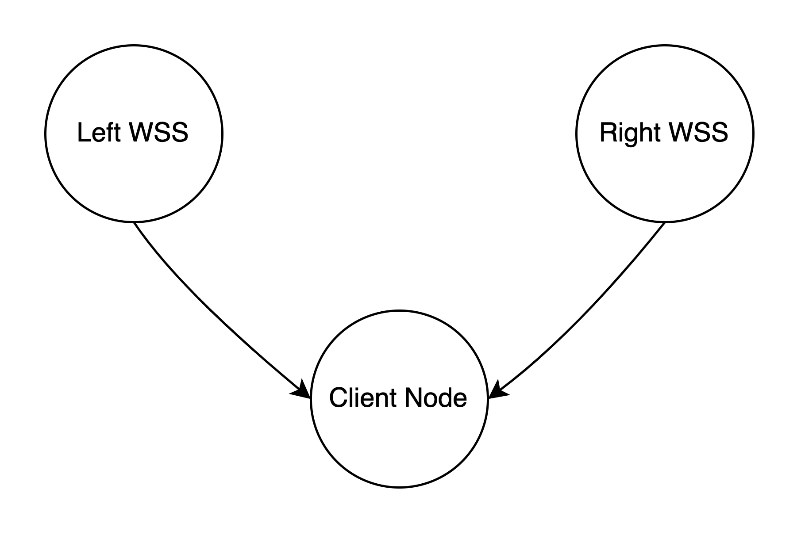

# ROS Message Filters Tutorial in C++ for message synchronization

## Introduction

ROS Message Filters is a powerful tool that facilitates the processing of messages from different topics simultaneously within a ROS node. This tutorial provideS a comprehensive guide to utilizing message filters in C++.

## Prerequisites

Before proceeding, ensure you have a functioning ROS environment and a fundamental understanding of ROS topics and messages.

## Installation

To employ message filters, the `message_filters` package must be installed. Execute the following command in your terminal:

```sh
sudo apt-get install ros-humble-message-filters
```

## Usage

To illustrate the functionality of Message Filters, let's consider a practical scenario: synchronizing data from left and right wheel speed sensors.

<p align="center">
  
</p>

Given that both sensors operate independently, it's essential to synchronize the data they produce. This ensures that when processing the combined data, we're aggregating information from instances with close timestamps. Message filters facilitate this synchronization process.

### Step 1. Creation of the Individual Subscriers

The first step is to define individual subscribers for each of the published topics:

```cpp
// In header file
message_filters::Subscriber<custom_interfaces::msg::WheelRPM> rlRPM_subscription;
message_filters::Subscriber<custom_interfaces::msg::WheelRPM> rrRPM_subscription;
```

```cpp
// In cpp file
rlRPM_subscription.subscribe(this, "rlRPM");
rrRPM_subscription.subscribe(this, "rrRPM");
```

Note: It's __crucial__ to utilize the subscriber class from the message_filters namespace to enable synchronization. Failure to do so will result in an inability to perform the synchronization process effectively.

### Step 2. Defining the Synchronization Policy

The definition of the policy is one of the most important steps of the synchronization process.

Several types of policies exist:

* `TimeSynchronizer`: ensures that messages on multiple topics with the __same__ timestamps are processed together.
* `ApproximateTime`: similar to the `TimeSynchronizer`, but it allows some slop in the timestamps for situations where the data doesn’t need to be perfectly synchronized.
* `Cache`: stores a history of messages and allows you to query for messages around a particular time.
* `Chain`: allows you to create a sequence of filters that process the data in stages.

For our case, the synchronization policy is as follows:

```cpp
typedef message_filters::sync_policies::ApproximateTime<custom_interfaces::msg::WheelRPM, custom_interfaces::msg::WheelRPM> WSSPolicy;
```

It's recommended to utilize a `typedef` to define a synonym for the synchronization policy. This practice is advantageous as it increases readability and maintains clarity, especially considering the large definitions associated with these policies.

### Step 3. Creation of the synchronizer and callback routine configuration

The final step involves creating the synchronizer itself and configuring the callback routine. This step is important as it establishes the mechanism for synchronizing the incoming messages and defines the function that will be executed upon synchronization.

```cpp
const WSSPolicy policy(10);
sync_ = std::make_shared<message_filters::Synchronizer<WSSPolicy>>(policy, rlRPM_subscription, rrRPM_subscription);
sync_->registerCallback(&InspectionMission::inspection_script, this);
```

The callback function, exemplified below, handles the synchronized messages and executes the necessary logic based on the combined data.

```cpp
void InspectionMission::inspection_script(custom_interfaces::msg::WheelRPM current_rlRPM, custom_interfaces::msg::WheelRPM current_rrRPM) {
  // initialization
  auto current_time = std::chrono::system_clock::now();
  auto elapsed_time = (current_time - initial_time).count();
  auto control_command = fs_msgs::msg::ControlCommand();
  float average_rpm = (current_rlRPM.rl_rpm + current_rrRPM.rr_rpm) / 2.0;
  double current_velocity = inspection_object->rpm_to_velocity(average_rpm);

  // calculate steering
  control_command.steering =
      mission == "inspection" ? inspection_object->calculate_steering(elapsed_time / pow(10.0, 9))
                              : 0;

  // calculate torque
  double calculated_torque = inspection_object->calculate_throttle(current_velocity);
  if (calculated_torque > 0) {
    control_command.throttle = calculated_torque;
    control_command.brake = 0;
  } else {
    control_command.brake = -1.0 * calculated_torque;
    control_command.throttle = 0;
  }

  // publish suitable message
  if (elapsed_time < (inspection_object->finish_time) * pow(10, 9)) {
    RCLCPP_DEBUG(this->get_logger(), "Publishing control command. Steering: %f; Torque: %f",
                 control_command.steering, calculated_torque);
    control_command_publisher->publish(control_command);
  } else {
    fs_msgs::msg::FinishedSignal finish;
    finish.placeholder = true;
    finish_publisher->publish(finish);
  }

  // update ideal velocity if necessary
  inspection_object->redefine_goal_velocity(current_velocity);
}
```

## Appendix A - Header files examples and namespaces

```cpp
#include <message_filters/subscriber.h>
#include "message_filters/synchronizer.h"
#include "message_filters/time_synchronizer.h"
#include <message_filters/sync_policies/approximate_time.h>
```

## Appendix B - Important comments

1. The synchronization process relies on the timestamps of the messages. Therefore, it's crucial to ensure that all messages used for synchronization include the Header message. Failure to include this header message will result in an exception being raised.