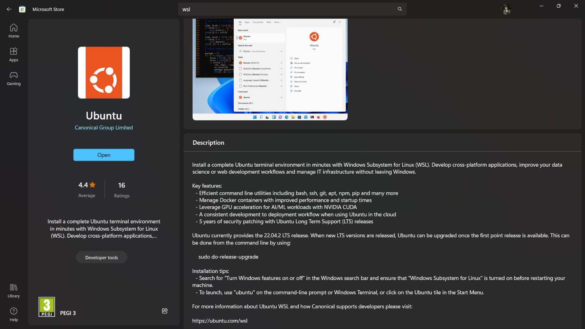
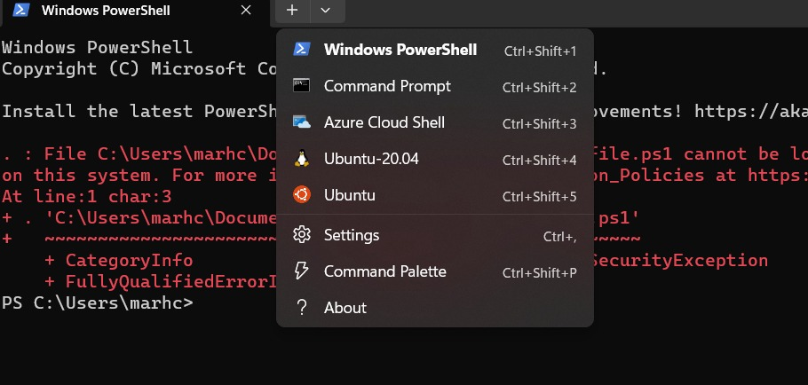

# ROS2 Setup

ROS (Robot Operating System) is a tool that allows engineers to easily program robots, providing a system to integrate programs in the robot as well as very handy tools that would otherwise required implementation. ROS2 is a new version of ROS with a few improvements, but the same core idea. You can check the difference between the two version here.

Both ROS and ROS2 are organized into distributions (releases). These distributions mostly vary in the packages available for usage and their implementations. The distribution that FS FEUP will use in the second year is the ROS2-Humble, as it is the most stable one and with the farthest End-Of-Life. 

This tutorial presents two different manners of setting up ROS2 Humble:
1. Through Mamba Conda and Robostack - fast to perform and easy to remove but limited
2. Normal installation of ROS2 in the system.

The first one can be interesting if you want a quick setup and one that functions well with python virtual environments. However, the second one is the typically recommended one.

### Windows

You can skip this step in case you OS is Ubuntu 22.04. For Windows, some extra steps must be taken, as ROS2 does not have that smooth of an integration with the OS.

#### Install WSL

There are instructions for direct instalation for Windows and there are other methods for having ROS2 in a Windows machine. However, the simplest and safest choice is to use **Windows Subsystem for Linux**. It is essentially the installation of the Linux Kernel and file system (corresponding to the latest Ubuntu distribution) on top of the Windows system.

The first step is to obtain it from the Windows Store. Make sure to get the 22.04 version of Ubuntu WSL.


After installation. Make sure to complete the first tip: 
- Search for "Turn Windows feature on or off" in the search bar of Windows and make sure Windows Subsystem for Linux's box is ticked in the control panel window that will open. If it is not, tick it. You will be prompted to reboot the pc.

#### Setting Up WSL

Open the Windows Terminal and type ubuntu. The final setup and installation of the Ubuntu WSL will be prompted and, after a few minutes, you will be asked to provide an username and password. After that, the setup is complete. Everytime you want to access WSL you can use its icon on the Start Menu or access it directly through the Windows Terminal, just as depicted in the image below.

.


## First Alternative - Mamba, Robostack
**Warning:** This alternative is very easy to set up but is a bit limited and can result in some problems when dealing with other packages and tools such as simulators.
[**Robostack**](https://robostack.github.io/index.html) is a tool that enables the usage of ROS2 inside a conda virtual evironment, which allows for its easy usage in windows and mac environments, as well as tools to utilize ROS2 with Jupyter Notebooks. It's prowess is exactly enabling you to easily set up/change/remove ROS environments without the use of a virtual machine, which also virtualises computer resources and thus renders simulations very slow (not mentioning more complex virtualization environments that also virtualize the GPU). The rest of the document will describe the steps for setting up such an environment for ROS2 development.
### First step - Install Mamba
For those that don't know, **conda** is a package and environment manager. For those that are wondering, **anaconda** is an installer/collection of packages that includes conda and other software development and data science tools for python. On the other hand, miniconda is another conda installer but with minimal extra tools. Finally, **mamba** is a lesser-known alternative installer of conda that offers an implementation of the aforementioned package manager in C++, providing greater speed and smaller wait times in its usage. 
#### Installation
Mambaforge is being substituted by miniforge, which works exactly the same. Click [this link](https://github.com/conda-forge/miniforge/releases/latest/download/Miniforge-pypy3-Linux-x86_64.sh) to download the installation script. Then, travel to the directory the script was saved to and open your terminal/shell:
```sh
bash Miniforge-pypy3-Linux-x86_64.sh
```
Mamba(conda) is now installed. Just reopen your shell and the base environment will already be active. You migh need to had the following lines to the .bashrc/.zshrc/... if they were not added automatically:
```sh
# >>> conda initialize >>>
# !! Contents within this block are managed by 'conda init' !!
__conda_setup="$('/home/marhcouto/miniforge-pypy3/bin/conda' 'shell.zsh' 'hook' 2> /dev/null)"
if [ $? -eq 0 ]; then
    eval "$__conda_setup"
else
    if [ -f "/home/marhcouto/miniforge-pypy3/etc/profile.d/conda.sh" ]; then
        . "/home/marhcouto/miniforge-pypy3/etc/profile.d/conda.sh"
    else
        export PATH="/home/marhcouto/miniforge-pypy3/bin:$PATH"
    fi
fi
unset __conda_setup

if [ -f "/home/marhcouto/miniforge-pypy3/etc/profile.d/mamba.sh" ]; then
    . "/home/marhcouto/miniforge-pypy3/etc/profile.d/mamba.sh"
fi
# <<< conda initialize <<<
```
Additionally run the following command to verify mamba is installed:
```sh
conda install mamba -c conda-forge
```
```sh
conda update -n base -c conda-forge conda
```
### Second step - Create ROS2 environment
Now, we will be creating a mamba environment to develop ROS2 projects, specifically with ROS2 Humble. First create the environment and set up its channels:
```sh
mamba create -n ros_env
mamba activate ros_env

# this adds the conda-forge channel to the new created environment configuration 
conda config --env --add channels conda-forge
# and the robostack channel
conda config --env --add channels robostack-staging
# remove the defaults channel just in case, this might return an error if it is not in the list which is ok
conda config --env --remove channels defaults
```
Then, install ROS2 Humble:
```sh
# Install ros-humble into the environment (ROS2)
mamba install ros-humble-desktop
```
Reset environment:
```sh
mamba deactivate
mamba activate ros_env
```
And lastly, install compiler tools:
```sh
mamba install compilers cmake pkg-config make ninja colcon-common-extensions catkin_tools
```
Additional dependencies for Windows:
```sh
# Install Visual Studio 2017, 2019 or 2022 with C++ support 
# see https://docs.microsoft.com/en-us/cpp/build/vscpp-step-0-installation?view=msvc-160

# Install the Visual Studio command prompt - if you use Visual Studio 2019:
mamba install vs2019_win-64

# Install the Visual Studio command prompt - if you use Visual Studio 2022:
mamba install vs2022_win-64
```
That's it! Enjoy developing using ROS2!
Testing:
```sh
mamba activate ros_env
rviz2
```
### Typical Errors
```sh
OSError: [Errno 24] Too many open files
```
Typical, harmless error. Run the last command again to ensure the action was completed correctly. 

## Second Alternative - Normal ROS2 Installation

There are two alternatives:
- os packages for some OSs
- source code installation and compilation (might fix some problems that the first option may have)
You can find very explicit guides for both methods in [this website](https://docs.ros.org/en/humble/Installation.html).
This chapter describes the guide for installation through packages in Ubuntu.

### Set LOCALE

Make sure you have a locale which supports `UTF-8`. If you are in a minimal environment (such as a docker container), the locale may be something minimal like `POSIX`. We test with the following settings. However, it should be fine if you’re using a different UTF-8 supported locale.

```bash
locale  # check for UTF-8

sudo apt update && sudo apt install locales
sudo locale-gen en_US en_US.UTF-8
sudo update-locale LC_ALL=en_US.UTF-8 LANG=en_US.UTF-8
export LANG=en_US.UTF-8

locale  # verify settings
```

### Setup Sources

You will need to add the ROS 2 apt repository to your system.

First ensure that the [Ubuntu Universe repository](https://help.ubuntu.com/community/Repositories/Ubuntu) is enabled.

```bash
sudo apt install software-properties-common
sudo add-apt-repository universe
```

Now add the ROS 2 GPG key with apt.

```bash
sudo apt update && sudo apt install curl
sudo curl -sSL https://raw.githubusercontent.com/ros/rosdistro/master/ros.key -o /usr/share/keyrings/ros-archive-keyring.gpg
```

Then add repository to your sources list.

```bash
echo "deb [arch=$(dpkg --print-architecture) signed-by=/usr/share/keyrings/ros-archive-keyring.gpg] http://packages.ros.org/ros2/ubuntu $(. /etc/os-release && echo $UBUNTU_CODENAME) main" | sudo tee /etc/apt/sources.list.d/ros2.list > /dev/null
```

### Install ROS2 packages

Update your apt repository caches after setting up the repositories.

```bash
sudo apt update
sudo apt upgrade
```

**Desktop Install:** ROS, RViz, demos, tutorials.

```bash
sudo apt install ros-humble-desktop
```
**Dev tools:**
```sh
sudo apt install ros-dev-tools
```
### Environment Setup

Run every time you open your shell (**important** this is meant to be run in any open shell that wants to use ros2 commands involving **eufs** custom interfaces).

```bash
# Replace ".bash" with your shell if you're not using bash
# Possible values are: setup.bash, setup.sh, setup.zsh
source /opt/ros/humble/setup.bash
```

Or edit your shell rc file

```bash
# Replace ".bash" with your shell if you're not using bash
# Possible values are: setup.bash, setup.sh, setup.zsh
echo "source /opt/ros/humble/setup.bash" >> ~/.bashrc
```

### Some examples

In one terminal, source the setup file and then run a C++ `talker`:

```bash
source /opt/ros/humble/setup.bash
ros2 run demo_nodes_cpp talker
```

In another terminal source the setup file and then run a Python `listener`:

```bash
source /opt/ros/humble/setup.bash
ros2 run demo_nodes_py listener
```

You should see the `talker`
 saying that it’s `Publishing`
 messages and the `listener`
 saying `I heard`
 those messages. This verifies both the C++ and Python APIs are working properly. Hooray!

### Colcon setup

[Colcon](https://colcon.readthedocs.io/en/released/) is a **command line tool** with the goal of improving building, testing and the usage of multi-package software applications in general. Essentially, it is a great **build tool** to help manage ROS2 packages.

#### Setup

```bash
sudo sh -c 'echo "deb [arch=amd64,arm64] http://repo.ros2.org/ubuntu/main `lsb_release -cs` main" > /etc/apt/sources.list.d/ros2-latest.list'
curl -s https://raw.githubusercontent.com/ros/rosdistro/master/ros.asc | sudo apt-key add -
sudo apt update
sudo apt install python3-colcon-common-extensions
```

Install pip3 if you haven’t

```bash
sudo apt install python3-pip
```

```bash
pip3 install colcon-common-extensions -U
```
