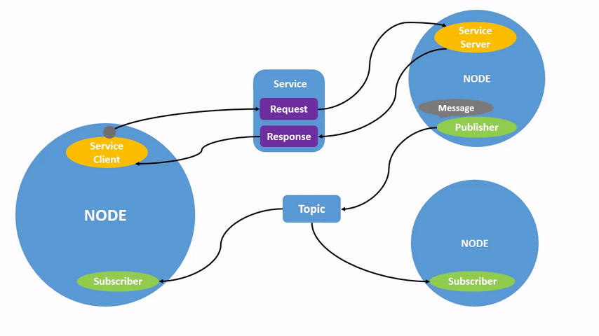
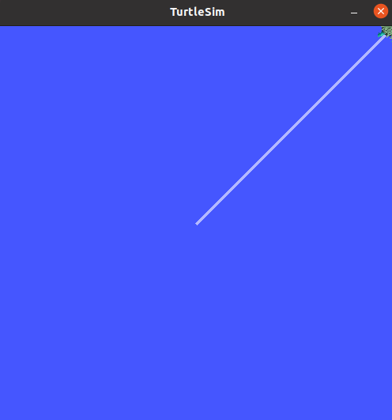
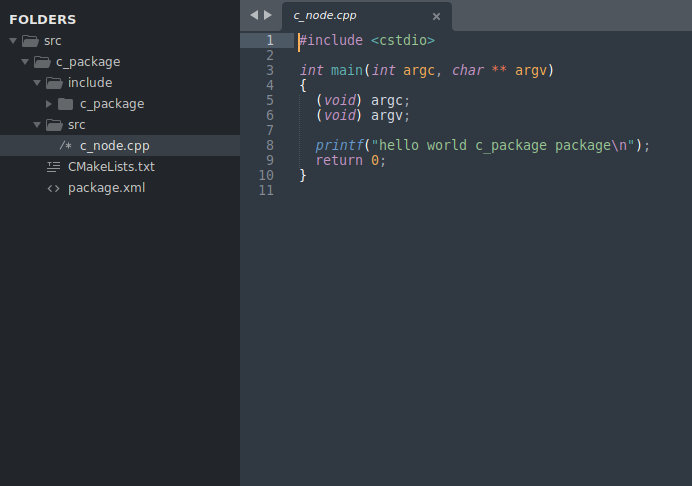
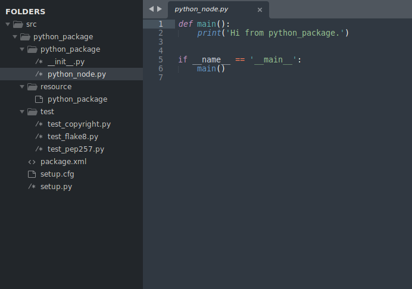
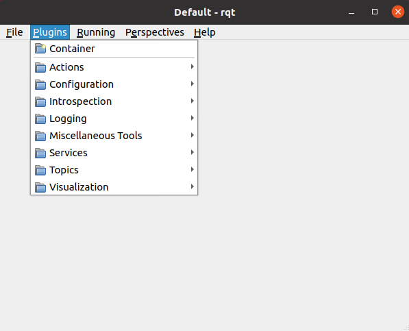

# ROS2 Tutorial

This tutorial is meant to help the developer learn [ROS2](https://docs.ros.org/en/foxy/index.html)'s basics. 

## Keywords

- ROS - Robot Operating System
- ROS2 - New version of ROS that will be used
- ROS and ROS2 are also used to mention the system behind both that is common to one another
- CLI - Command Line Interface

## ROS2 System Overview

### What ROS offers

- an environment where your programs can communicate with each other
- handy robotics tools/algorithms
- other robotics related material online

### ROS Environment

The environment ROS programs run on works similarly to a distributed computers system, where the computers are, in this case, programs/processes. The system is then composed by the **nodes** (the ROS programs/scripts you are running) which have three distinct forms to communicate:

- **Topics -** the nodes communicate in a [Publish/Subscribe](https://www.enjoyalgorithms.com/blog/publisher-subscriber-pattern) paradigm, where nodes can publish events (data) to topics and subscribe topics so that they receive events when they are published
- **Services -** the nodes communicate via a [Client/Server](https://en.wikipedia.org/wiki/Client%E2%80%93server_model) paradigm, where client nodes request data to server nodes in a blocking synchronous fashion (the client awaits the server’s response)
- **Actions -** the nodes communicate via a [Client/Server](https://en.wikipedia.org/wiki/Client%E2%80%93server_model) paradigm, where client nodes request data to server nodes in a non-blocking asynchronous fashion (the client does not wait for the response). Actions are built on top of both topics and services.



### ROS2 Programming

ROS2 projects are organized into packages. Packages are composed by software for one or more nodes. Inside a package, the tendency is to use more or less the same technologies. Multi-package ROS2 projects can be composed of code in multiple different languages and using multiple different build systems. Essentially, a package defines norms for the code written to be traduced into ROS components (TODO: see if this naming is appropriate). 

ROS2 mainly utilizes 2 build systems:

- Python - originates project in Python
- CMake - originates project in C++

There are more languages to which ROS and ROS2 are available. However, these languages’ implementation of ROS is community made and maintained.

ROS2 offers a multitude of tools in the form of code libraries for these programming languages.

### ROS2 CLI (Command Line Interface)

ROS2 also offers a CLI that provides the user with the option to interact with the ROS2 system outside a program, using only a Shell. For instance, you can publish data into a topic through the command line, like a ROS node would, thus interacting with the system. This tool will come in handy on the time of testing and debugging systems, as well as punctual interactions.

## Topics, Services and Actions

In a ROS2 system, nodes can interact through 3 different types of interfaces: ************Actions, Services************ and ************Topics.************ Each of these interfaces have strengths and weaknesses, meaning there is a correct situation to use each of them. According to [documentation](https://docs.ros.org/en/foxy/How-To-Guides/Topics-Services-Actions.html):

### Topics

- System works in a **Publish/Subscribe** fashion
- The publisher decides when data is sent
- The subscriber receives the data when it is available
- **Many-to-Many relation**
- **USAGE:** Good for continuous data streams (sensor data, robot state, …) and real time communication; when there is no needed feedback

### Services

- System works in a **Client/Server (Request/Response)** fashion
- Simple blocking call, client blocks waiting for response
- **USAGE:** Should be used sparingly, good for remote procedure calls that terminate quickly

### Actions

- Built on top of Topics and Services
- Composed by **Goal**, **Feedback** and **Result.** Client node sends a goal to server node, who acknowledges the goal and returns a stream of feedback and the result (if returnable)
- System works in a **Client/Server** fashion but can keep long-lived connections and connections are preemptable (can be canceled)
- More complex implementation
- Can keep state of a goal
- More complex non-blocking background processing; used for longer tasks like execution of robot actions
- **USAGE:** Should be used for discrete behavior that runs for a longer time and that require feedback during execution;

## Nodes, Packages and Executables

**Nodes** are the building block of a ROS system. Nodes can be seen as an entity of the system. **Packages** are more like projects. A Package can define different elements of a ROS system, such as Topics, Nodes, etc. A Package is essentially a bundle of ROS2 resources with defined technologies. An **Executable** is not the same as a Node. In ROS2, an executable is a compiled program that can launch one (typically) or more nodes into the system.

## ROS2 CLI (Command Line Interface)

### Links

- [ROS2 CLI Cheat Sheet](https://github.com/ubuntu-robotics/ros2_cheats_sheet/blob/master/cli/cli_cheats_sheet.pdf)

ROS2 comes with a powerful CLI that enables the user to perform multiple actions. To get information on all commands, we can use ‘ros2’ with the help flag:

```bash
ros2 -h
```

**OUTPUT:**

- action     Various action related sub-commands
- bag        Various rosbag related sub-commands
- component  Various component related sub-commands
- daemon     Various daemon related sub-commands
- doctor     Check ROS setup and other potential issues
- interface  Show information about ROS interfaces
- launch     Run a launch file
- lifecycle  Various lifecycle related sub-commands
- multicast  Various multicast related sub-commands
- node       Various node related sub-commands
- param      Various param related sub-commands
- pkg        Various package related sub-commands
- run        Run a package specific executable
- security   Various security related sub-commands
- service    Various service related sub-commands
- topic      Various topic related sub-commands
- wtf        Use `wtf` as alias to `doctor`

### Run

Run commands allows for the execution of nodes in packages. 

```bash
ros2 run -h
usage: ros2 run [-h] [--prefix PREFIX] package_name executable_name ...

Run a package specific executable

positional arguments:
  package_name     Name of the ROS package
  executable_name  Name of the executable
  argv             Pass arbitrary arguments to the executable

optional arguments:
  -h, --help       show this help message and exit
  --prefix PREFIX  Prefix command, which should go before the executable. Command must be wrapped in quotes if it contains spaces (e.g. --prefix 'gdb -ex run --args').
```

### Node

Node command gives information on, you guessed it, nodes:

```bash
ros2 node -h
# usage: ros2 node [-h] Call `ros2 node <command> -h` for more detailed usage. ...
#
# Various node related sub-commands
#
# optional arguments:
#   -h, --help            show this help message and exit
#
# Commands:
#   info  Output information about a node
#   list  Output a list of available nodes
#
#   Call `ros2 node <command> -h` for more detailed usage.
```

Node info command compacts a lot of information related to the topics the node interacts with and services and actions. **Example:**

```bash
ros2 node /turtlesim info
# /turtlesim
#   Subscribers:
#     /parameter_events: rcl_interfaces/msg/ParameterEvent
#     /turtle1/cmd_vel: geometry_msgs/msg/Twist
#   Publishers:
#     /parameter_events: rcl_interfaces/msg/ParameterEvent
#     /rosout: rcl_interfaces/msg/Log
#     /turtle1/color_sensor: turtlesim/msg/Color
#     /turtle1/pose: turtlesim/msg/Pose
#   Service Servers:
#     /clear: std_srvs/srv/Empty
#     /kill: turtlesim/srv/Kill
#     /reset: std_srvs/srv/Empty
#     /spawn: turtlesim/srv/Spawn
#     /turtle1/set_pen: turtlesim/srv/SetPen
#     /turtle1/teleport_absolute: turtlesim/srv/TeleportAbsolute
#     /turtle1/teleport_relative: turtlesim/srv/TeleportRelative
#     /turtlesim/describe_parameters: rcl_interfaces/srv/DescribeParameters
#     /turtlesim/get_parameter_types: rcl_interfaces/srv/GetParameterTypes
#     /turtlesim/get_parameters: rcl_interfaces/srv/GetParameters
#     /turtlesim/list_parameters: rcl_interfaces/srv/ListParameters
#     /turtlesim/set_parameters: rcl_interfaces/srv/SetParameters
#     /turtlesim/set_parameters_atomically: rcl_interfaces/srv/SetParametersAtomically
#   Service Clients:
#
#   Action Servers:
#     /turtle1/rotate_absolute: turtlesim/action/RotateAbsolute
#   Action Clients:
```

### Interface

Interface command allows the user to get information on the format of messages for the 3 different types of interfaces, as well as the interfaces defined in a packages, etc.

```bash
ros2 interface -h
# usage: ros2 interface [-h]
#                       Call `ros2 interface <command> -h` for more detailed
#                       usage. ...
# 
# Show information about ROS interfaces
# 
# optional arguments:
#   -h, --help            show this help message and exit
# 
# Commands:
#   list      List all interface types available
#   package   Output a list of available interface types within one package
#   packages  Output a list of packages that provide interfaces
#   proto     Output an interface prototype
#   show      Output the interface definition
# 
#   Call `ros2 interface <command> -h` for more detailed usage.
```

To get information, for instance, on the format of the requests of a certain service:

```bash
ros2 interface show <service_name>
# or
ros2 interface proto <service_name>
```

‘interface show’ shows the type definitions of the parameters while proto shows a string format of the message. **Example:**

```bash
# Check the messages for /cmd topic 
ros2 topic info /cmd
# OUTPUT
# Type: ackermann_msgs/msg/AckermannDriveStamped
# Publisher count: 1
# Subscription count: 1
# Check the message format
ros2 interface proto ackermann_msgs/msg/AckermannDriveStamped
# OUTPUT
# "header:
#   stamp:
#     sec: 0
#     nanosec: 0
#   frame_id: ''
# drive:
#   steering_angle: 0.0
#   steering_angle_velocity: 0.0
#   speed: 0.0
#   acceleration: 0.0
#   jerk: 0.0
# "
```

### Pkg

Pkg command is useful to find out what packages you have installed, as well as information on specific packages.

```bash
ros2 pkg -h
# usage: ros2 pkg [-h] Call `ros2 pkg <command> -h` for more detailed usage. ...
#
# Various package related sub-commands
#
# optional arguments:
#   -h, --help            show this help message and exit
#
# Commands:
#   create       Create a new ROS 2 package
#   executables  Output a list of package specific executables
#   list         Output a list of available packages
#   prefix       Output the prefix path of a package
#   xml          Output the XML of the package manifest or a specific tag
#
#   Call `ros2 pkg <command> -h` for more detailed usage.
```

If you are wondering what you might be able to run in a package, you can use **executables** command. **Example:**

```bash
ros2 pkg executables turtlesim
# turtlesim draw_square
# turtlesim mimic
# turtlesim turtle_teleop_key
# turtlesim turtlesim_node
```

### Topic

Topic command allows the user to attain information on topics, as expected.

```bash
ros2 topic -h
# usage: ros2 topic [-h] [--include-hidden-topics]
#                   Call `ros2 topic <command> -h` for more detailed usage. ...
# 
# Various topic related sub-commands
#
# optional arguments:
#   -h, --help            show this help message and exit
#   --include-hidden-topics
#                         Consider hidden topics as well

# Commands:
#   bw     Display bandwidth used by topic
#   delay  Display delay of topic from timestamp in header
#   echo   Output messages from a topic
#   find   Output a list of available topics of a given type
#   hz     Print the average publishing rate to screen
#   info   Print information about a topic
#   list   Output a list of available topics
#   pub    Publish a message to a topic
#   type   Print a topic's type
#
#   Call `ros2 topic <command> -h` for more detailed usage. 
```

topic info command shows the publishers and subscribers (nodes) of the topic, as well as the type (message format name). **Example:**

```bash
ros2 topic list
# /parameter_events
# /rosout
ros2 topic info /parameter_events
# Type: rcl_interfaces/msg/ParameterEvent
# Publisher count: 1
# Subscription count: 0
```

topic pub command is useful to interact with the ROS environment without the need of a program. **Example:**

```bash
# node /turtlesim is running
ros2 node /turtlesim info
# /turtlesim
#   Subscribers:
#     /parameter_events: rcl_interfaces/msg/ParameterEvent
#     /turtle1/cmd_vel: geometry_msgs/msg/Twist
#   Publishers:
#     /parameter_events: rcl_interfaces/msg/ParameterEvent
#     /rosout: rcl_interfaces/msg/Log
#     /turtle1/color_sensor: turtlesim/msg/Color
#     /turtle1/pose: turtlesim/msg/Pose
#   Service Servers:
#     /clear: std_srvs/srv/Empty
#     /kill: turtlesim/srv/Kill
#     /reset: std_srvs/srv/Empty
#     /spawn: turtlesim/srv/Spawn
#     /turtle1/set_pen: turtlesim/srv/SetPen
#     /turtle1/teleport_absolute: turtlesim/srv/TeleportAbsolute
#     /turtle1/teleport_relative: turtlesim/srv/TeleportRelative
#     /turtlesim/describe_parameters: rcl_interfaces/srv/DescribeParameters
#     /turtlesim/get_parameter_types: rcl_interfaces/srv/GetParameterTypes
#     /turtlesim/get_parameters: rcl_interfaces/srv/GetParameters
#     /turtlesim/list_parameters: rcl_interfaces/srv/ListParameters
#     /turtlesim/set_parameters: rcl_interfaces/srv/SetParameters
#     /turtlesim/set_parameters_atomically: rcl_interfaces/srv/SetParametersAtomically
#   Service Clients:
#
#   Action Servers:
#     /turtle1/rotate_absolute: turtlesim/action/RotateAbsolute
#   Action Clients:
ros2 interface proto geometry_msgs/msg/Twist
# "linear:
#   x: 0.0
#   y: 0.0
#   z: 0.0
# angular:
#   x: 0.0
#   y: 0.0
#   z: 0.0
# "
ros2 topic pub -h
# usage: ros2 topic pub [-h] [-r N] [-p N] [-1 | -t TIMES] [--keep-alive N] [-n NODE_NAME]
#                       [--qos-profile {unknown,system_default,sensor_data,services_default,parameters,parameter_events,action_status_default}]
#                       [--qos-depth N] [--qos-history {system_default,keep_last,keep_all,unknown}]
#                       [--qos-reliability {system_default,reliable,best_effort,unknown}]
#                       [--qos-durability {system_default,transient_local,volatile,unknown}]
#                       topic_name message_type [values]
#
# Publish a message to a topic
#
# positional arguments:
#   topic_name            Name of the ROS topic to publish to (e.g. '/chatter')
#   message_type          Type of the ROS message (e.g. 'std_msgs/String')
#   values                Values to fill the message with in YAML format (e.g. 'data: Hello World'),
#                         otherwise the message will be published with default values
#
# optional arguments:
#   -h, --help            show this help message and exit
#   -r N, --rate N        Publishing rate in Hz (default: 1)
#   -p N, --print N       Only print every N-th published message (default: 1)
#   -1, --once            Publish one message and exit
#   -t TIMES, --times TIMES
#                         Publish this number of times and then exit
#   --keep-alive N        Keep publishing node alive for N seconds after the last msg (default: 0.1)
#   -n NODE_NAME, --node-name NODE_NAME
#                         Name of the created publishing node
#   --qos-profile {unknown,system_default,sensor_data,services_default,parameters,parameter_events,action_status_default}
#                         Quality of service preset profile to publish with (default:
#                         system_default)
#   --qos-depth N         Queue size setting to publish with (overrides depth value of --qos-profile
#                         option)
#   --qos-history {system_default,keep_last,keep_all,unknown}
#                         History of samples setting to publish with (overrides history value of
#                         --qos-profile option, default: system_default)
#   --qos-reliability {system_default,reliable,best_effort,unknown}
#                         Quality of service reliability setting to publish with (overrides
#                         reliability value of --qos-profile option, default: system_default)
#   --qos-durability {system_default,transient_local,volatile,unknown}
#                         Quality of service durability setting to publish with (overrides
#                         durability value of --qos-profile option, default: system_default)
# ros2 topic pub -t <times> <topic_name> <message_type> <message_content>
ros2 topic pub -t 4 /turtle1/cmd_vel geometry_msgs/msg/Twist "linear:
  x: 2.0
  y: 2.0
  z: 0.0
angular:
  x: 0.0
  y: 0.0
  z: 0.0
"
```

**Aftermath:**



## Create Basic ROS2 Package

A ROS2 package is like a container of ROS2 software. It can contain code for nodes, services, topics, messages… a whole ROS2 subsystem. By default, you can create a ROS2 package with two different build tools:

- Python - originates project in Python
- CMake - originates project in C++

### Create Package

To create a simple single node package:

**CMAKE**

```bash
cd [project_dir]
mkdir src
cd src
ros2 pkg create --build-type ament_cmake --node-name [desired_node_name] [desired_package_name] # CMake version
```



**PYTHON**

```bash
cd [project_dir]
mkdir src
cd src
ros2 pkg create --build-type ament_python --node-name [desired_node_name] [desired_package_name]
```



These commands will originate a folder structure as well as:
- a package.xml file, which defines the package, dependencies and other important properties
- setup.py files or CMakeLists.txt files, which help with the building process, also defining dependencies, paths, libraries and other definitions

### Compile

#### Source ROS
Whenever you open a new shell, you **must** run the following command:

```bash
source /opt/ros/humble/setup.bash
```

This command tells the shell where the compilation results are, in this case, where ROS itself is.

If you don't want to always do this, add it to the shell startup file. Bash case:

```bash
echo "source /opt/ros/humble/setup.bash" >> ~/.bashrc
```

#### Compilation

To compile any project, go to the base folder (parent folder to src)

```bash
colcon build 
```

If you only wish to **compile specific packages**, you can use the following command:
```sh
colcon build --packages-select [your package and others necessary]
```


### Run setup file

Whenever you open a new shell, you **must** run the following command:

```bash
source install/setup.bash
```

This command tells the shell where the compilation results are.

### Run node

To run package:

```bash
ros2 run [package_name] [node_name]
```
#### Launching

Running a node is different from launching because running will only execute one node while launching can execute multiple nodes. Launching can be done with the aid of launch files, which can define particular scenarios with combinations of nodes from multiple packages and their respective arguments.

Launch file example:

```python
from launch import LaunchDescription
from launch_ros.actions import Node

def generate_launch_description():
    return LaunchDescription([
        Node(
            package='turtlesim',
            namespace='turtlesim1',
            executable='turtlesim_node',
            name='sim'
        ),
        Node(
            package='turtlesim',
            namespace='turtlesim2',
            executable='turtlesim_node',
            name='sim'
        ),
        Node(
            package='turtlesim',
            executable='mimic',
            name='mimic',
            remappings=[
                ('/input/pose', '/turtlesim1/turtle1/pose'),
                ('/output/cmd_vel', '/turtlesim2/turtle1/cmd_vel'),
            ]
        )
    ])
```

## Logging

ROS2's logging system works on 5 levels:
- DEBUG: Information that you never need to see if the system is working properly.
- INFO: Small amounts of information that may be useful to a user.
- WARN: Information that the user may find alarming, and may affect the output of the application, but is part of the expected working of the system.
- ERROR: Something serious (but recoverable) has gone wrong.
- FATAL: Something unrecoverable has happened.

To control the level of logging in which a node is executing, use the log-level ros argument as so:
```sh
ros2 run [package_name] [node_name] --ros-args --log-level [level]
```

## RQT

rqt is a Qt-based framework for GUI development for ROS. Essentially, it enables the construction of simple GUIs for ROS programs.

```bash
rqt
```



You can not only construct GUIs with it, but it also serves as a GUI for ROS2 itself, as you can consult information on topics, subscribers and others without previously programming these interfaces.

## RCLPY and RCLCPP

RCLPY and RCLCPP are two libraries, for CPP and Python respectively, used to ease the interaction with the ROS2 system and create Object Oriented programs with multiple nodes. We shall be using these libraries for all our nodes. Follow [this tutorial](https://docs.ros.org/en/foxy/Tutorials/Beginner-Client-Libraries/Writing-A-Simple-Cpp-Publisher-And-Subscriber.html) to get started using the libraries to create nodes.

## Extra tutorials

- [Beginner tutorials](https://www.youtube.com/watch?v=0aPbWsyENA8&list=PLLSegLrePWgJudpPUof4-nVFHGkB62Izy)
- [Official tutorials](https://docs.ros.org/en/humble/Tutorials.html)