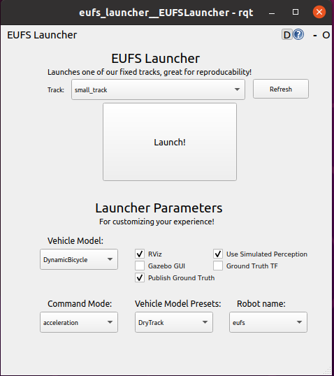
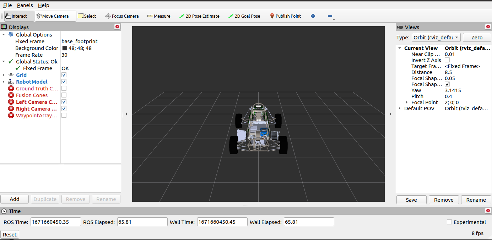
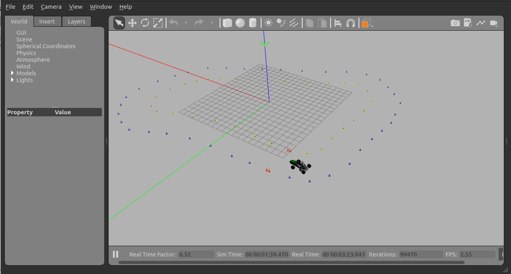
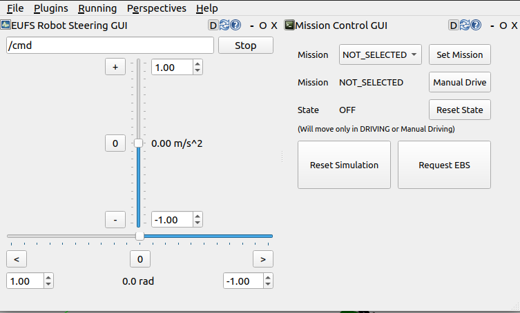
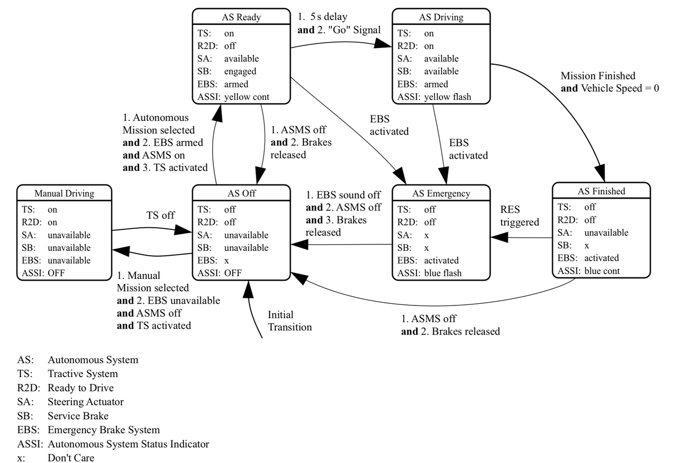
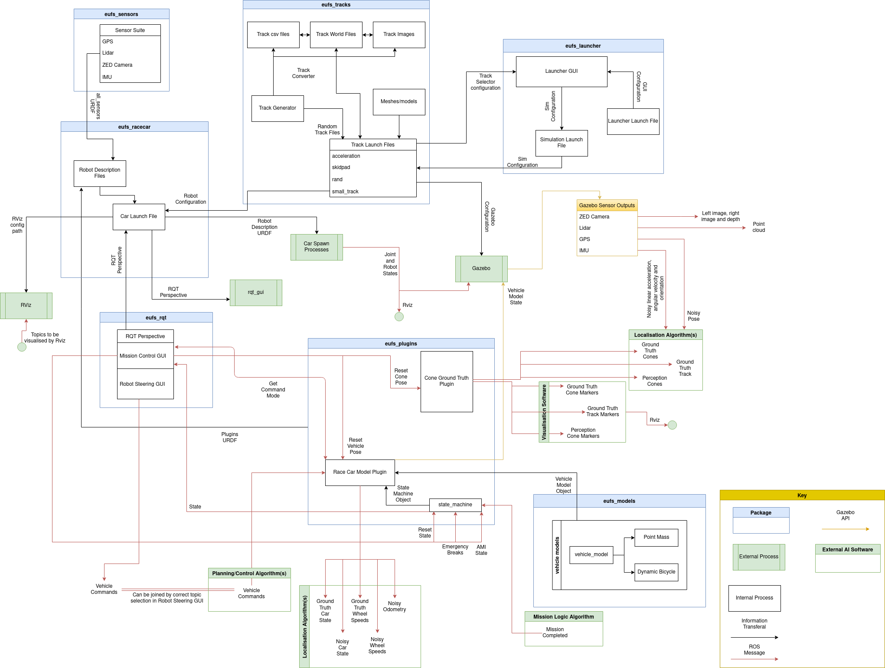
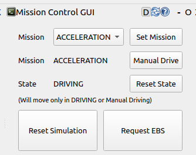
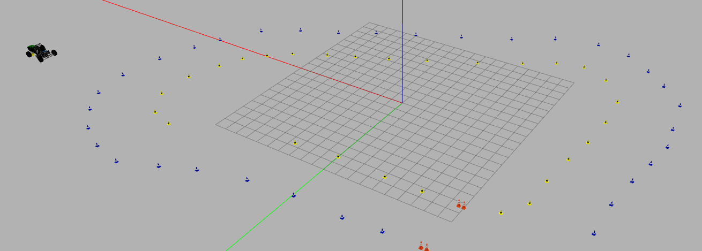

# EUFS SIM Tutoria

This tutorial is meant to aid the user understand the basics of the EUFS Simulator.

## Links

- [EUFS SIM repo](https://gitlab.com/eufs/eufs_sim)
- [ROS2 galactic documentation](https://docs.ros.org/en/galactic/index.html)

## Keywords

- ROS - Robot Operating System
- ROS2 - New version of ROS that will be used
- ROS and ROS2 are also used to mention the system behind both that is common to one another
- CLI - Command Line Interface
- SIM - Simulator

## Launcher Menu

The first thing presented to the user after launch is the EUFS SIM launcher GUI:

In this menu, the user can choose:

- **GUI** **for the Simulator** - RViz is default but Gazebo seems better to visualize events (you can use both)
- **Vehicle Model:** the physical vehicle model to be used - Dynamic Bicycle or Point Mass (more can be created)
- **Track** (pista)
- **Command Mode:** TODO: figure what this does
- **Robot Name**
- **Vehicle Model Presets** - wet track vs dry track
- Etc.



## GUIs

### RViz

The RViz GUI has many functionalities:

- Visualize the car model up close
- Investigate properties on the model of the car (measurement and others)
- TODO: search functionalities and complete this part



### Gazebo

The Gazebo GUI seems a little bit more intuitive for the simulation of events. Functionalities:

- Visualize the track
- Check properties of the surrounding environment (sun position, cones position and properties, atmosphere and wind properties)
- Change camera view points and configurations
- TODO: search functionalities and complete this part



## RQT

Together with the program, the RQT is also launched, with a GUI constructed to ease the configuration of the event/mission to be performed. It enables the user to:

- Select the Mission for the vehicle to perform through the **************************************Mission Control GUI**************************************. The mission can also be set to ‘Manual Drive’
- Control the vehicle manually through the **********************************************EUFS Robot Steering GUI**********************************************; this GUI only works when the mission set is ‘Manual Drive’
- Set the name of the topic from where the vehicle should read the steering and control information in case of an autonomous driving mission



The following image depicts how the state machine defining the robots state works with inputs on the RQT GUI.



To better understand the simulator mission system, it is advised to read the [full wiki page](https://gitlab.com/eufs/eufs_sim/-/wikis/State-Machine) from where this picture was taken.

## Interaction Via ROS2

The simulator’s purpose is to test the system we are developing in a simulated environment closely resembling the real environment of FS-AI. Having said that, the most important part of the simulator is how to interact with it via our programs, meaning, the opposite of manual drive.

The repo provides a diagram that illustrates how the system is suppose to work with the integration of the modules to develop by our team.



### Using CLI - Publishing to Control

When launching the GUI, the RQT GUI will show a topic name that can be redefined. This topic is the topic from where the simulator will receive the control information to drive the car. The default topic is **/cmd**. To obtain the message format:

 

```bash
# Check the messages for /cmd topic 
ros2 topic info /cmd
# OUTPUT
# Type: ackermann_msgs/msg/AckermannDriveStamped
# Publisher count: 1
# Subscription count: 1
# Check the message format
ros2 interface proto ackermann_msgs/msg/AckermannDriveStamped
# OUTPUT
# "header:
#   stamp:
#     sec: 0
#     nanosec: 0
#   frame_id: ''
# drive:
#   steering_angle: 0.0
#   steering_angle_velocity: 0.0
#   speed: 0.0
#   acceleration: 0.0
#   jerk: 0.0
# "
```

Posterior to that, you need to certify that the simulator is in ‘****DRIVING’**** mode and in an self-driving event.



Mission Control GUI on Driving mode in Acceleration event

To publish a message:

```bash
# Publish once
ros2 topic pub -1 /cmd ackermann_msgs/msg/AckermannDriveStamped "header:
  stamp:
    sec: 0
    nanosec: 0
  frame_id: ''
drive:
  steering_angle: 0.0
  steering_angle_velocity: 0.0
  speed: 0.0
  acceleration: 2.0
  jerk: 0.0
"
# Publish 5 times
ros2 topic pub -t 5 /cmd ackermann_msgs/msg/AckermannDriveStamped "header:
  stamp:
    sec: 0
    nanosec: 0
  frame_id: ''
drive:
  steering_angle: 0.0
  steering_angle_velocity: 0.0
  speed: 0.0
  acceleration: 2.0
  jerk: 0.0
"
# /cmd topic does not support recursive publication of a message through CLI
```

Aftermath of the latter command:



### Using a Node (via programming) - Publishing to Control

TODO: Complete this

### Using CLI - Reading Sensor Data

TODO: Investigate where camera data comes from

### Using a Node (via programming) - Publishing Sensor Data

# Notes

- ~~Weird error when trying to get information on the groundtruth topics of the SIM: “The passed message type is invalid” and “The message type 'eufs_msgs/msg/ConeArrayWithCovariance' is invalid”~~ (problem is solved by running `source install/setup.bash` in every new shell that is open).
