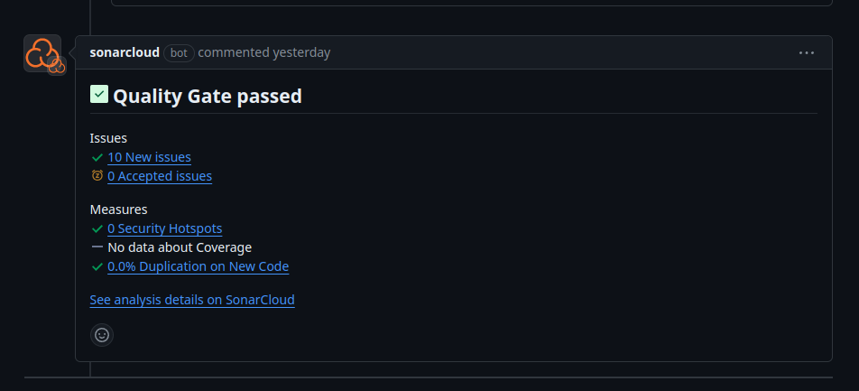
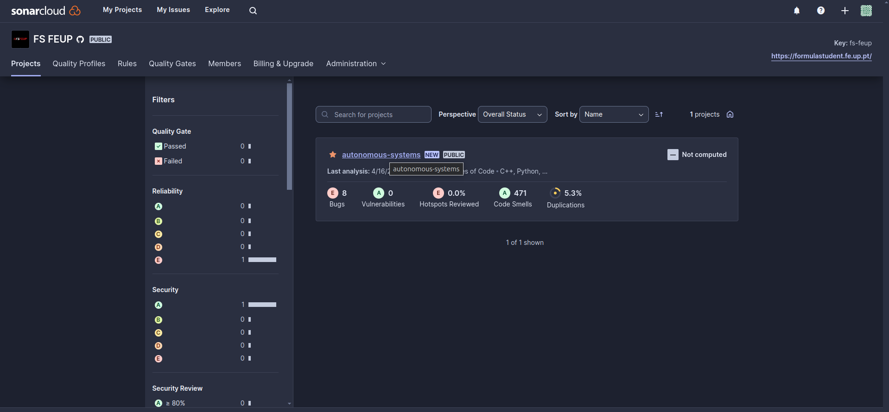
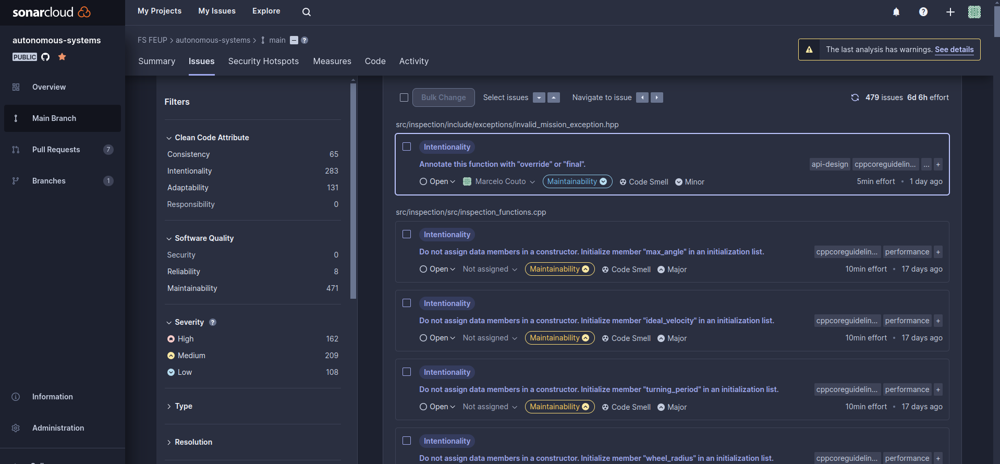
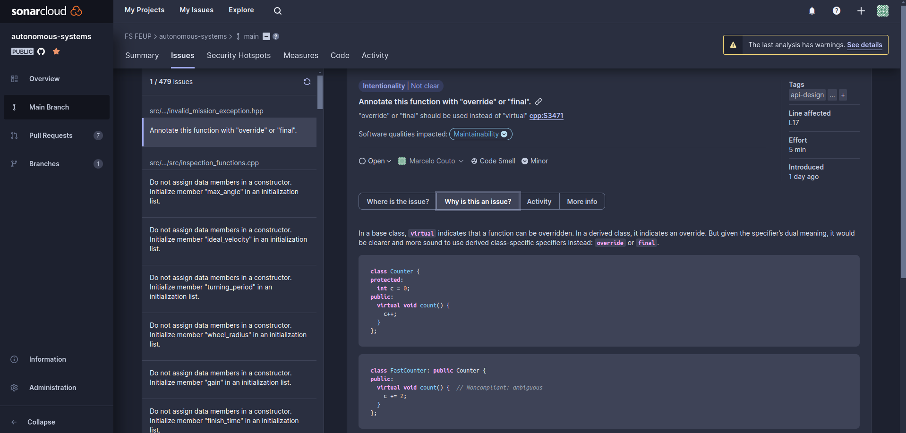
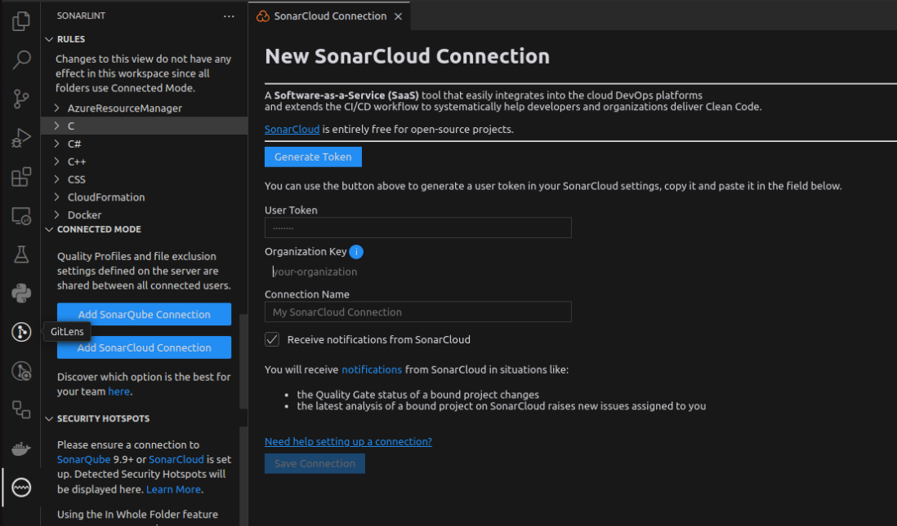
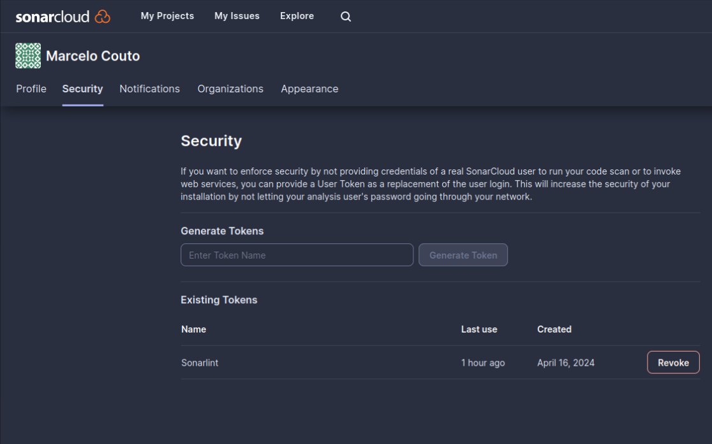
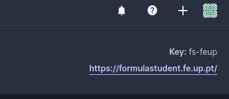
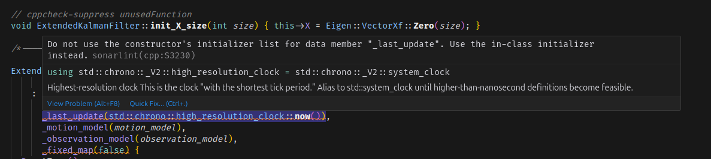
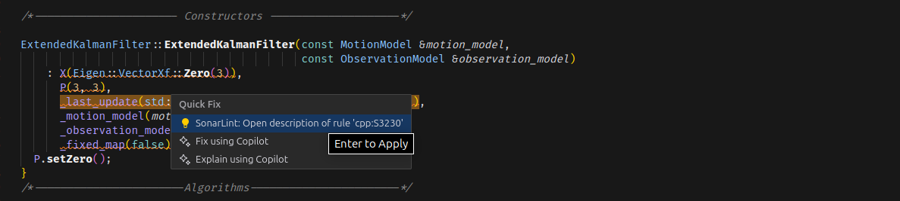
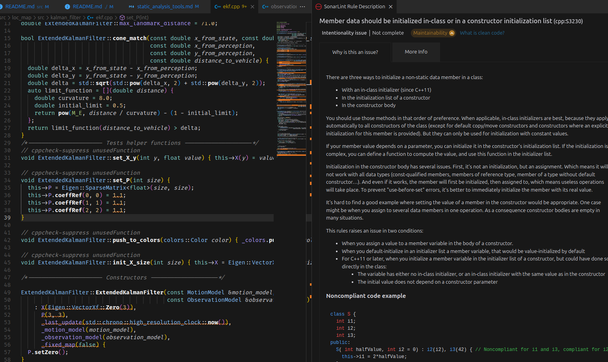

# Static Analysis Tools

This tutorial mentions the multiple static analysis tools setup in this project and teaches the developer how to use them.

**NOTES:** 
- All the tools are already installed in the devcontainer. If you are not using the container, you should consult the installation commands in the [Dockerfile](../../.devcontainer/Dockerfile).
- We used to use a few separate tools configured to run in Pull Requests such as CPPCheck and CPPLint. We have moved to use Sonar tools.

## Formatters

We use two tools for formatting code:
- **black** for python
- **clang-format** for C++

Both can be run by using the [format.sh script](../../format.sh), but they are also configured to run on file save by the [vscode settings.json file](../../.vscode/settings.json).

## Sonarcloud

Sonarcloud is a static analysis services. It is configured in our project to analyze our code and generate reports on it. It runs upon push to main or pull request. 

### Access
When in a Pull Request, a short summary is provided as a comment:



You can access more details about the report by clicking in any link of the ones in the comment. You can also access the Sonarcloud platform [via link](https://sonarcloud.io/organizations/fs-feup/projects?sort=name), which is also in the Notion department's home page.

### Home Page
The project's home page at Sonarcloud looks like this:



The projects of the team are listed in the projects tab, along with metrics regarding code quality. Other tabs include:

- **Quality Profiles:** define groups of rules that are active for different languages
- **Rules:** showcase the specific rules the code must comply with
- **Quality Gates:** define limits that pull requests must fulfill to be considered valid, such as minimum code coverage or maximum bugs

The other tabs shown are only present if you have an administrator account in sonarcloud.

### Project
Upon entering a project, there are four main views:

- **Overview:** provides a general view on the project
- **Main Branch:** details on the main branch
- **Pull Requests:** open pull requests and details on them
- **Branches:** details on other analyzed branches

Both the branches and each pull request provide a similar view, which enables an in-depth analysis on the quality of the code and the detected issues:

- **Summary:** quick summary on the state and problems of the code in that branch or PR
- **Issues:** shows information on all the issues regarding that branch or PR
    
    The issues presented were raised by static analysis tools from Sonar itself, to verify code quality on multiple dimensions:
    - **Type:** Code Smell, Bug or Vulnerability
    - **Severity:** High, Medium or Low
    - **Software Quality:** Reliability, Security and Maintainability
    
    Among others...

    It also allows advanced search and filter capabilities
- **Security Hotspots:** similar to issues, but focuses on code that could present security vulnerabilities specifically.
- **Measures:** provides information on the state of the branch of PR through insightful plots and statistics
- **Code:** allows for issues and bugs to be searched via file, by presenting a directory structure
- **Activity:** irrelevant mostly

### Issues and Security Hotspots

Each issue and security hotspot is accompanied by information regarind its location and cause, reasoning behing the classification, rules used and sometimes even possible fixes (specific fixes for that situation, on top of the general suggestions provided in the *Where is this issue?* and *Why is this an issue?* tabs).



## Sonarlint

Sonarlint is an extension for VSCode that allows for immediate static analysis on code development. 

### Set Up

The tool must be configured before it can be used:
1. Connect sonarlint to the organization in Sonarcloud
    
    1. Create an account linked to your github account
    2. Click in generate token
        
    3. Add your organziation key
        
    4. Add connection name
    5. Save connection
2. Provide sonarlint with a compile_commands.json, which allows it to understand how the C++ code works and how to analyze it.
    1. Make sure you have bear installed (already installed in docker environment)
    2. Run the compilation command with bear:
        ```sh
        bear -- colcon build
        ```
        Tip: most likely, not all nodes can be compiled inside the container. As such, you might have to use *--packages-select* to select the packages desired to be analyzed.

        The command will generate a *compile_commands.json* file which is automatically read by Sonarlint.


### Features

After set-up, Sonarlint will show the same issues present in Sonarcloud with error squiggles, providing a simplified version of the content. Example:
1. 
2. 
3. 

### Final Notes

- Sometimes, Sonarlint will stop detecting issues for some reason. If this happens, run the bear command again, originating a new *compile_commands.json* file.


## C++

### CPPCheck

In this project, we will be using CPPCheck as a static analysis tool for the c++ packages, to check for any underlying bugs. We will be using it in the GitHub pipeline, but it is handy that the developer can use it locally. To install it, just run ```sudo apt install cppcheck``` (to install in windows, check [their website](https://cppcheck.sourceforge.io/))

To use it, run:

```sh
./static-tools.sh cppcheck
```

### CPPLint

CPPLint will be used to check some aditional linting and styling on the C++ packages of the project. To install it, use [pip](https://pypi.org/project/pip/): ```pip install cpplint``` (you will therefore require python and pip).

CPPLint can be configured through configuration files called 'CPPLINT.cfg'. These files can be present in multiple directories and configurations stack with subdirectories (unless 'set noparent' is used). 

To run CPPLint, execute the following command:

```sh
./static-tools.sh cpplint
```

### Clang-format

CLang-format is a formatter i.e. it automatically formats code following a certain suite of guidelines provided in a configuration file (like clang-format.txt). This will be used to format c++ code, maintaining similar code style throughout the codebase.

To install Clang-format in a debian-based system, run ```sudo apt install clang-format```.

```sh
./static-tools.sh clang-format
```

## Python

### Black

Black is a straightforward formatter widely used for its simplicity. To use it, run:

```sh
./static-tools.sh black
```

Black is not very configurable, but it is extremely fast and does the job well enough.

### Pylint

Pylint is one of the most used python static analysis tools, overall due to its configurability and robustness. The enumerous options to edit are chown in a .pylintrc file (among other options). This python linter is extremely complete, providing insights in all sorts of good coding behaviours and all sorts of errors.
To run it:

```sh
./static-tools.sh pylint
```

### Mypy

Mypy is a small addition to the team. It is a simpler linter that focuses on type checking, which is great as python does not have intrinsic type checking, even if typed python is growing due to its better readability and ease of development. It essentially checks if the types defined for the variables were indeed correct or not, ignoring the cases where a type was not given. To run it:

```sh
./static-tools.sh mypy
```

## Static tools and scripts

To make the usage of these tools easier, scripts have been configured to make them work out of the box. The main script, **static-tool.sh** is essentially a wrapper around the configured and complex commands for each tool. On top of the configurations presented, the script can also be ran with the following options:
- **all** - run all tools
- **format** - run formatting tools (black and clang-format)
- **check** - run analysing tools (cpplint, cppcheck, pylint and mypy)

Another important note is that these tools are configured to run in an automated github workflow, which analyses the repo's code every push or PR to main.