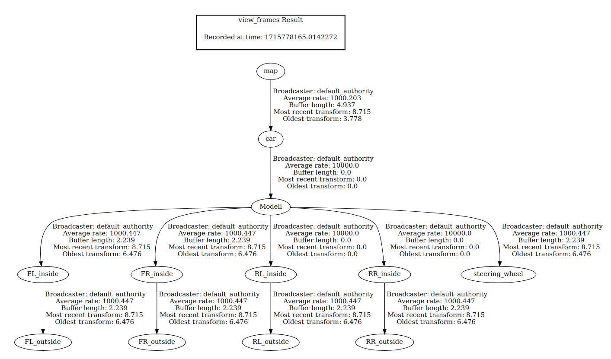

# ROS2 Transforms (TF2)

ROS2 Transforms is a mechanism / assortment of functionalities and packages that enables developers to easily perform geometrical transformation (translations and rotations) between different referentials and keep track of the transformations between them.  

## Installation

This step is already included in the docker dev environment container.
```sh
sudo apt install ros-humble-tf-transformations
```

## Basic Principle

Transforms are organized in a tree fashion. At any moment, you can run a program to get a pdf version of this tree:

```sh
ros2 run tf2_tools view_frames
```

This is an example of a tf tree, corresponding to PacSim.



Each node of the tree represents a frame (a referential) and each edge represents a transformation. This way, each frame is represented relative to its parent frame.

## Topics and messages

Transforms are communicated via topics. Each message is of the **geometry_msgs/msg/TransformStamped** type:
```sh
# This expresses a transform from coordinate frame header.frame_id
# to the coordinate frame child_frame_id at the time of header.stamp
#
# This message is mostly used by the
# <a href="https://index.ros.org/p/tf2/">tf2</a> package.
# See its documentation for more information.
#
# The child_frame_id is necessary in addition to the frame_id
# in the Header to communicate the full reference for the transform
# in a self contained message.

# The frame id in the header is used as the reference frame of this transform.
std_msgs/Header header
        builtin_interfaces/Time stamp
                int32 sec
                uint32 nanosec
        string frame_id

# The frame id of the child frame to which this transform points.
string child_frame_id

# Translation and rotation in 3-dimensions of child_frame_id from header.frame_id.
Transform transform
        Vector3 translation
                float64 x
                float64 y
                float64 z
        Quaternion rotation
                float64 x 0
                float64 y 0
                float64 z 0
                float64 w 1
```
There is also a **tf2_msgs/msg/TFMessage**, which is essentially an array of the previous ones. As can be seen, each transformation is represented by the frame_id and child_frame_id and the actual transform, which contains translation and rotation data.

The broadcasting of this information allows any node to perform any transformation in just a few lines.

There are also two types of transforms:
- **static transforms:** do not change over time, published to /tf2_static e.g. position of a LiDAR relative to the COG of a car
- **dynamic transforms:** change over time, published to /tf e.g. position of a car relative to the main world/map frame

## Code

To communicate transformations, all you have to do is use a special publisher from tf2 library that already handles some parts of the communication (topic and settings) and publish the data as normal. Examples:
- [dynamic transform broadcaster](https://docs.ros.org/en/foxy/Tutorials/Intermediate/Tf2/Writing-A-Tf2-Broadcaster-Cpp.html)
- [static transform broadcaster](https://docs.ros.org/en/foxy/Tutorials/Intermediate/Tf2/Writing-A-Tf2-Static-Broadcaster-Cpp.html)

To listen to trasnforms, the default listener already saves the transforms in a buffer, and you can fetch them with the ```lookupTransform``` function. This function can also be used to fetch transforms relative to a certain time.
Examples:
- [subscriber/listener](https://docs.ros.org/en/foxy/Tutorials/Intermediate/Tf2/Writing-A-Tf2-Listener-Cpp.html) - section 1.1 (the rest is useless and context specific)

To create new frames, all that is needed is to publish a transform with a new child frame name and it is automatically created.

## Utils

Rotations are represented as quaternions in tf2. The x, y and z components represent a 3 dimensional vector, while the w component represents the amount of rotation performed around this vector. 

There are two types in ROS2: one from geometry_msgs and another one from ```#include <tf2_geometry_msgs/tf2_geometry_msgs.hpp>``` and another from ```#include <tf2/LinearMath/Quaternion.h>```.

It might be easier to think of rotations in Euler angles (Yaw, Pitch, Roll). You can use the ```setRPY``` function to create quaternions from euler angles. Checkout the rest of [this tutorial](https://docs.ros.org/en/foxy/Tutorials/Intermediate/Tf2/Quaternion-Fundamentals.html) for more information.


