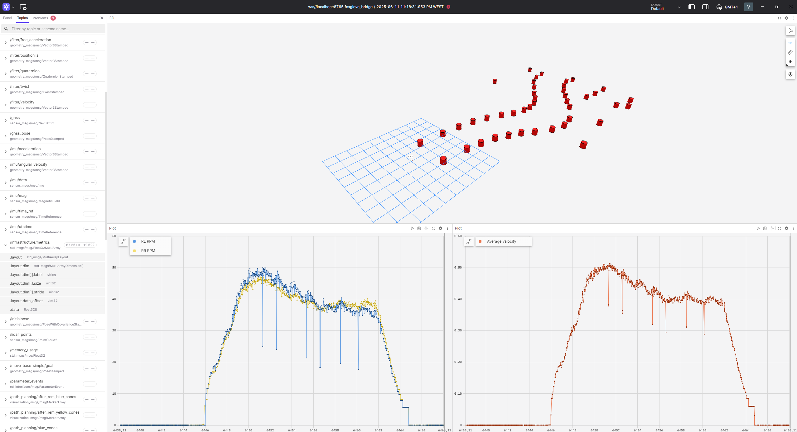

# 🚗 Data Infrastructure Workshop

This workshop demonstrates how to use ROS 2 to calculate vehicle metrics based on wheel RPM data using synchronized messages and publish them for real-time visualization.

---

## How to Run the Image Workshop

Open three terminal windows and execute the following commands:

**Terminal 1: Launch ROS 2 and Foxglove Bridge**
```bash
source install/setup.bash
ros2 bag play -l Hard_Course-DV-7.mcap
ros2 launch foxglove_bridge foxglove_bridge_launch.xml
```

**Terminal 2: (Redundant bag replay for robustness or split playback)**
```bash
source install/setup.bash
ros2 bag play -l Hard_Course-DV-7.mcap
```

**Terminal 3: Run the infrastructure node**
```bash
# Navigate to the folder containing infrastructure.py
cd infrastructure_des
python infrastructure.py
```

---

## Implementation Details

### Node Overview

The `InfrastructureDesign` node performs the following:

- Subscribes to `/vehicle/rl_rpm` and `/vehicle/rr_rpm` topics of type `WheelRPM`.
- Synchronizes incoming messages using `ApproximateTimeSynchronizer`.
- Calculates a range of performance and diagnostic metrics from the RPM data.
- Publishes the metrics to `/infrastructure/metrics` as a `Float32MultiArray`.

### Synchronization & Subscription

```python
self.rl_rpm_subscription = Subscriber(self, WheelRPM, "/vehicle/rl_rpm")
self.rr_rpm_subscription = Subscriber(self, WheelRPM, "/vehicle/rr_rpm")
```

These subscribers are synchronized:
```python
self.wss_sensors = ApproximateTimeSynchronizer(
    [self.rl_rpm_subscription, self.rr_rpm_subscription],
    queue_size=10,
    slop=0.1,
    allow_headerless=True
)
self.wss_sensors.registerCallback(self.wss_callback)
```

### Callback Logic

Each synchronized message pair provides RPM values for all four wheels:
```python
fl_rpm = rl_rpm_msg.fl_rpm  # Front-left
rl_rpm = rl_rpm_msg.rl_rpm  # Rear-left
fr_rpm = rr_rpm_msg.fr_rpm  # Front-right
rr_rpm = rr_rpm_msg.rr_rpm  # Rear-right
```

These are used to compute the following metrics:

### Calculated Metrics

| Metric Name          | Description                                               |
|----------------------|-----------------------------------------------------------|
| `average_rpm`        | Mean of all four wheel RPMs                               |
| `min_rpm`            | Minimum RPM among the four wheels                         |
| `max_rpm`            | Maximum RPM among the four wheels                         |
| `left_avg_rpm`       | Mean RPM of the left-side wheels (FL & RL)                |
| `right_avg_rpm`      | Mean RPM of the right-side wheels (FR & RR)               |
| `front_avg_rpm`      | Mean RPM of the front wheels (FL & FR)                    |
| `rear_avg_rpm`       | Mean RPM of the rear wheels (RL & RR)                     |
| `front_rear_diff`    | Difference between front and rear average RPM             |
| `left_right_diff`    | Difference between left and right average RPM             |
| `rpm_variance`       | Variance of the four RPM values                           |
| `rpm_stddev`         | Standard deviation of the four RPM values                 |
| `average_velocity`   | Mean linear velocity computed from all wheel RPMs         |
| `wheel_velocities[]` | Linear velocity of each wheel: `[fl, rl, fr, rr]`         |

These metrics are packed into a `Float32MultiArray` and published on `/infrastructure/metrics`.

---

## Results

You can visualize the real-time published metrics in **Foxglove Studio** using the `/infrastructure/metrics` topic.


