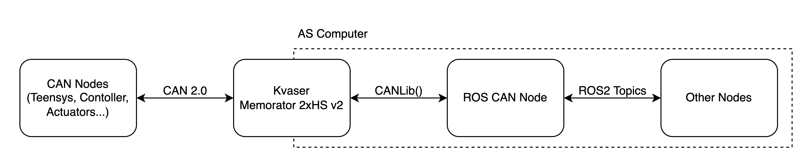

# ROS CAN INTERFACE

This node makes the interface between the AS ROS system and the CAN bus of the prototype. 
It has the main mission of translating the information doubling as a wall of defence, employing safety measures such as limiting control commands.

  

## Node info

This package is very simple as of now, and requires no configuration and has no dependencies.

- **Package name:** ros_can
- **Node name:** ros_can

## Dependencies

- **[canlib](https://kvaser.com/canlib-webhelp/)** - library from Kvaser