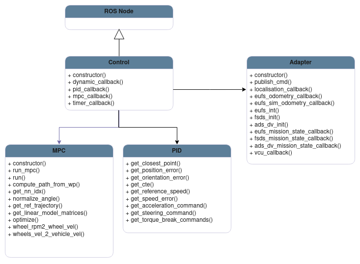
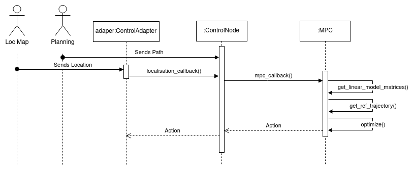
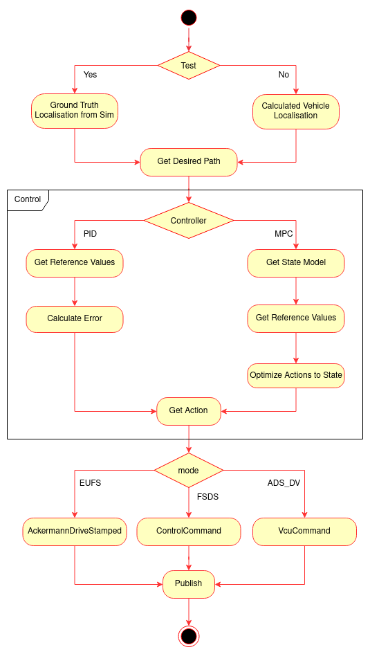

# Control Module

The control module is the last core module of the autonomous system's processing. Its goal is to provide commands that will move the car according to the desired trajectory.For that it will need both information from Localisation and Mapping, with the vehicle position and the odometry information(wheel sensors, for example) and the path reference from the previous module in the chain Path Planning. This module will gather this data and calculate the ideal actions/commands to follow the pretended behaviour. These commands will be sent afterwards to the car through a CAN interface. 

## Install Dependencies

To run this module, some python libraries and the tf-transormations package in the current ros distribution are needed.

```SHELL
  pip3 install transform3d
  pip3 install transforms3d
  pip3 install cvxpy
  pip3 install scipy
  sudo apt install ros-humble-tf-transformations
```

## Run the Node

### Compile

```SHELL
	colcon build --packages-select control custom_interfaces
```

### Source 

```SHELL
	source ./install/setup.bash
```

### Run

```SHELL
	ros2 run control control
```

### Test

```SHELL
    colcon test --packages-select control --event-handler=console_direct+
```

## Design

The architecture of the module may be described according to the following diagrams.

### Class Diagram

<p align="center">
  
</p>

* **ROS Node:** Serves as the fundamental structure and operational backbone of the system.

* **Control:** It is the central part of the module. It contains an adapter which manages all communication, and it provides the access to the main variables and controls used in the algorithms.

* **MPC:** This component is responsible for all the functions used in the MPC algorithm. 

* **PID:** This component is responsible for all the functions used in the PID algorithm.

* **ControlAdapter:** Implementation of the Adapter Pattern. It is an abstraction layer that's used to receive and interact with the car or simulator. It receives the information from the localisation and odometry. It also coordinates the messages with the simulator with and the signals sent by the car.


### Sequence Diagram

As previously mentioned, the control node needs both the localisation and the path. Therefore, these are the first actors to enter in the system. While the planning goes directly into the node, the localisation goes through the adapter, since it depends on the mode.
After this data is gathered, the module starts to calculate the best action using one of the algorithms(In this case, MPC is represented. The paralelism and other alternatives are shown later). As all the required functions are called, an action is then returned back to be published.

<p aligh="center">
  
</p>

### Activity Diagram

Below is an Activity Diagram illustrating the operational flow of the control model. The adapter pattern creates an abstraction that uses different localisation sources depending if the program is running on test mode. After getting the path, a controler is chosen, and depending on it, different functions are called, all leading to a action/command. At last, depending on the mode, the action is published as the required type, by either a simulator or the car.

<p align="center">
  
</p>

## Full Documentation

A more precise information about the Control Module can be found [here](https://www.overleaf.com)

## Main External Libraries

1. [ROS](https://docs.ros.org/en/foxy/index.html)
2. [Cvxpy](https://www.cvxpy.org/index.html)
3. [Scipy](https://docs.scipy.org/doc/scipy/)
4. [Numpy](https://numpy.org/doc/stable/)
