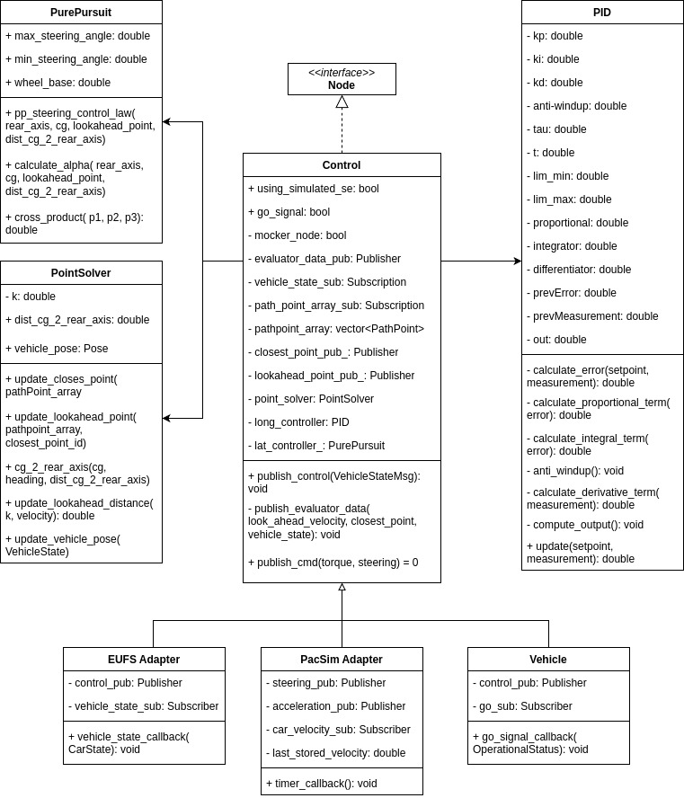

# Control Module

## Package Information

### Description

The Control node uses Planning (pathpoints with expected velocity values) and State Estimation (current vehicle pose) data to effectively calculate longitudinal (torque) and lateral values (steering angle) using PID and Pure Pursuit controllers, respectively. 


### Folder Structure

- [adapter_control](./include/adapter_control/): Adapters to change ros2 interfaces according to simulator or environment
- [node_](./include/node_/): Node class and main control class
- [pid](./include/pid/): PI-D controller class, used for longitudinal control
- [point_solver](./include/point_solver/): Point Solver class, used to calculate the reference point for the Pure Pursuit controller and the PID controller
- [pure_pursuit](./include/pure_pursuit/): Pure Pursuit controller class, used for lateral control


### Launch Configurations

- [eufs.launch.py](./launch/eufs.launch.py): Launch file for the EUFS simulator
- [pacsim.launch.py](./launch/pacsim.launch.py): Launch file for the PacSim simulator
- [vehicle.launch.py](./launch/vehicle.launch.py): Launch file for the 01 vehicle


### Important Dependencies


## How to Run

### Install Dependencies

```sh
  ./dependencies_install.sh
```

### Compiling

```sh
colcon build --packages-up-to control
```

### Testing

```sh
colcon test --packages-select control # use event-handler=console_direct+ for imediate output
```

To check test results:
```sh
colcon test-result --all --verbose
```
### Running

Run with ros2 launch. You may select custom parameters for testing such as simulated state estimation or the mocker node. Check the [launch file](./launch/control.launch.py) for more details. Example:

```sh
source ./install/setup.bash # If in a new terminal
ros2 launch control control.launch.py 'adapter:=pacsim' 'use_simulated_se:=true' 'mocker_node:=true'
```
Using simulated state estimation allows you to independently test control without using the state estimation module, by using information directly from the simulator. The mocker node allows for the same thing but for planning, by using a hand-picked pathpoint array. The lookahead_gain is for tuning purposes.

## Design
The following class diagram illustrates the structure of the Control package:


We have the following classes:    
* Control: The node itself and the main class that initializes the other classes and runs the control callback.
* PSolver: The class that receives Planning information and calculates the reference for the controllers.
* PID: The class that implements the PID controller, for Longitudinal Control.
* PP: The class that implements the Pure Pursuit controller, for Lateral Control.
* Adapter: Provides an interface to correctly subscribe/publish, as well as parse and normalize values as needed by the different simulators we use.

The actions taken when the node gets spinning are the following:
