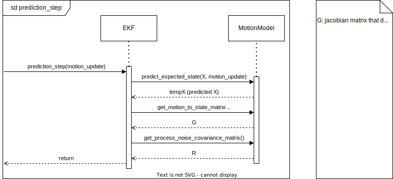
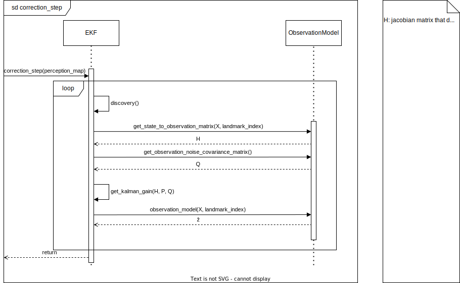

# EKF State Estimation Package

## Package Information


### Description

The State Estimation module is responsible for the processing of the perception module and localisation sensors' data and its transformation into useful information. In this case, the data is combined to generate the best estimates possible on the pose and speed of the vehicle and the location of the cones that delimit the track.


### Folder Structure

- [adapter_ekf_state_est](./include/adapter_ekf_state_est/): Adapters to change ros2 interfaces according to simulator or environment
- [kalman_filter](./include/ekf/): Extended Kalman Filter class, used for state estimation
    - [kalman_filter/data_association](./include/ekf/data_association.hpp): Data Association class, used to associate observations to landmarks and determine which landmarks are new
    - [kalman_filter/motion_model](./include/ekf/motion_model.hpp): Motion Model class, used to predict the state based on previous states and measurements
    - [kalman_filter/observation_model](./include/ekf/observation_model.hpp): Observation Model class, used to correct the state based on observations
- [ros_node](./include/ros_node/): Node class


### Launch Configurations

- [eufs.launch.py](./launch/eufs.launch.py): Launch file for the EUFS simulator
- [pacsim.launch.py](./launch/pacsim.launch.py): Launch file for the PacSim simulator

### Important Dependencies

- [Eigen3](https://eigen.tuxfamily.org/index.php?title=Main_Page)

## How to Run

### Install Dependencies

```sh
  ./dependencies_install.sh
```

### Compiling

```sh
colcon build --packages-up-to ekf_state_est
```

### Testing

```sh
colcon test --packages-select ekf_state_est # use event-handler=console_direct+ for imediate output
```

To check test results:
```sh
colcon test-result --all --verbose
```

or 

```sh
source ./install/setup.bash # If in a new terminal
ros2 run ekf_state_est ekf_state_est_test
```

### Running

Use a launch file:

```sh
source ./install/setup.bash # If in a new terminal
ros2 launch ekf_state_est eufs.launch.py
```

or run directly:


```sh
source ./install/setup.bash # If in a new terminal
ros2 run ekf_state_est ekf_state_est
```

## Design

Below, some diagrams are presented that can illustrate the structure and behaviour of the program.

### Behaviour

The control flow below illustrates briefly the flow of execution and information through the node, you can also checkout [documentation pdf](../../docs/assets/Loc_map/EKFSlam1.0.pdf) to get a better understanding.


The sequence diagrams below illustrate in greater detail the interactions between the components of the system in a normal use case.


1. Information from localisation sensors is received in the adapter (the adapter is a layer for adaptation of the different environments the node runs in).
2. LMNode (the localisation and mapping node) processes the information and requests execution of the prediction step to the Extended Kalman Filter cass (illustrated below).
    1. The Motion Model is used to utilize the Motion data to predict the change in state.
    2. The Motion Model is used to reaturn the G matrix (maps the transformation from the motion to the state)
    3. Get the noise matrix, required for the calculation of the predicted covariance matrix P.
    4. Compute predicted X and P.
3. After the step, the pose and map are updated and published.



4. When cone coordinates are published by perception, the LMNode receives them directly, executing the perception_callback.
5. The node requests execution of the correction step to the EKF (more detail below). For every landmark (cone):
    1. Discovery is executed, checking if the observation corresponds to a new cone/landmark or one that already exists in the state vector (X)
    2. H (matrix that maps the transformation from the state to the observations), Q (2x2 matrix that encodes the perception's noise) are requested to the Observation Model (class that encodes how perception data is interpreted).
    3. the kalman gain (K) is calculated (smart weight that controls in what extent observations contribute to the update of the state).
    4. the observation model is executed to obtain the z_hat, required for the calculation of the state.
    5. Compute X and P.
6. The EKF updates the estimates and the node publishes them.



### Structure

The node is composed by multiple classes. The diagram below illustrates roughly how they sit in the code structure. The main two are the LMNode, which is the class of the node, and the Extended Kalman Filter, which corresponds to the code of the implementation of the EKF SLAM.


