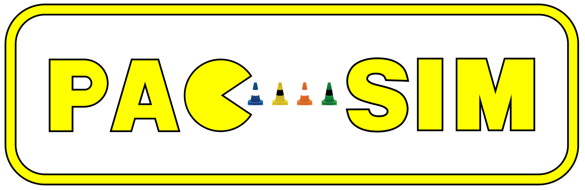

# PacSim
PacSim (Planning and Controls Simulator) is a simulator for Formula Student Driverless competitions originally developed at [Elbflorace](https://elbflorace.de/).

Example of a pipeline running in PacSim with visualizations in Foxglove:

# Features
* Closed loop simulation of the autonomous system.
  * Simulation of vehicle dynamics
  * Simulation of all the relevant sensors (except for raw perception data) for autonomous operation. All sensors simulated are specified by at least their rate, dead time (delay), noise and some sensor-specific additional attributes.
    * IMU, wheel speeds, wheel motor torques, steering angle, GNSS
    * Mock model of the detected cones by the perception system
  * Competition logic
    * Track lap times, evaluate penalties and detect DNF
    * Create report at the end of the run
  * Configurable grip map (different friction coefficients for track segments)
* Additional scripts and tools
  * Track editor (track_editor directory)
  * Converter from [FSSIM](https://github.com/AMZ-Driverless/fssim) sdf to our track format.

# Prerequisites
This package is developed and tested on Ubuntu 22.04 with ROS2 Iron. 

Install dependencies:

`sudo apt install ros-iron-desktop ros-iron-xacro`

# How to get started
To use PacSim with your autonomous system, you need to create a message converter node to match your own interfaces with the simulator.

We provide an example launch file (example.launch.py) which shows an example of how to start the simulator node and the robot_state_publisher for the 3d visualization of the car.

The sensors and vehicle model are configured using config files. Examples are provided in the config folder. Things such as the discipline or the path of the track file or config files are defined using ros2 parameters.

The default vehicle model provided is rather simple and just meant to be a starting point. You are encouraged to integrate your own vehicle model by implementing the `IVehicleModel` class.

## Docker Dev Container

A [Dockerfile](./.devcontainer/Dockerfile) is configured that already contains all the dependencies. It can be used with a [dev container environment](./.devcontainer) or launched independently wiht the [docker-compose](./docker-compose.yml) file. For more info, check the [docs folder](./doc/docker_usage.md).

# Contributing
Contributions in any form (reports, feedback, requests, submissions) are welcome. Preferably create an Issue or Pull request for that.

The project also has a [discord server](https://discord.gg/Ay3XzB5p33).

# Known issues
* In Foxglove Studio (in contrast to RViz) the mesh of the car is displayed incorrectly using default settings. To fix this go to the left sidebar of the 3d panel -> Scene -> Mesh up axis and select Z-up. Restart to apply the change.
* Currently the track editor can't handle the skidpad and acceleration tracks (lanesFirstWithLastConnected = False) properly.
* Currently there exists no editor and visualization for the grip map.

# Acknowledgements
The initial version was developed at Elbflorace by:
* Alexander Phieler (Main development)
* Niklas Leukroth (Track and Config file parser)
* Sergio Antuna (Artwork)
* Tim Hanel (3d car model integration)

# Report Generation
As mentioned above, pacsim generates a final report after every simulation that contains some relevant metrics that allow us to evaluate performance and validate changes.
Currently, the report shows the following:
- Discipline
- Run status (Failure or success)
- The reason for failure
- Total simulation time
- Timeout for the first lap
- Timeout for the total event
- If the car was off-course
- If cones were hit
- If the car manged to stop after the end of the event
- Sector times and lap times
- Recorded penalties
  - Penalty time
  - Ocurrence time
  - Position
  - Reason
- Track name

These metrics can be split in groups to evaluate the subsystems' performance. We can evaluate performance for the following subsystems:

#### Path Planning:
- Off-course detection: This metric can be used to validate that the path planning subsystem is working as intended and not pushing the car off-track.
- Cone-hit detection: Same logic as off-course detection.
- Recorded penalties: Can be used to evaluate possible shortcuts or wrong paths taken.
- Sector and Lap times: Path planning has a large impact on vehicle performance on track, therefore a large increase in sector and lap times can indicate an error in path planning.

#### Perception
Perception cannot be evaluated directly unless we increase the data on the report.
Right now the only way to evaluate perception is to find errors in other subsystems that depend on perception.
Possible data we could add to the report in order to properly evaluate perception:
- Sensor detection report: A simple list of all the sensors that are in the car with a boolean that shows if they were active or not.

#### State Estimation
To validate state estimation we will use the same approach we used to path planning in this case we can add a few metrics:
- Off-course detection: This metric can be used to validate that state estimation subsystem is correctly outputting the car's state which allows a smooth path.
- Cone-hit detection: Same logic as off-course detection.
- Recorded penalties: Can be used to evaluate possible shortcuts or wrong paths taken which can be caused by wrong state estimation.
- Sector and Lap times: State Estimation has a large impact on vehicle performance on track, therefore a large increase in sector and lap times can indicate an error in state estimation.
- Car stopped after the end of the event: This functionality should also come from state estimation and then passed to control.

#### Driverless Control
Almost every single metric is used to evaluate control, if the car is off-course, takes cones, penalties or increases the run time, control could be the issue.

#### Data Infrastructure and Simulation & Validation
Data Infrastructure and Simulation & validation cannot be evaluated by this simulation.

#### Conclusion

The current report generated by pacsim contains a lot of interesting information. Realistically it is very hard to separate a subsystem from another purely based on the current data. Most subsystems are so interdependent that it is almost impossible to detect if the error is in one or the other. Adding the suggested metric could allow for separation between perception and the rest.
Generating automated tests is possible but analyzing the results will be paramount to ensure that we can detect which subsystem is failing.