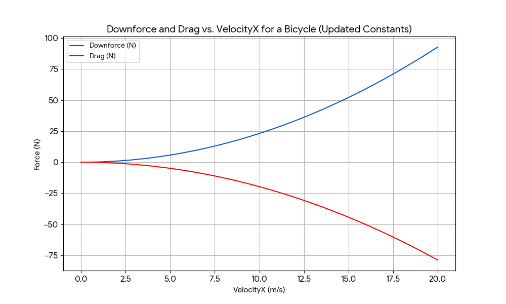
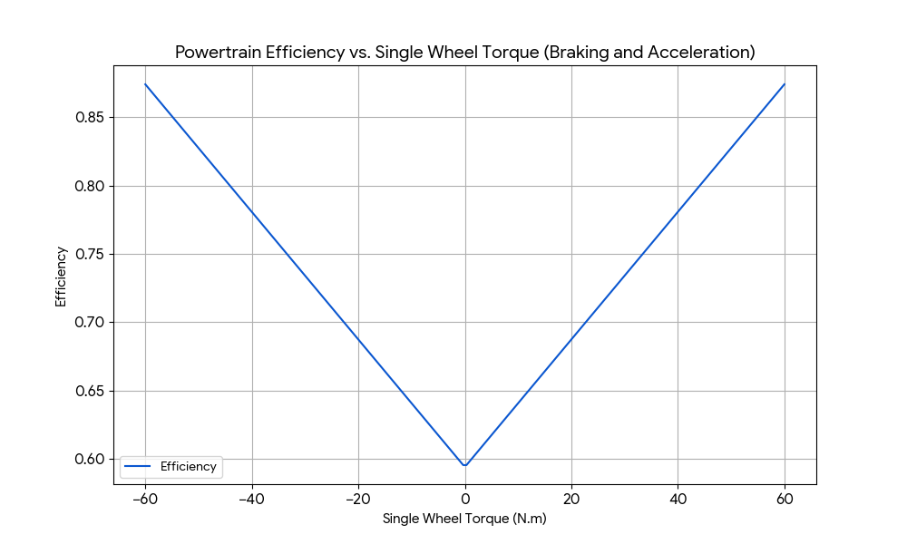
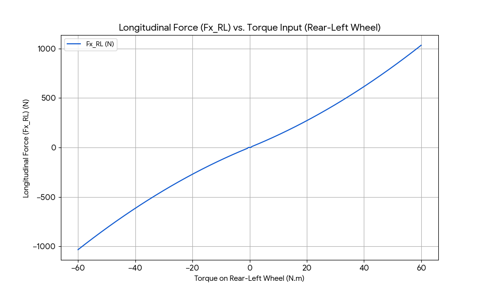
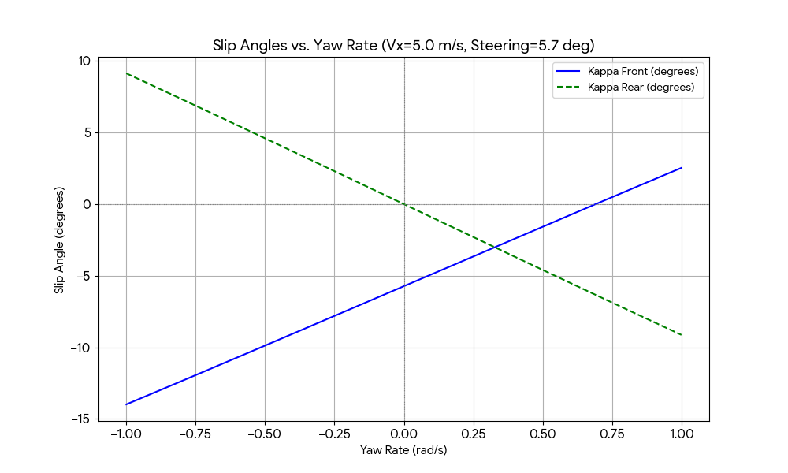
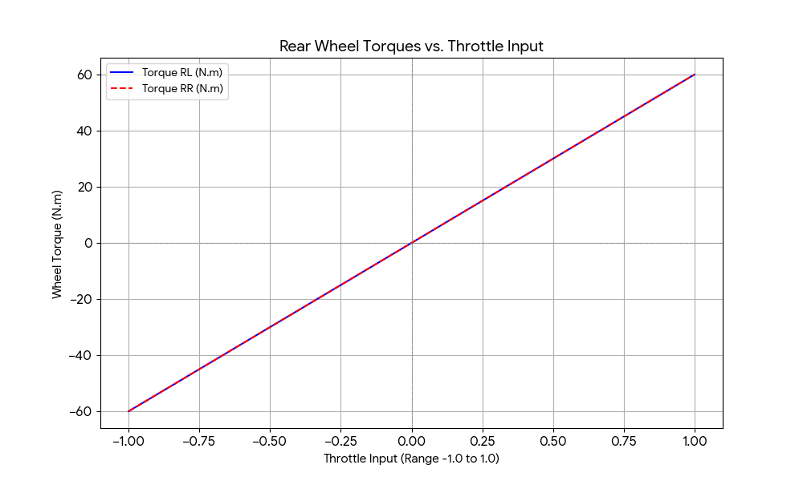
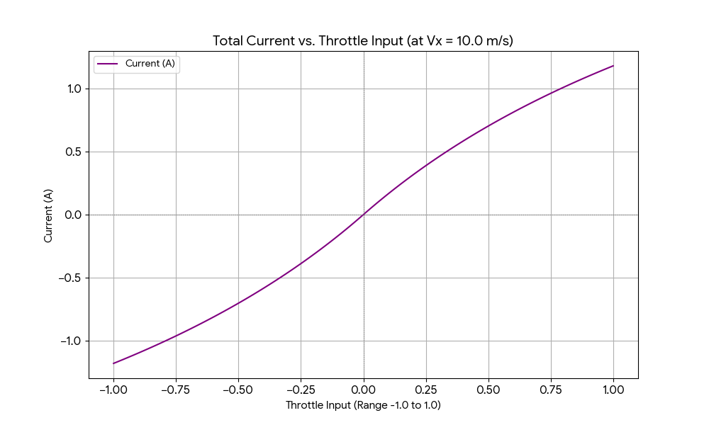
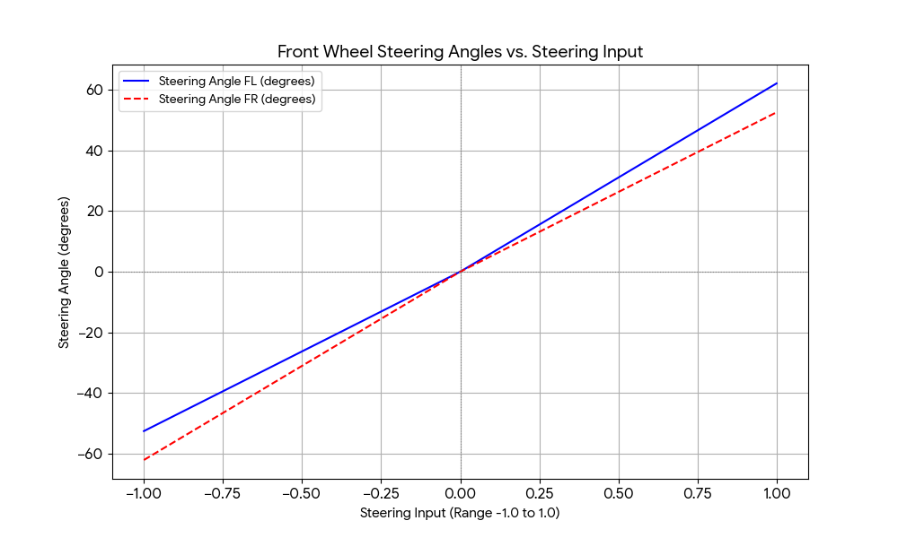

# Unit testing for the bicycleModel currently used for the Pacsim simulator

## Objective:
Validate the pacsim simulator by unit testing all relevant functions used in the simulator.

***

## Tested functions and methods used:

1. [CalculateForces](../../src/VehicleModel/VehicleModelBicycle.cpp#L114): _See line 114_
    - Dependencies: None.
    - Cases tested: 
        - Zero: Velocity in the X axis is zero.
            - Expected:
                - Downforce: 0
                - Drag: 0
        - Positive: Velocity in the X axis is greater than zero.
            - Expected for velocity = 5 m/s:
                - Downforce: 6.1017
                - Drag: -5.17935
        - Negative: Velocity in the X axis is smaller than zero.
            - Expected for velocity = -5 m/s:
                - Downforce: 6.1017
                - Drag: 5.17935
    - Graph:
    

2. [CalculateEfficiency]((../../src/VehicleModel/VehicleModelBicycle.cpp#L182)): _See Line 182_
    - Dependencies: None.
    - Cases tested:
        - Low torque: Back wheels torque is set to a low value(5).
            - Expected: 0.617.
        - Medium torque: Back wheels torque is set to half of the maximum value (30).
            - Expected: 0.732.
        - High torque: Back wheels torque is to maximum torque(60).
            - Expected: 0.879.
        - Negative torque: Back wheels troque is set to a small negative value (-5) to simulate braking.
            - Expected: 0.617.
    - Graph:
    

3. [CalculateLongitudinalForces](../../src/VehicleModel/VehicleModelBicycle.cpp#L312): _See line 312_
    - Dependencies: calculateEfficency (tested before).
        > Since the car is rear-wheel driven all the tests will expect the front wheels to have Fx set to zero, since the car is symmetrical the forces applied in the left wheel needs to be same force applied on the right one too.
        > Although this is not technically unit testing, the dependency for the calculateEfficency has not been mocked since it was also validated.
    - Cases tested:
        - Low torque: Back wheels torque is set to a low value(10).
            - Expected: 127.10.
        - Medium torque: Back wheels torque is set to a medium value (30).
            - Expected: 433.71.
        - High torque: Back wheels torque is set to the maximum toerque value (60).
            - Expected: 1033.25.
        - Negative torque: Back wheels torque is set to negative to simulate braking (-10).
            - Expected: -127.10
    - Graph:
        

4. [calculateNormalForces](../../src/VehicleModel/VehicleModelBicycle.cpp#L234): _See line 234_
    - Dependencies: calculateForces (tested previously).
    - Cases tested:
        - Static: Vehicle at rest, flat ground.
            - Expected: 
                - Fz_Front: 516.98.
                - Fz_Rear: 466.36.
        - Moving forward: Vehicle moving at 5 m/s.
            - Expected: 
                - Fz_Front: 519.1.
                - Fz_Rear: 469.3.
    - Graph:
    

5. [calculateSlipAngles](../../src/VehicleModel/VehicleModelBicycle.cpp#L251): _See line 251_
    - Dependencies: None.
    - Cases tested:
        - Zero velocity: All wheel velocities and angular velocities are zero.
            - Expected: 
                - kappaFront = 0. 
                - kappaRear = 0.
        - Positive velocity: Vehicle moving forward, no steering (5 m/s).
            - Expected: 
                - kappaFront = 0.
                - kappaRear = 0.
        - With steering: Vehicle moving forward (5 m/s), steering set (0.1 rads/s).
            - Expected: 
            - kappaFront ≠ 0. 
            - kappaRear ≈ 0.
    - Graph:
    

6. [calculateWheelTorques](../../src/VehicleModel/VehicleModelBicycle.cpp#L172): _See Line 172_
    - Dependencies: None.
    - Cases tested:
        - Positive throttle input: Throttle is set to maximum (1).
            - Expected: 60 torque on each back wheel.
        - Zero throttle input:
            - Expected: 0 torque on all wheels.
        - Negative throttle input: Throttle is set to minimum (-1).
            - Expected: -60 torque on all wheels.
    - Graph:
    

7. [calculateCurrent](../../src/VehicleModel/VehicleModelBicycle.cpp#L190): _See Line 190_
    - Dependencies: None.
    > All this tests assume voltage to be 600 volts.
    - Cases tested:
        - Maximum Torque (60) with positive wheel speeds (10):
            - Expected: 0.2396.
        - Negative Torque (-60) with positive wheel speeds (10):
            - Expected: -0.2396.
        - Zero Torque with positive wheel speeds (10):
            - Expected: 0.
        - Maximum torque (60) with zero wheel speeds:
            -Expected: 0.
    - Graph:
    

8. [calculateSteeringAngles](../../src/VehicleModel/VehicleModelBicycle.cpp#L207): _See line 207_
    - Dependencies: None.
    > All tests expect the back wheels to have zero steering.
    - Cases tested:
        - Positive maximum steering (1):
            - Expected:
                - Left front wheel: 1.08.
                - Right front wheel: 0.92.
        - Zero sterring:
            - Expected: All zero.
        - Negative maximum steering (-1).
            - Expected:
                - Left front wheel: 0.92.
                - Right front wheel: 1.08.
    - Graph:
    

9. [calculateSteeringWheelAngle](../../src/VehicleModel/VehicleModelBicycle.cpp#L226): _See line 226_
    Same approach to the above function values are expected to be the exact oposite of the previous function.

10. [calculateWheelGeometry](../../src/VehicleModel/VehicleModelBicycle.cpp#L286): _See line 286_
    - Dependencies: None.
    - Cases tested:
        - Zero steering: All wheel positions and velocities calculated for straight wheels.
            - Expected: Symmetric geometry.
        - With steering: Front wheels turned, check correct geometry.
            - Expected: Front wheel positions/velocities reflect steering angle.

11. [updateWheelSpeeds](../../src/VehicleModel/VehicleModelBicycle.cpp#L370): _See line 370_
    - Dependencies: None.
    - Cases tested:
        - Zero velocity: All wheel speeds should be zero.
        - Forward velocity: All wheel speeds should match vehicle velocity.

12. [getWheelPositions](../../src/VehicleModel/VehicleModelBicycle.cpp#L473): _See line 473_
    - Dependencies: None.
    - Cases tested:
        - Vehicle at origin:
            - Expected: Wheels aligned with the original placements.
        - Vehicle at origin but rotated:
            - Expected: wheels aligned with the original placements but rotated.
        - Vehicle off the origin not rotated:
            - Expected: Same as the first test with the added offset of the new position.
        - Vehicle off the origin rotated:
            - Expected: Same as the second test with the added offset of the new positiion.

13. [calculateAccelerations](../../src/VehicleModel/VehicleModelBicycle.cpp#L334): _See line 334_
    - Dependencies: None.
    - Cases tested:
        - Zero input: All forces and friction are zero.
            - Expected: (0, 0, 0)
        - Friction only: Friction.x() is set to 10, all other inputs zero.
            - Expected: x ≈ 0.0498, y = 0, z = 0
        - Straight acceleration: Fx_RL = Fx_RR = 5, all else zero.
            - Expected: x ≈ 0.0498, y = 0, z = 0
        - Straight braking: Fx_RL = Fx_RR = -5, friction.x() = 2, all else zero.
            - Expected: x ≈ -8/200.707, y = 0, z = 0
        - Turning: Fx_RL = Fx_RR = 5, Fy_Front = 0.1, all else zero.
            - Expected: x ≈ 0.0498, y ≈ -0.005, z ≈ 0
    - Note: Friction is added directly to acceleration, which may not be physically realistic from standstill.

---

