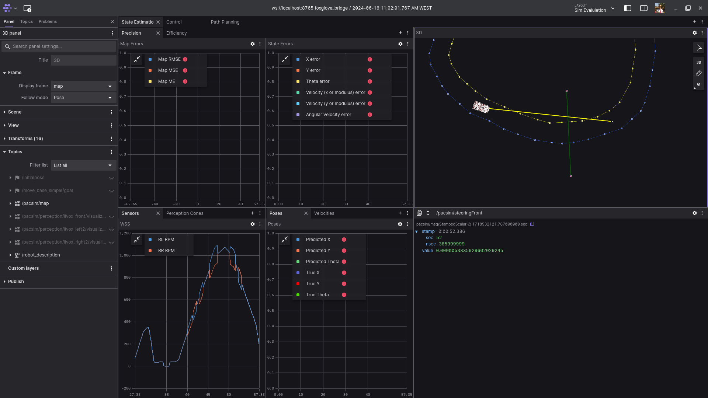

# PacSim Keys

## Package Information

### Description

This package provides a "Control Mock" by allowing the control of the acceleration and steering of the PacSim vehicle using the keyboard.

### Important Dependencies

## How to Run

### Install Dependencies

```sh
./denpendencies_install.sh
```

### Compiling
    
```sh
colcon build --packages-up-to pacsim_keys
```

### Running

To run the control mock, you need to run the following command:

```sh
ros2 run pacsim_keys pacsim_keys
```

### How to use

The control mock uses the following keys:
- `w`: Increase torque by 0.1 to a max of 1.0
- `s`: Decrease torque by 0.1 to a min of -1.0
- `a`: Increase steering by pi/16 to a max of pi/8
- `d`: Decrease steering by pi/16 to a min of -pi/8
- `q`: Quit

**Note:** The torque starts at 0.6 right away because the vehicle does not move otherwise.
**Note2:** You need to have the terminal selected for the control to be read.
**Tip:** Have a plot showing the wheel rotation to control the torque better.

