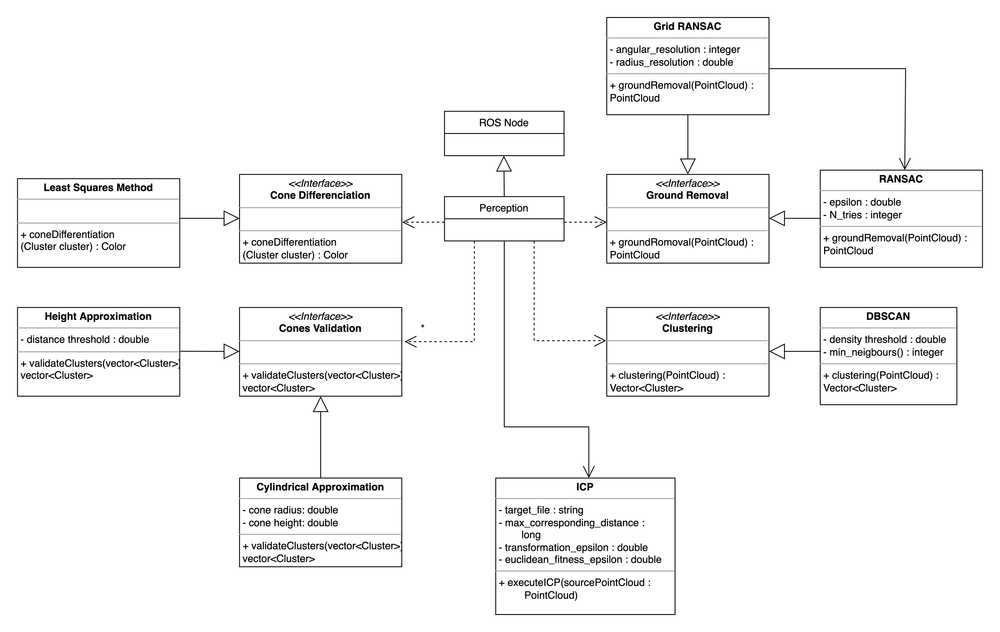

# Perception Package

The Perception module is responsible for the processing of the perception module and perception sensors' data and its transformation into useful information. In this case, the LiDAR's point cloud is processed to generate the cones' position on the track.

## Run the Node

### Compiling

From src folder:
```sh
colcon build --packages-select perception custom_interfaces fs_msgs eufs_msgs common_lib pacsim
```

## Testing

From src folder:
```sh
colcon test --packages-select perception # use event-handler=console_direct+ for imediate output
```

To check test results:
```sh
colcon test-result --all --verbose
```

### Running the node

```sh
ros2 run perception perception
```

### Running with launch files

To streamline parameter management, a launch file is used to set these parameters. For ease of use, additional files can also be created:

To run the node with the specified launch file parameters, you can:

```sh
ros2 launch perception perception.launch.py
```

The parameters are

| Parameter               | Description                                                |
|-------------------------|------------------------------------------------------------|
| ransac_epsilon          | Threshold for determining inliers in RANSAC                |
| ransac_n_neighbours     | Number of neighbours considered in RANSAC                  |
| clustering_n_neighbours | Number of neighbours for DBSCAN clustering                 |
| clustering_epsilon      | Distance threshold for DBSCAN clustering                   |
| horizontal_resolution   | Angular resolution of the lidar sensor in the horizontal plane |
| vertical_resolution     | Angular resolution of the lidar sensor in the vertical plane   |
| adapter                 | Component that adapts the system to its operating environment |

## Design

Below, some diagrams are presented that can illustrate the structure and behaviour of the program.

### Class Diagram




## Main External Libraries

- [Eigen](https://eigen.tuxfamily.org/index.php?title=Main_Page)
- [PCL](https://pointclouds.org)
- [ROS2](https://docs.ros.org/en/foxy/index.html)
- [Gtest](http://google.github.io/googletest/)
- [OpenMP](https://www.openmp.org)