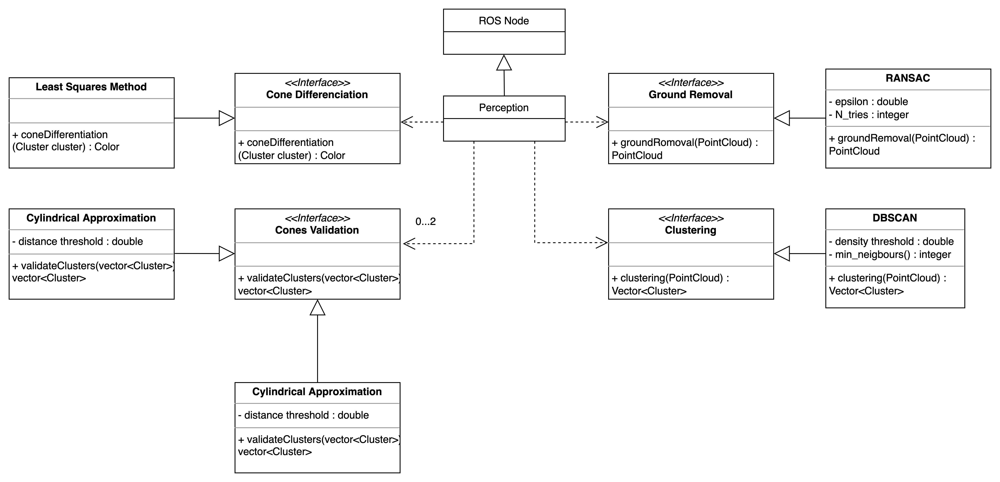

# Perception Package

The Perception module is responsible for the processing of the perception module and perception sensors' data and its transformation into useful information. In this case, the LiDAR's point cloud is processed to generate the cones' position on the track.

## Run the Node

### Compiling

From src folder:
```sh
colcon build --packages-select perception custom_interfaces
```

## Testing

From src folder:
```sh
colcon test --packages-select perception # use event-handler=console_direct+ for imediate output
```

To check test results:
```sh
colcon test-result --all --verbose
```

### Running the node

```sh
ros2 run perception perception
```

## Design

Below, some diagrams are presented that can illustrate the structure and behaviour of the program.

### Class Diagram




## Main External Libraries

- [Eigen](https://eigen.tuxfamily.org/index.php?title=Main_Page)
- [PCL](https://pointclouds.org)
- [ROS2](https://docs.ros.org/en/foxy/index.html)
- [Gtest](http://google.github.io/googletest/)