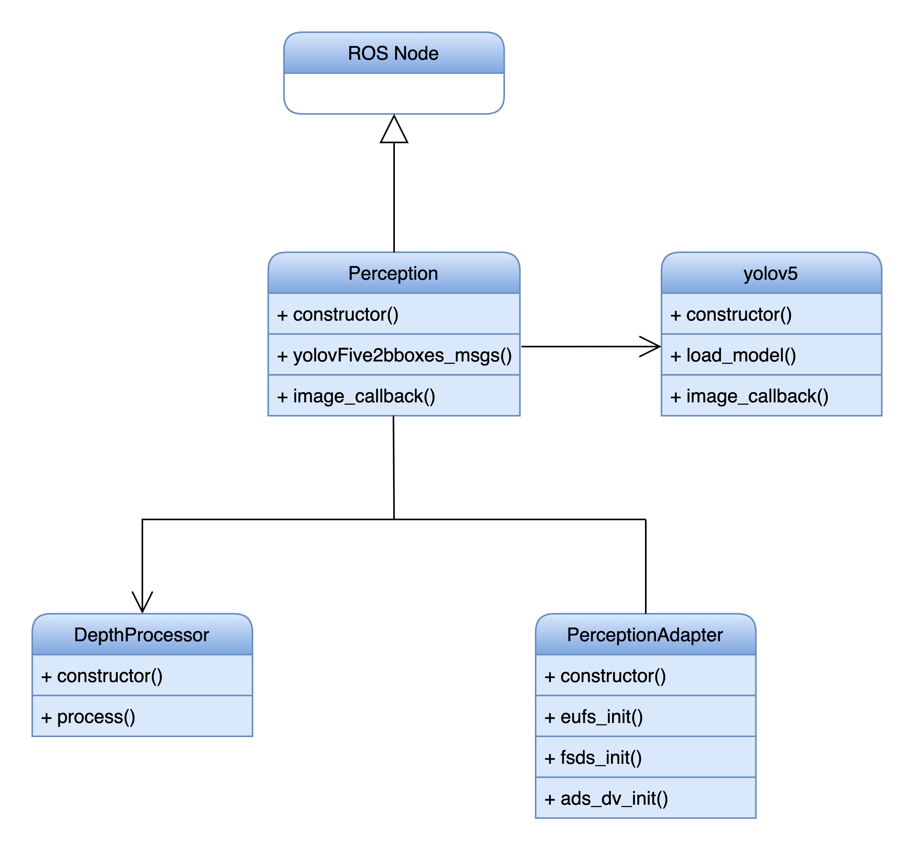
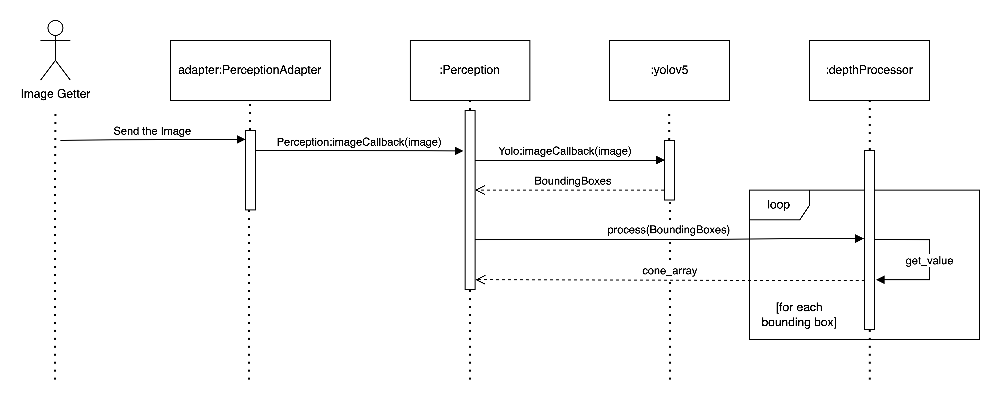

# Perception Module

The autonomous system's initial stage, the perception module, is responsible for detecting nearby objects and calculating their exact distances from the vehicle. The documentation provides an introductory understanding of the tangible model and structure that underlie the functionality of this crucial module.

## Run the Node

### Compile

```SHELL
	colcon build --symlink-install --packages-select perception custom_interfaces
```

### Run

```SHELL
	ros2 run perception perception
```

### Test

```SHELL
    colcon test --packages-select perception --event-handler=console_direct+
```

## Architecture

Below are several diagrams from the documentation illustrating the details of the Perception Module.

### Class Diagram

<p align="center">
  
</p>

* **ROS Node:** Serves as the fundamental structure and operational backbone of the system.

* **Perception:** The core node of the module. It manages the communication between the different components (mainly yolov5 and depthProcessor) and publishes the output of the node to other ROS nodes

* **yolov5:** This component is responsible for processing the input image and detecting objects of interest. It uses a deep learning model called YOLOv5 to generate bounding boxes around the detected objects.

* **DepthProcessor:** This component estimates the depth of the objects in the image.

* **PerceptionAdapter:** Functions as an abstraction layer, adeptly managing the image sources to be published.

### Sequence Diagram

The perception adapter acquires images from an image getter and transmits them to both the YOLOv5 object detection model and the depth processor. Subsequently, it integrates the bounding boxes and depth information to compile a comprehensive list of cones, which is then forwarded to the subsequent node, Localization and Mapping.

<p aligh="center">
  
</p>

### Activity Diagram

Below is an Activity Diagram illustrating the operational flow of the perception model.

<p align="center">
  
</p>


## Main External Libraries

1. [PyTorch](https://pytorch.org/tutorials/)
2. [ROS](https://docs.ros.org/en/foxy/index.html)
3. [CV2](https://docs.opencv.org/4.x/d6/d00/tutorial_py_root.html)
4. [Numpy](https://numpy.org/doc/stable/)
