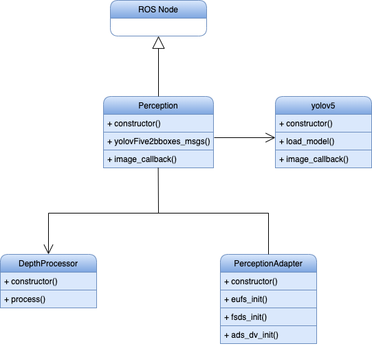

# Perception Module

## Run the Node

### Compile

```SHELL
	colcon build --symlink-install --packages-select perception custom_interfaces
```

### Run

```SHELL
	ros2 run perception perception
```

### Test

```SHELL
    colcon test --packages-select perception --event-handler=console_direct+
```

## Architecture

<p align="center">
  
</p>


## Main External Libraries

1. [PyTorch](https://pytorch.org/tutorials/)
2. [ROS](https://docs.ros.org/en/foxy/index.html)
3. [CV2](https://docs.opencv.org/4.x/d6/d00/tutorial_py_root.html)
4. [Numpy](https://numpy.org/doc/stable/)
