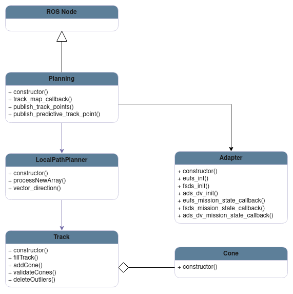
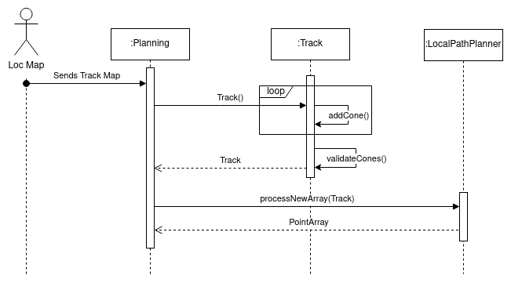
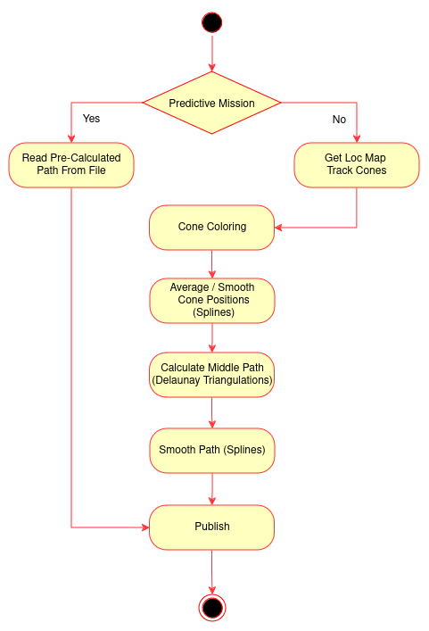

# Planning Module

The planning module is the third main module in the autonomous system. It comes after the Localization and Mapping processing and precedes the Control module. It is responsible for processing the cones information(position and color) and to calculate the best path for the car to follow considering the received track. It then sends the desired path to the control in the form of a ordered position sequence.

## Run the Node

### Install Dependencies
You will need CGAL library for the Delaunay Triangulations. GSL library for the splines.

```SHELL
  sudo apt-get install libcgal-dev
  sudo apt-get install libgsl-dev
```

### Compile

```SHELL
	colcon build --packages-select planning custom_interfaces
```
### Source 

```SHELL
	source ./install/setup.bash
```

### Run

```SHELL
	ros2 run planning planning
```

### Test
A) You can either run with colcon test.
```SHELL
    colcon test --packages-select planning --event-handler=console_direct+
```
B) Or you can run using the test executable, after compiling.
```SHELL
    ros2 run planning planning_test
```

## Design

The architecture of the module may be described according to the following diagrams.

### Class Diagram

This diagram will focus on the main classes and instances inside the planning module, mentioning only the core units and most important functions.

<p align="center">
  
</p>

* **ROS Node:** Serves as the fundamental structure and operational backbone of the system.

* **Planning:** It is the main orchestrator behind all the processes. It is responsible for the communication with other nodes. It contains an Adapter instance to manage information from the car/simulator and a LocalPathPlanner that will be responsible for the path calculation.

* **LocalPathPlanner:** This component is responsible for calculation the desired path. It takes the information from the track and using that it creates a sequence of points within the track boundaries for the control module to use as a reference later on.

* **Track:** This component assembles the information received by the track map, splitting and organizing the different colors and cones. It can also validate the received cones using splines to evaluate the distance between one cone and the trend in its side of the track.

* **Cone:** Basic unit that will fill the track instance. Contains its coordinates, color and id, which will be useful to identify it.

* **PlanningAdapter:** Implementation of the Adapter Pattern. It is an abstraction layer that's used to receive and interact with the car or simulator, depending on the current usage. It can be used for example to control the current event or the car state.

### Sequence Diagram

The planning module receives the track map(a cone array) from the Localization and Mapping block. The main module receives it and will send it to the Track instance to fill itself and validates the data using splines. After this step it will transmit the track to the Local Path Planner, which will calculate the ideal path and return it, finally to the main module again. The path is then forwarded to the subsequent node Control.

<p aligh="center">
  
</p>

### Activity Diagram

The planning module doesn't have many different flows. The main one to notice is the difference in the action depending on the event. Since for the Skidpad and Acceleration Events, the best path is already calculated, the module will just go find that data and send it. If we are not in the presence of those, the flow will follow just like previously mentioned.

<p align="center">
  
</p>

## Full Documentation

A more precise information about the Planning Module can be found [here](https://github.com/fs-feup/documentation/blob/main/AS/FSFEUP_02_Planning_Control/main.pdf)

## Main External Libraries

1. [ROS](https://docs.ros.org/en/foxy/index.html)
2. [CGAL](https://www.cgal.org/)
3. [GSL](https://www.gnu.org/software/gsl/)


