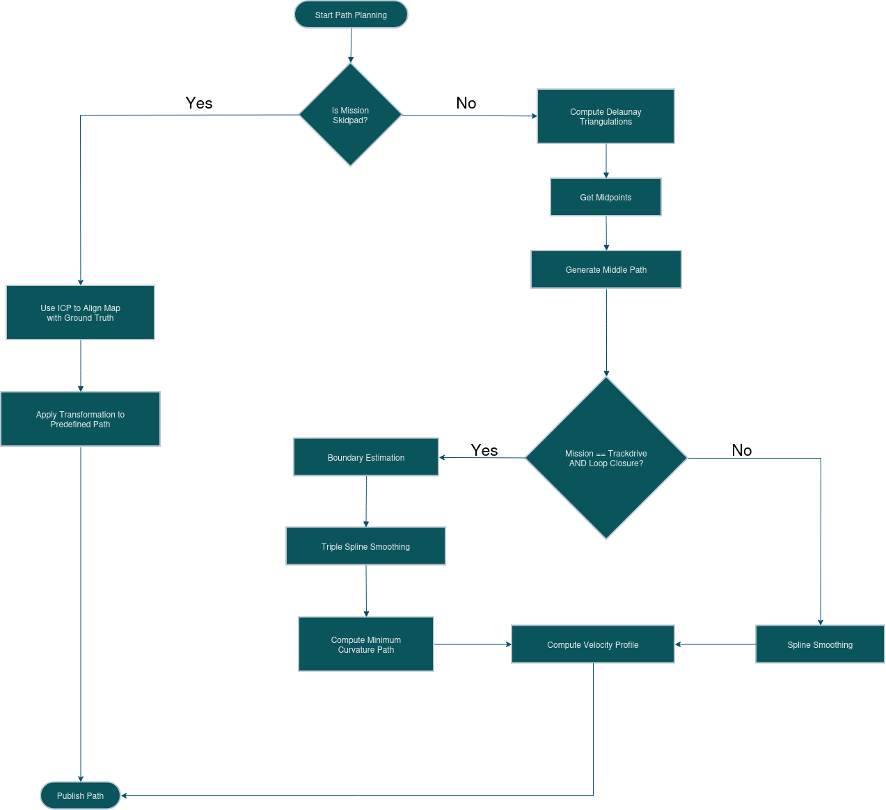
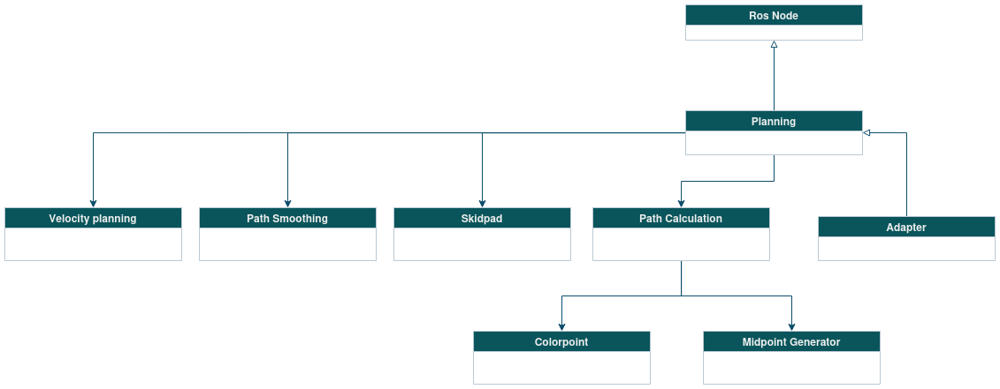

# Planning Module

## Package Information

### Description

The planning module is the third main module in the autonomous system. It comes after the Localization and Mapping processing and precedes the Control module. It is responsible for processing the cones position and to calculate the best path for the car to follow considering the received track. It then sends the desired path to the control in the form of an ordered path points sequence.

The module operates in two modes:
- **Skidpad mission:** ICP alignment with predefined paths
- **Other missions:** Full path generation via Delaunay triangulation, midpoint extraction, (B-spline smoothing), (minimum curvature optimization), and velocity planning

### Folder Structure
- [adapter_planning](include/adapter_planning/): Adapters to change ros2 interfaces according to simulator or environment
- [config](include/config/): Configuration structures for the planning module
- [utils](include/utils/): Utility functions for the planning module, including spline fitting
- [planning](include/planning/): Main classes and functions for the planning module
  - [planning/planning](include/planning/planning.hpp): Top-level ROS 2 node, it orchestrates all sub-modules and handles mission dispatch
  - [planning/midpoint_generator](include/planning/midpoint_generator.hpp): `MidpointGenerator` class, inserts cones into a Delaunay triangulation, computes midpoints, and builds the neighbour graph
  - [planning/path_calculation](include/planning/path_calculation.hpp): `PathCalculation` class, it uses Delaunay-based midpoint graph construction, graph search with recursive lookahead, and loop closure
  - [planning/colorpoint](include/planning/colorpoint.hpp): `Colorpoint` class, assigns yellow/blue labels to cone pairs using cross-product side determination
  - [planning/smoothing](include/planning/path_smoothing.hpp): `PathSmoothing` class, B-spline smoothing and OSQP-based minimum curvature optimization
  - [planning/velocity_planning](include/planning/velocity_planning.hpp): `VelocityPlanning` class, curvature-based speed targets with friction-ellipse acceleration and braking limiters
  - [planning/skidpad](include/planning/skidpad.hpp): `Skidpad` class, ICP-based alignment of a hardcoded path to the detected cone map

### Launch Configurations

- [eufs.launch.py](launch/eufs.launch.py): Launches the planning node with the necessary parameters for the EUFS simulator.
- [vehicle.launch.py](launch/vehicle.launch.py): Launches the planning node with the necessary parameters for the 03 vehicle.
- [pacsim.launch.py](launch/pacsim.launch.py): Launches the planning node with the necessary parameters for the PacSim simulator.


### Important Dependencies


- [CGAL](https://www.cgal.org/): Computational Geometry Algorithms Library, used for Delaunay triangulation in `MidpointGenerator`.
- [GSL](https://www.gnu.org/software/gsl/): GNU Scientific Library, used for B-spline fitting in `PathSmoothing`.
- [OSQP](https://osqp.org/): Operator Splitting QP Solver, used for minimum curvature path optimization in `PathSmoothing`.
- [PCL](https://pointclouds.org/): Point Cloud Library, used for ICP alignment in `Skidpad`.
- [Eigen](https://eigen.tuxfamily.org/): Linear algebra library, used for transformation matrices in `Skidpad`.


## How to Run

### Install Dependencies
```sh
# Initialize submodules
git submodule update --init --recursive
# Build and install osqp
./src/planning/dependencies_install.sh
```

### Compiling
```sh
colcon build --packages-up-to planning
```

### Testing
```sh
colcon test --packages-select planning # use --event-handlers console_direct+ for immediate output
```

To check test results:
```sh
colcon test-result --all --verbose
```

### Running

Choose one of the launch files in the `launch` directory. Each file's name indicates the context in which it should be used:
```sh
source ./install/setup.bash
ros2 launch planning <file_name>
```

Each launch file exposes arguments that control visualization publishing, input source, and algorithm parameters. To change a value, edit the launch file and recompile.

## Design

### Pipeline Overview

The path planning workflow is determined by the active mission type.

**Skidpad mission:**
1. Load hardcoded path and reference cones from file (once).
2. Align the reference cone map to the detected cones using ICP.
3. Apply the inverse transformation to the hardcoded path.
4. Find the closest point to the vehicle and return the next 70 points.

**All other missions (Autocross / Trackdrive / Acceleration):**
1. Generate a Delaunay triangulation of visible cones (sliding window or full map).
1. Extract midpoints from triangulation edges, applying distance constraints.
1. Build a neighbour graph connecting midpoints within the same triangle.
1. Run a recursive lookahead graph search using an angle+distance cost function to select the best path.
1. On loop closure (Trackdrive): fit triple splines to the centerline and boundaries, then run OSQP minimum curvature optimization.
1. Compute a velocity profile using Menger curvature, a friction-ellipse model, and forward/backward kinematic passes.
1. Publish the path to `/path_planning/path`.

<p align="center">
  
</p>

The architecture of the module may be described according to the following diagrams.

### Class Diagram

This diagram will focus on the main classes and instances inside the planning module, mentioning only the core units and most important functions.

<p align="center">
  
</p>

* **ROS Node:** Serves as the fundamental structure and operational backbone of the system.

* **Planning:** The main orchestrator behind all processes. It is responsible for communication with other nodes, mission dispatching, and managing the full planning pipeline. It owns an Adapter instance to abstract simulator or vehicle interfaces, and coordinates the core sub-modules.

* **PathCalculation:** Responsible for computing the desired path. It uses Delaunay triangulation over the detected cones to generate a midpoint graph, then performs a recursive lookahead graph search using an angle and distance cost function to select the best sequence of midpoints. It also manages cone discarding as the vehicle advances, and loop closure detection for the trackdrive mission.

* **MidpointGenerator:** Inserts cone positions into a Delaunay triangulation (optionally restricted to a sliding window around the vehicle), computes midpoints for each valid triangulation edge using distance constraints, and builds the neighbour graph connecting midpoints within the same triangle.

* **Colorpoint:** Assigns yellow and blue labels to cone pairs at each midpoint. It determines which cone is on which side of the path using cross products of the path direction and cone vectors, propagating color consistently along the full path sequence.

* **PathSmoothing:** Fits a B-spline through the calculated path points to produce a smooth, densely sampled trajectory. For the trackdrive mission after loop closure, it additionally fits triple splines to the centerline and track boundaries, then solves an OSQP quadratic program to minimize path curvature subject to track boundary constraints and a configurable safety margin.

* **VelocityPlanning:** Assigns an ideal velocity to each path point based on local Menger curvature, a friction-ellipse model, and forward acceleration and backward braking kinematic passes. For the trackdrive mission, it operates on a tripled path to ensure velocity continuity across the loop boundary.

* **Skidpad:** Handles the skidpad mission by loading a hardcoded reference path and cone positions from file on the first call, aligning the reference cones to the detected cone map using ICP, applying the inverse transformation to the reference path, and returning the next 70 points ahead of the vehicle's current position.

* **PlanningAdapter:** Implementation of the Adapter Pattern. An abstraction layer used to receive and interact with the car or simulator depending on the current context, decoupling the planning logic from the specific ROS interface in use.