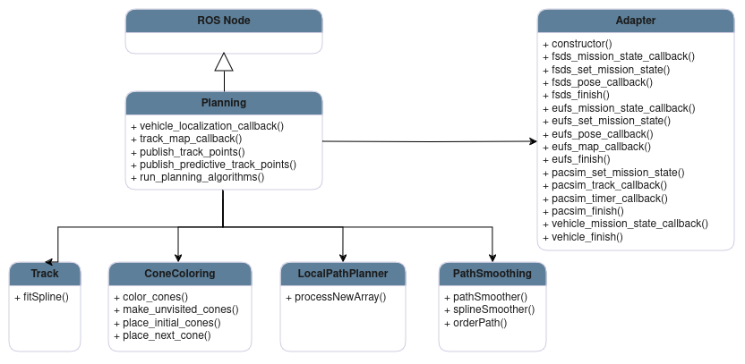
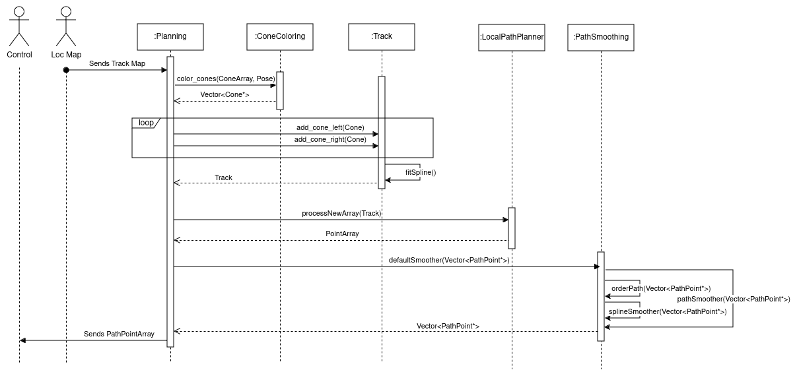

# Planning Module

The planning module is the third main module in the autonomous system. It comes after the Localization and Mapping processing and precedes the Control module. It is responsible for processing the cones information(position and color) and to calculate the best path for the car to follow considering the received track. It then sends the desired path to the control in the form of a ordered position sequence.

## Run the Node

### Install Dependencies
You will need CGAL library for the Delaunay Triangulations. GSL library for the splines.

```SHELL
  sudo apt-get install libcgal-dev
  sudo apt-get install libgsl-dev
```

### Compile

```SHELL
	colcon build --packages-select planning custom_interfaces
```
### Source 

```SHELL
	source ./install/setup.bash
```

### Run

```SHELL
	ros2 run planning planning
```

### Test
A) You can either run with colcon test.
```SHELL
    colcon test --packages-select planning --event-handler=console_direct+
```
B) Or you can run using the test executable, after compiling.
```SHELL
    ros2 run planning planning_test
```

## Design

The architecture of the module may be described according to the following diagrams.

### Class Diagram

This diagram will focus on the main classes and instances inside the planning module, mentioning only the core units and most important functions.

<p align="center">
  
</p>

* **ROS Node:** Serves as the fundamental structure and operational backbone of the system.

* **Planning:** It is the main orchestrator behind all the processes. It is responsible for the communication with other nodes. It contains an Adapter instance to manage information from the car/simulator and the main intervenients in the pipeline, as the LocalPathPlanner, responsible for the path calculation, the ConeColoring, responsible for attributing a color to unlabeled cones, the PathSmoothing, responsible for smoothing the point array to be published and the Track, which assembles the cones information after coloring and averages them using splines.

* **LocalPathPlanner:** This component is responsible for calculation the desired path. It takes the information from the track and using that it creates a sequence of points within the track boundaries for the control module to use as a reference later on.

* **Track:** This component assembles the information received by the track map, splitting and organizing the different cones in side and colors. It can also deals with any outliers by averaging out all cones using splines, and thus transforming the outliers into the main distribution sequence.

* **ConeColoring:** This component responsible for attributing a color to unlabeled ones. It starts from a certain pair, and searches for the next cone for each using a cost function, achieving a fully colored track map in the end.

* **PathSmoothing:** This component is responsible for fitting a spline through all the calculated points, smoothing the path the vehicle will follow and augmenting the number of references if necessary. 

* **PlanningAdapter:** Implementation of the Adapter Pattern. It is an abstraction layer that's used to receive and interact with the car or simulator, depending on the current usage. It can be used for example to control the current event or the car state.

### Sequence Diagram

The planning module receives the track map(a cone array) from the Localization and Mapping block. The main module receives it and will send it to the Cone Coloring to attribute a side to each. The Track instance is then filled with these and deals with outliers by averaging the margins using splines. The next step is transmitting the track to the Local Path Planner, which will calculate the ideal path and return it. Finally, these points are sent to the PathSmoothing, where they are processed by a spline approximation, being then returned back to the main module. The path is then forwarded to the subsequent node Control.

<p aligh="center">
  
</p>

### Activity Diagram

The planning module doesn't have many different flows. The main one to notice is the difference in the action depending on the event. Since for the Skidpad and Acceleration Events, the best path is already calculated, the module will just go find that data and send it. If we are not in the presence of those, the flow will follow just like previously mentioned.

<p align="center">
  
</p>

## Full Documentation

A more precise information about the Planning Module can be found [here](https://github.com/fs-feup/documentation/blob/main/AS/FSFEUP_02_Planning_Control/main.pdf)

## Main External Libraries

1. [ROS](https://docs.ros.org/en/foxy/index.html)
2. [CGAL](https://www.cgal.org/)
3. [GSL](https://www.gnu.org/software/gsl/)


