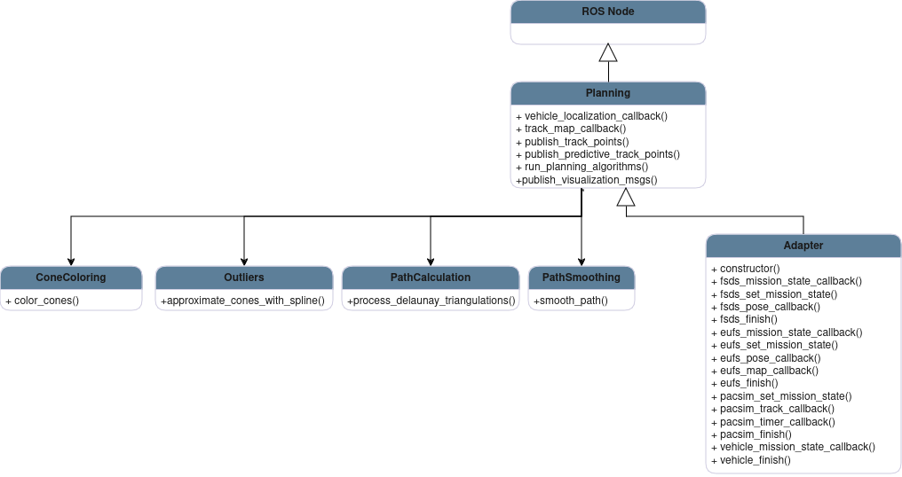
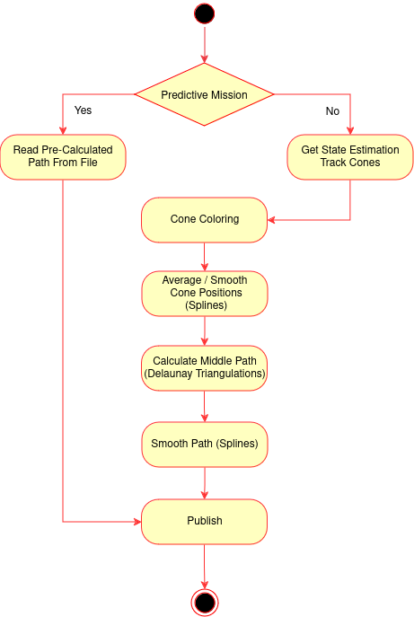

# Planning Module

## Package Information

### Description


The planning module is the third main module in the autonomous system. It comes after the Localization and Mapping processing and precedes the Control module. It is responsible for processing the cones information(position and color) and to calculate the best path for the car to follow considering the received track. It then sends the desired path to the control in the form of a ordered position sequence.


### Folder Structure

- [adapter_planning](include/adapter_planning/): Adapters to change ros2 interfaces according to simulator or environment
- [config](include/config/): Configuration structures for the planning module
- [utils](include/utils/): Utility functions for the planning module, including spline fitting
- [planning](include/planning/): Main classes and functions for the planning module
  - [planning/cone_coloring](include/planning/cone_coloring.hpp): ConeColoring class, used to attribute a color to unlabeled cones
  - [planning/path_calculation](include/planning/path_calculation.hpp): PathCalculation class, used to calculate the desired path using delaunay triangulation
  - [planning/smoothing](include/planning/path_smoothing.hpp): PathSmoothing class, used to smooth the path using splines, increasing the number of path points
  - [planning/outliers](include/planning/outliers.hpp): Outliers class, used to remove outliers from the track map
  - [planning/planning](include/planning/planning.hpp): Node class


### Launch Configurations

- [eufs.launch.py](launch/eufs.launch.py): Launches the planning node with the necessary parameters for the EUFS simulator.
- [vehicle.launch.py](launch/vehicle.launch.py): Launches the planning node with the necessary parameters for the 01 vehicle.
- [pacsim.launch.py](launch/pacsim.launch.py): Launches the planning node with the necessary parameters for the PacSim simulator.


### Important Dependencies

- [CGAL](https://www.cgal.org/): Computational Geometry Algorithms Library. Used for Delaunay Triangulations.
- [GSL](https://www.gnu.org/software/gsl/): GNU Scientific Library. Used for splines.


## How to Run

### Install Dependencies
You will need CGAL library for the Delaunay Triangulations. GSL library for the splines.

```sh
  ./denpendencies_install.sh
```

### Compiling

```sh
	colcon build --packages-up-to planning
```

### Testing

```sh
colcon test --packages-select planning # use event-handler=console_direct+ for imediate output
```

To check test results:
```sh
colcon test-result --all --verbose
```

### Running

Choose one of the launch files available at the "launch" directory. Each file's name indicates the context in which 
it should be used. If the name of the file is <file_name> run the following command (replace <file_name> with the 
actual name of the launch file):
```sh
  source ./install/setup.bash # If in a new terminal
	ros2 run planning <file_name>
```
At each launch file, you can find the arguments which will be passed to the planning node. Those arguments control whether the node publishes 
visualization messages (which can be used to foxglove), where the node gets its input from, and parameters intrinsic to the algorithms (which were 
tuned to some extent). At the declaration of each launch argument, you will find the description of the argument and the value which will be used if you launch the node with that launch file. If you want to change the value which will be used, edit the launch file and compile the package again.


## Design

The architecture of the module may be described according to the following diagrams.

### Class Diagram

This diagram will focus on the main classes and instances inside the planning module, mentioning only the core units and most important functions.

<p align="center">
  
</p>

* **ROS Node:** Serves as the fundamental structure and operational backbone of the system.

* **Planning:** It is the main orchestrator behind all the processes. It is responsible for the communication with other nodes. It contains an Adapter instance to manage information from the car/simulator and the main intervenients in the pipeline, as the LocalPathPlanner, responsible for the path calculation, the ConeColoring, responsible for attributing a color to unlabeled cones, the PathSmoothing, responsible for smoothing the point array to be published and the Track, which assembles the cones information after coloring and averages them using splines.

* **LocalPathPlanner:** This component is responsible for calculation the desired path. It takes the information from the track and using that it creates a sequence of points within the track boundaries for the control module to use as a reference later on.

* **Track:** This component assembles the information received by the track map, splitting and organizing the different cones in side and colors. It can also deals with any outliers by averaging out all cones using splines, and thus transforming the outliers into the main distribution sequence.

* **ConeColoring:** This component responsible for attributing a color to unlabeled ones. It starts from a certain pair, and searches for the next cone for each using a cost function, achieving a fully colored track map in the end.

* **PathSmoothing:** This component is responsible for fitting a spline through all the calculated points, smoothing the path the vehicle will follow and augmenting the number of references if necessary. 

* **PlanningAdapter:** Implementation of the Adapter Pattern. It is an abstraction layer that's used to receive and interact with the car or simulator, depending on the current usage. It can be used for example to control the current event or the car state.

### Sequence Diagram

The planning module receives the track map(a cone array) from the Localization and Mapping block. The main module receives it and will send it to the Cone Coloring to attribute a side to each. The Track instance is then filled with these and deals with outliers by averaging the margins using splines. The next step is transmitting the track to the Local Path Planner, which will calculate the ideal path and return it. Finally, these points are sent to the PathSmoothing, where they are processed by a spline approximation, being then returned back to the main module. The path is then forwarded to the subsequent node Control.

<p aligh="center">
  
</p>

### Activity Diagram

The planning module doesn't have many different flows. The main one to notice is the difference in the action depending on the event. Since for the Skidpad and Acceleration Events, the best path is already calculated, the module will just go find that data and send it. If we are not in the presence of those, the flow will follow just like previously mentioned.

<p align="center">
  
</p>

