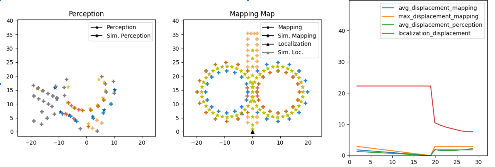

# Evaluation Tool (Plots) Module

This module is for a small evaluation tool, used in conjunction with EUFS to plot metrics linked to the accuracy and precision of the perception and loc-map modules, as well as visualize the planning's path. It uses matplotlib and simply subscribes to the information, both the system's topics and the simulator's groundtruths, and generates performance metrics based on the disparity.



## Run the Node

### Compile

```SHELL
colcon build --packages-select plots custom_interfaces eufs_msgs
```

### Run

```SHELL
ros2 run plots plots
```

## Main External Libraries

1. [Matplotlib](https://matplotlib.org/)


