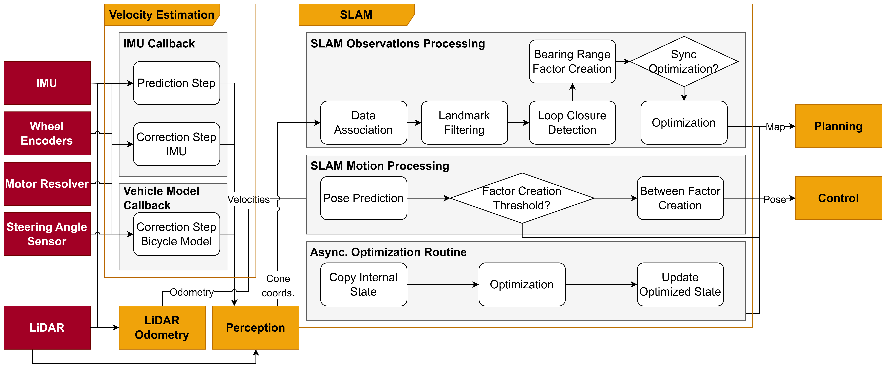
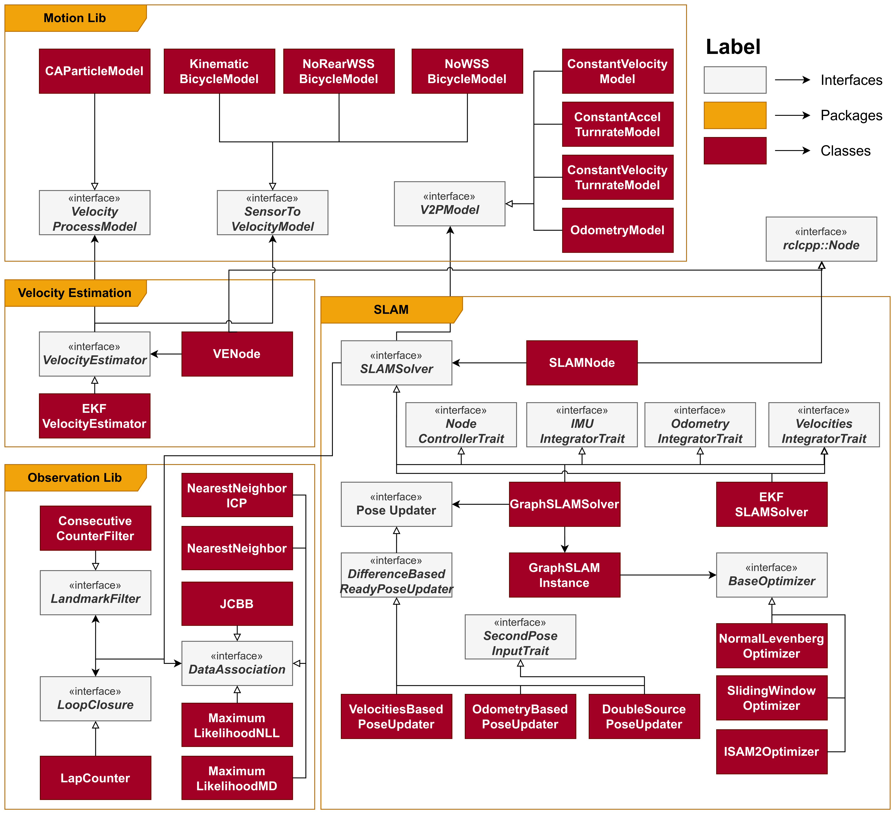
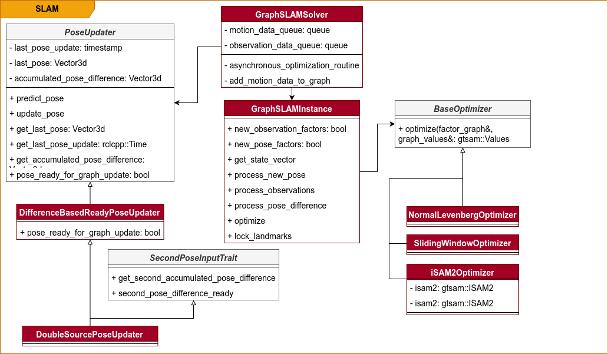

# SLAM Package

## Package Information


### Description

This package defines the SLAM node: a node responsible for performing localization and mapping. It receives linear and angular velocities and perception relative cone coordinates and outputs an estimate of the vehicle's pose and the map of the track.


### Folder Structure

- [adapter_slam](./include/slam/): Adapters to change ros2 interfaces according to simulator or environment
- [slam_solver](./include/slam_solver/): Includes the actual solvers of the SLAM problem
    - [slam_solver/graph_slam](./include/slam_solver/graph_slam/): Code for using smoothing based SLAM with GTSAM library
    - [slam_solver/ekf_slam](./include/slam_solver/ekf_slam/): Code for using Extended Kalman Filter based SLAM
- [ros_node](./include/ros_node/): Node class
- [slam_config](./include/slam_config/): Configuration files for the SLAM node with parameters for the solvers


### Launch Configurations

- [vehicle.launch.py](./launch/vehicle.launch.py): Launch file for the vehicle environment
- [pacsim.launch.py](./launch/pacsim.launch.py): Launch file for the PacSim simulator

### Important Dependencies

- [Eigen3](https://eigen.tuxfamily.org/index.php?title=Main_Page)
- [GTSAM](https://gtsam.org/)

## How to Run

### Install Dependencies

```sh
  ./dependencies_install.sh
```

### Compiling

```sh
colcon build --packages-up-to slam
```

### Testing

```sh
colcon test --packages-select slam # use event-handler=console_direct+ for imediate output
```

To check test results:
```sh
colcon test-result --all --verbose
```

or 

```sh
source ./install/setup.bash # If in a new terminal
ros2 run slam slam_test
```

### Running

Use a launch file:

```sh
source ./install/setup.bash # If in a new terminal
ros2 launch slam eufs.launch.py
```

or run directly:


```sh
source ./install/setup.bash # If in a new terminal
ros2 run slam slam
```

## Design

Below, some diagrams are presented that can illustrate the structure and behaviour of the program.

### Behaviour

The following diagram illustrates the flow of data through the SLAM node.



### Structure

The node is composed by multiple classes. The diagram below illustrates roughly how they sit in the code structure and interact with other packages.




The following are the interfaces for this package:
```cpp
// Subscriptions
  if (!params.use_simulated_perception_) {
    this->_perception_subscription_ = this->create_subscription<custom_interfaces::msg::ConeArray>(
        "/perception/cones", 1,
        std::bind(&SLAMNode::_perception_subscription_callback, this, std::placeholders::_1),
        subscription_options);
  }
  if (!params.use_simulated_velocities_) {
    this->_velocities_subscription_ = this->create_subscription<custom_interfaces::msg::Velocities>(
        "/state_estimation/velocities", 50,
        std::bind(&SLAMNode::_velocities_subscription_callback, this, std::placeholders::_1),
        subscription_options);
  }

  // Publishers
  this->_map_publisher_ =
      this->create_publisher<custom_interfaces::msg::ConeArray>("/state_estimation/map", 10);
  this->_vehicle_pose_publisher_ =
      this->create_publisher<custom_interfaces::msg::Pose>("/state_estimation/vehicle_pose", 10);
  this->_visualization_map_publisher_ =
      this->create_publisher<visualization_msgs::msg::MarkerArray>(
          "/state_estimation/visualization_map", 10);
  this->_associations_visualization_publisher_ =
      this->create_publisher<visualization_msgs::msg::MarkerArray>(
          "/state_estimation/visualization_associations", 10);
  this->_trajectory_visualization_publisher_ =
      this->create_publisher<visualization_msgs::msg::MarkerArray>(
          "/state_estimation/visualization/trajectory", 10);
  this->_execution_time_publisher_ = this->create_publisher<std_msgs::msg::Float64MultiArray>(
      "/state_estimation/slam_execution_time", 10);
  this->_covariance_publisher_ = this->create_publisher<std_msgs::msg::Float64MultiArray>(
      "/state_estimation/slam_covariance", 10);
  this->_lap_counter_publisher_ =
      this->create_publisher<std_msgs::msg::Float64>("/state_estimation/lap_counter", 10);
  this->_tf_broadcaster_ = std::make_shared<tf2_ros::TransformBroadcaster>(this);
```

for PacSim adapter:
```cpp
if (params.use_simulated_perception_) {
    RCLCPP_INFO(this->get_logger(), "Using simulated perception");
    this->_perception_detections_subscription_ =
        this->create_subscription<pacsim::msg::PerceptionDetections>(
            "/pacsim/perception/lidar/landmarks", 1,
            std::bind(&PacsimAdapter::_pacsim_perception_subscription_callback, this,
                      std::placeholders::_1),
            subscription_options);
  }

  if (params.use_simulated_velocities_) {
    this->_velocities_subscription_ =
        this->create_subscription<geometry_msgs::msg::TwistWithCovarianceStamped>(
            "/pacsim/velocity", 1,
            std::bind(&PacsimAdapter::_pacsim_velocities_subscription_callback, this,
                      std::placeholders::_1),
            subscription_options);
  }

  this->_imu_subscription_ = this->create_subscription<sensor_msgs::msg::Imu>(
      "/pacsim/imu/cog_imu", 1,
      std::bind(&PacsimAdapter::_pacsim_imu_subscription_callback, this, std::placeholders::_1),
      subscription_options);

  this->_finished_client_ = this->create_client<std_srvs::srv::Empty>("/pacsim/finish_signal");
  param_client_ =
      this->create_client<rcl_interfaces::srv::GetParameters>("/pacsim/pacsim_node/get_parameters");
```

and for vehicle adapter:

```cpp
_operational_status_subscription_ =
      this->create_subscription<custom_interfaces::msg::OperationalStatus>(
          "/vehicle/operational_status", 10,
          [this](const custom_interfaces::msg::OperationalStatus::SharedPtr msg) {
            RCLCPP_INFO(this->get_logger(), "Operational status received. Mission: %d - Go: %d",
                        msg->as_mission, msg->go_signal);
            _go_ = true;  // msg->go_signal;
            _mission_ = common_lib::competition_logic::Mission(msg->as_mission);
            this->_slam_solver_->set_mission(_mission_);
          });
  _finished_client_ = this->create_client<std_srvs::srv::Trigger>("/as_srv/mission_finished");
  // Create a static map frame
  _tf_static_broadcaster_ = std::make_shared<tf2_ros::StaticTransformBroadcaster>(*this);

  geometry_msgs::msg::TransformStamped transformStamped;
  transformStamped.header.stamp = this->get_clock()->now();
  transformStamped.header.frame_id = "map";              // Fixed frame: "map"
  transformStamped.child_frame_id = "vehicle_estimate";  // The child frame: "vehicle"

  /// ....

  // LiDAR odometry subscription
  if (!params.receive_lidar_odometry_) {
    RCLCPP_INFO(this->get_logger(), "Not receiving lidar odometry, using only velocities");
    return;
  }

  this->_lidar_odometry_subscription_ = this->create_subscription<nav_msgs::msg::Odometry>(
      params.lidar_odometry_topic_, 1,
      std::bind(&VehicleAdapter::_lidar_odometry_subscription_callback, this,
                std::placeholders::_1),
      subscription_options);
```