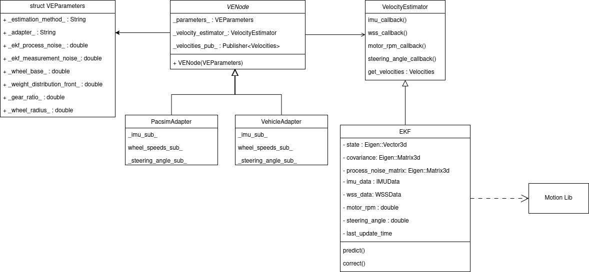

# Velocity Estimation Package

## Description

This package is responsible for estimating the velocity of the vehicle based on measurements by the sensors. The results of this estimation are meant to be used for SLAM and Control. The package has enough modularity that using different estimators and running it on different environments only requires changing/creating launch files.

## Directory Structure

- [include](./include/): declarations of all classes and functions, implementations of factories
    - [include/adapters/parameters.hpp](./include/adapters/parameters.hpp): struct of parameters to use when launching the node
    - [include/adapters/estimator_factory.hpp](./include/adapters/estimator_factory.hpp): factory to generate estimator based on parameters
    - [include/adapters/parameters_factory.hpp](./include/adapters/parameters_factory.hpp): load parameters from launch files, and create adapter
- [launch](./launch/): launch configuration files
- [src](./src/): implementations of classes and functions
    - [adapters](./src/adapters/): adapters for each running environment
    - [estimators](./src/estimators/): implementation of each velocity estimator
    - [node](./src/node/): implementation of [VENode](./include/node/node.hpp)

## Launch Configurations

- [pacsim.launch.py](./launch/pacsim.launch.py): Launch file for the PacSim simulator
- [vehicle.launch.py](./launch/vehicle.launch.py): Launch file for the vehicle

## How to Run

### Install Dependencies

```sh
  ./dependencies_install.sh
```

### Compiling

```sh
colcon build --packages-up-to velocity_estimation
```

### Running

Use a launch file:

```sh
source ./install/setup.bash # If in a new terminal
ros2 launch velocity_estimation pacsim.launch.py
```

or run directly:

```sh
source ./install/setup.bash # If in a new terminal
ros2 run velocity_estimation velocity_estimation
```

### Testing

```sh
colcon test --packages-select velocity_estimation # use event-handler=console_direct+ for imediate output
```

To check test results:
```sh
colcon test-result --all --verbose
```

## Estimators

### EKF

This estimator is an extension of the Kalman Filter for non-linear models. It's car model is the kinematic bicycle model, which assumes no-slip in the tires, with lateral dynamics included. The sensors used are an IMU, wheel speed sensors, a steering angle sensor and a motor rpm sensor.

## Structure
This UML diagram shows how the classes that compose this package are related to each other. The main takeaway is that there is a main class called VENode, a ROS2 node, which depends on a velocity estimator to do the actual velocity estimation.



## Design

Important design decisions:
- The class [VENode](./include/node/node.hpp) depends on an [abstract estimator](./include/estimators/estimator.hpp) to make it easier to implement new estimation methods.
- The parameters in the launch files determine the [adapter](./include/adapters/parameters_factory.hpp) and the [estimator](./include/adapters/estimator_factory.hpp) to be used, through corresponding and are created in corresponding factories.

## Important Dependencies

- [Eigen3](https://eigen.tuxfamily.org/index.php?title=Main_Page)